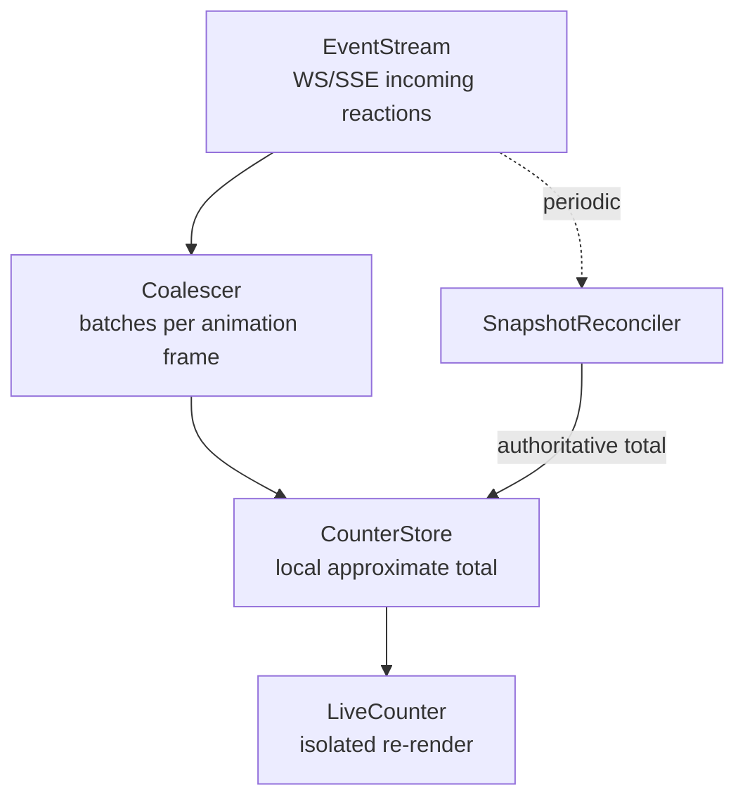
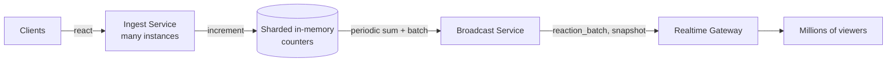

## Overview

- **Real-world analog:** Live-stream like counts, YouTube Live/Twitch reaction bursts.
- **Difficulty:** Medium-Hard · **Asked at:** Meta, YouTube Live, Twitch, live-stream products.
- The core challenge looks trivial — it's a number going up — until the scale is stated out loud: a million concurrent viewers, each capable of tapping "like" repeatedly, all watching the same counter. The real question is how you show that number updating in real time without lying about its precision or melting the browser tab trying to be exact.

## Clarifying Questions & Requirements

> **Ask these first:**
> 1. Does the count need to be exactly correct at all times, or is a smoothly-updating approximation acceptable?
> 2. Is this a single global counter per stream, or per-reaction-type (like/love/laugh) counts shown separately?
> 3. Do individual reaction *events* need to be visible (floating heart animations), or only the aggregate number?
> 4. What happens to a viewer who reconnects mid-stream — do they need the exact count history, or just the current value?

| | In scope | Out of scope |
|---|---|---|
| **Functional** | Real-time aggregate counter, optional per-type breakdown, optional floating-reaction animation layer | Historical analytics/reporting on reaction data, per-user reaction attribution in the UI |
| **Non-functional** | Smooth, non-janky updates under extreme event volume; the displayed number converges to the true value quickly once traffic settles | Per-event exactness at every instant (explicitly *not* a requirement — see Data Model) |

## ── FRONTEND TRACK (RADIO) ──

### R — Requirements

| | Requirement | Why it's not optional |
|---|---|---|
| **Functional** | A counter that visibly updates in near-real-time under both quiet and extreme-burst conditions | A counter that only updates once a minute during a burst reads as broken, not calm |
| **Non-functional** | Rendering must not degrade the rest of the page (video playback, chat) even during a reaction spike | This is a secondary UI element competing for main-thread time with the actual content the user came for |
| **Non-functional** | The displayed count is allowed to be *approximate* moment-to-moment, but must never visibly decrease or jump backward | A backward jump reads as a bug regardless of whether it's technically a "more accurate" correction |

### A — Architecture



- **`Coalescer` sits between the raw event stream and any rendering** — it never lets individual events reach a component directly. Every incoming reaction increments an in-memory counter with no render triggered; a `requestAnimationFrame` loop flushes the accumulated delta to `CounterStore` at most once per frame, regardless of how many hundred events arrived in that frame.
- **`LiveCounter` is isolated from the rest of the page's render tree** — it's the one component that re-renders on every counter tick, so it's deliberately kept as small and cheap to re-render as possible, with nothing else (video player, chat) as a sibling inside its own re-render boundary.

```ts
class Coalescer {
  private pendingDelta = 0;
  private scheduled = false;

  onEvent(count: number) {
    this.pendingDelta += count;
    if (!this.scheduled) {
      this.scheduled = true;
      requestAnimationFrame(() => this.flush());
    }
  }

  private flush() {
    this.store.applyDelta(this.pendingDelta);
    this.pendingDelta = 0;
    this.scheduled = false;
  }
}
```

This is the actual substance of "batch high-frequency updates" — not a bullet point, a real accumulator that guarantees at most one state write (and therefore at most one re-render) per animation frame, no matter how many raw events arrived.

### D — Data Model

```ts
type CounterState = {
  displayedTotal: number;     // what's rendered — always monotonically non-decreasing
  lastAuthoritativeTotal: number; // from the most recent periodic snapshot
  driftSinceSnapshot: number;     // locally-accumulated deltas since that snapshot
};
```

> **Key insight:** the displayed total is explicitly a **local approximation reconciled periodically**, not a value kept exactly correct on every single event — this is the frontend expression of this course's `Consistency model` term applied to a social/engagement count specifically: eventual, approximate, batched, per the consistency spectrum this course's field guide lays out (money needs strong consistency; a like count does not).

### I — Interface / API

**Component API**

```
<LiveCounter total={number} label={string} />
<ReactionBurstLayer events={ReactionEvent[]} />
```

**Network API** — the shared contract with the backend track below:

| Action | Transport | Shape |
|---|---|---|
| Reaction event stream | WebSocket/SSE | `{ type: 'reaction', streamId, count, reactionType }` — batched server-side, see backend track |
| Periodic authoritative snapshot | Same channel, distinguished message type | `{ type: 'snapshot', streamId, total, asOf }`, every few seconds |
| Send a reaction | `POST /streams/:id/react` | `{ reactionType }`, fire-and-forget from the client's perspective |

### O — Optimizations

**Performance**
- Coalesce to at most one state update per animation frame (the `Coalescer` above) — this single decision is what separates a chart that stays smooth at 10,000 events/sec from one that locks up the tab.
- Reconcile against the periodic authoritative snapshot by animating the displayed value toward it over a short duration, rather than snapping instantly — a sudden jump reads as janky even when it's the "more correct" value.
- If a floating-reaction animation layer exists, cap the number of simultaneous animated elements and represent overflow as a burst effect rather than one DOM/canvas element per raw event.

**Resilience**
- On reconnect, request a fresh snapshot rather than trying to replay every individual event that occurred while disconnected — for this data, the aggregate is all that matters, and replaying history has no value a snapshot doesn't already provide.

### Frontend Deep Dives

**1. Coalescing without ever visibly regressing the number.** The tempting naive approach — snap `displayedTotal` directly to whatever `lastAuthoritativeTotal` the server last reported — can make the number briefly *decrease* if the local, optimistically-accumulated total had already raced ahead of what the server's last snapshot reflects. The fix: `displayedTotal` is computed as `max(displayedTotal, lastAuthoritativeTotal + driftSinceSnapshot)` — it only ever moves forward, treating a lower authoritative value as "not yet caught up to what we've locally seen" rather than a correction to display immediately.

**2. Isolating the hot component from the rest of the tree.** A counter re-rendering 60 times a second is fine in isolation; a counter re-rendering 60 times a second *while nested inside the same component tree as the video player and chat* risks dragging unrelated subtrees into every re-render if state isn't scoped carefully. The fix is a dedicated, narrowly-scoped store (or a signal/atom in whatever state library is in use) that only `LiveCounter` itself subscribes to — a change to the counter should not be visible to `React.memo`-unwrapped siblings at all.

> **Signature gotcha:** rendering every single event. At volume, you must sample and aggregate — per-event rendering melts the main thread, and it's the single most common mistake a shallow answer makes on this question, because the naive version ("just append to a list and increment a counter") works perfectly in a demo with ten test clicks and falls over instantly at real volume.

### Frontend Bottlenecks & Tradeoffs

| Bottleneck | Mitigation | Tradeoff accepted |
|---|---|---|
| One re-render per incoming event at high volume | Coalesce to one update per animation frame | The displayed number is a batched approximation between frames, not a live, per-event-accurate value — acceptable, since exactness was never a real requirement here |
| Floating-reaction animations at high event rates | Cap simultaneous animated elements, represent overflow as a burst effect | Individual reactions become visually indistinguishable during a genuine spike — an acceptable loss of per-event detail in exchange for a page that stays responsive |
| Snapshot reconciliation causing a visible number jump | Animate toward the reconciled value over a short duration, and never regress below the current displayed value | Slight, deliberate lag between "true" server state and displayed state — invisible to users, and strictly preferable to a jarring correction |

## ── BACKEND TRACK ──

### Requirements & Scope

- Ingest an extremely high-frequency stream of reaction events per popular stream, maintain an aggregate count, and broadcast updates to potentially millions of concurrently connected viewers without the fan-out cost scaling linearly with raw event volume.

### Scale & Estimation

| | Estimate |
|---|---|
| Concurrent viewers on a popular live stream | 1M |
| Peak reactions/sec on that stream | Can spike to 50K-100K/sec during a notable moment |
| Fan-out cost if every raw event were pushed to every viewer | 1M viewers × 100K events/sec — clearly untenable, this number alone is the whole design problem |
| Acceptable update frequency per viewer | A batched update every few hundred milliseconds is indistinguishable from "real-time" to a human, and is orders of magnitude cheaper than per-event fan-out |

### API Design

```
POST /streams/:id/react   {reactionType}                    → 202 Accepted (fire-and-forget)
WS   reaction_batch       → {streamId, deltaCount, reactionType}   -- server-side batched, not 1:1 with raw events
WS   snapshot             → {streamId, total, asOf}                -- periodic authoritative total
```

- The server never fans out raw individual reaction events to viewers at all — `reaction_batch` messages are themselves already aggregated server-side before being broadcast, which is the backend-side mirror of the frontend's coalescing: batching happens on *both* sides of the wire, and each layer solves a genuinely different bottleneck (fan-out cost on the server, render cost on the client).

### Data Model & Storage

```
stream_counters
  stream_id     text PK
  total         bigint          -- approximate, eventually consistent across shards
  updated_at    timestamp

reaction_events   -- optional, only if per-event durability/analytics matters at all
  stream_id     text
  reaction_type text
  count         int             -- pre-aggregated in short windows, not one row per tap
  window_start  timestamp
```

| Choice | Why |
|---|---|
| **In-memory counter (per stream, sharded), not a relational row incremented per event** | At 100K events/sec on one hot stream, a relational row is a guaranteed bottleneck; an in-memory, shardable counter with periodic (not per-write) durability is the only way to actually absorb this rate |
| **Counters sharded across multiple nodes per stream, summed on read/broadcast** | A single counter instance has a real throughput ceiling regardless of how it's implemented — sharding the write path (each shard handling a fraction of incoming events) and summing on the read/broadcast path is what removes that ceiling |
| **Approximate, eventually-consistent total, not a strongly-consistent one** | This data sits at the "social/engagement counts" row of the consistency spectrum this course's field guide lays out — eventual and approximate is not a compromise here, it's the actually-correct posture for this specific data |

### High-Level Architecture



- The **Broadcast Service**, not the ingest path, is what applies the fan-out batching — it periodically reads the summed value across shards and emits one `reaction_batch`/`snapshot` message per broadcast interval, which is then fanned out to viewers through the realtime gateway layer. Ingest and broadcast are deliberately separate concerns running at different, independently-tunable frequencies.

### Deep Dives

**1. Sharding a single hot counter without losing accuracy.** A viral stream's reaction counter is a classic hot-key problem — one logical counter receiving far more write volume than any single node can absorb. The fix: shard the counter itself (e.g., N independent counters, incoming events randomly or round-robin assigned to one), with the true total computed as the sum across shards at read/broadcast time. This trades a small amount of read-time aggregation cost for removing the single-node write bottleneck entirely, and it's the same fan-out-by-partitioning idea this course's chat-messaging question uses for large-group message delivery, applied to write throughput instead of read fan-out.

**2. Broadcast fan-out decoupled from ingest rate.** Broadcasting on every single counter increment would mean broadcast volume scales directly with reaction volume — exactly the same problem the raw ingest path has, just moved one layer downstream. The fix: the broadcast interval is a fixed, independent cadence (e.g., every 200-500ms) regardless of how many increments happened in that window — one `reaction_batch` message carries the accumulated delta for the whole interval, so broadcast cost is bounded by *viewer count × broadcast frequency*, never by raw event volume.

**3. Reconciling sharded, eventually-consistent counters into one displayed number.** Because each shard is updated independently and summed only periodically, the "true" total at any given instant is never perfectly well-defined across the whole system — and that's fine, because nothing in this question's requirements needs it to be. The durable design decision is making that explicit: `stream_counters.total` is documented and treated as an approximation with a bounded staleness window (the broadcast interval), not something any part of the system should ever query expecting exact, real-time precision.

### Bottlenecks & Tradeoffs

| Bottleneck | Mitigation | Tradeoff accepted |
|---|---|---|
| A single hot counter on a viral stream | Shard the counter, sum on read | Read-time aggregation cost across shards, in exchange for removing the write-side bottleneck entirely |
| Fan-out cost scaling with raw reaction volume | Decouple broadcast cadence from ingest rate; broadcast a periodic batched delta | Viewers see updates on a fixed cadence (hundreds of milliseconds) rather than instantly per event — imperceptible to a human, and the entire point of the design |
| Counter durability under a node failure | Periodic snapshot to durable storage, not per-event durability | A small amount of very recent, in-flight delta can be lost on a crash — acceptable for an approximate engagement metric, unlike a financial or inventory count |

## The Shared Contract

- **Transport:** WebSocket/SSE, batched aggressively on both the ingest and broadcast side — the wire protocol was never designed to carry one message per reaction; both tracks agree the unit of communication is a periodic delta, not a raw event.
- **Ownership boundary:** the backend owns the authoritative (if approximate) total; the frontend owns smoothing that total into a visually pleasant, monotonically-increasing display — neither side claims per-event exactness, and that's a deliberate, shared design decision stated up front, not an accident.
- **Consistency posture:** explicitly eventual and approximate on both sides of the wire — the one thing this question tests as hard as the batching mechanics themselves is whether a candidate can *justify* that posture rather than reaching for it by default.

## Interview Signals

| | Strong answer | Weak answer |
|---|---|---|
| **Frontend** | Names the coalesce-to-one-update-per-frame pattern explicitly, and explains why the displayed value must never regress | Describes appending each event to state directly, with no discussion of render volume |
| **Backend** | Explains sharding the hot counter and decoupling broadcast cadence from ingest rate as two separate fixes for two separate bottlenecks | Proposes a single counter with no discussion of what happens at real viral-stream volume |
| **Both** | Explicitly states and justifies the eventual/approximate consistency posture as correct for this data, not a shortcut | Treats approximation as an unfortunate compromise rather than the actually-right design choice |

**Common failure modes:** designing the counter as if it needs to be exactly accurate at every instant; rendering every raw event directly; a single unsharded counter with no discussion of hot-key contention; broadcasting on every increment instead of on a fixed cadence.

## Glossary Links

This question draws on: Consistency model, Backpressure, WebSocket, Server-Sent Events — each linked on first mention above.
