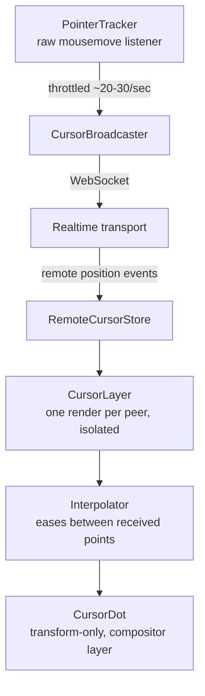
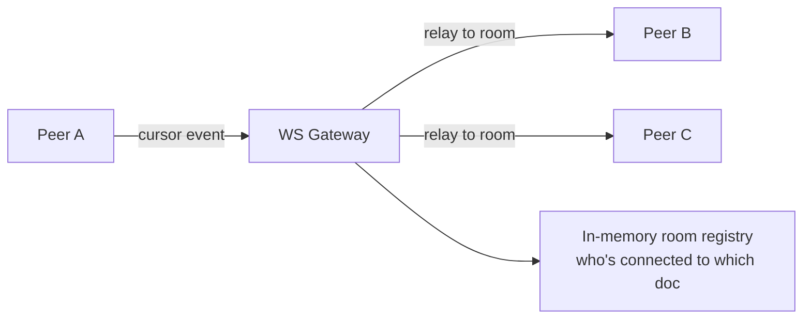

## Overview

- **Real-world analog:** Figma, FigJam, multiplayer editors and whiteboards.
- **Difficulty:** Medium · **Mechanism family:** Real-time coordination — a high-frequency, low-value-per-event stream.
- The core challenge isn't drawing a cursor — it's moving 30 remote cursors smoothly without flooding the network or melting the render loop, when the raw input event rate is unusably high.

## Clarifying Questions & Requirements

> **Ask these first:**
> 1. How many concurrent peers realistically share one canvas — 5, 30, or 500? The answer changes whether naive broadcast is even viable.
> 2. Do cursors need labels (name, avatar color), or just a dot?
> 3. Does this run alongside real content edits (so cursor position has to stay meaningful as the document reflows), or over a static canvas?
> 4. Mobile/touch support, or pointer-only?

| | In scope | Out of scope |
|---|---|---|
| **Functional** | Broadcasting and rendering N remote pointer positions in real time, labeled cursors, graceful degradation with many peers | Click-to-select multiplayer editing itself (that's `collaborative-editor`/`design-drawing-tool`), voice/video presence |
| **Non-functional** | Smooth-looking motion despite a sparse, throttled data stream; bounded network and render cost regardless of peer count | Perfect positional accuracy — a cursor lagging the real mouse by ~50-100ms is invisible to a user, not a defect |

## ── FRONTEND TRACK (RADIO) ──

### R — Requirements

| | Requirement | Why it's not optional |
|---|---|---|
| **Functional** | Render every connected peer's cursor position, with a label, updating in real time | The entire point of the feature — anything less isn't "live cursors" |
| **Non-functional** | Outbound updates are bounded regardless of how fast the local mouse actually moves | A raw `mousemove` stream is 60-120 events/sec — broadcasting that verbatim is the single most common mistake in this question |
| **Non-functional** | Motion still reads as smooth on the receiving end even though updates arrive sparsely | Throttling the sender creates visibly choppy motion on the receiver unless the receiver does its own interpolation |
| **Non-functional** | Rendering N cursors doesn't degrade the app's own interactivity | A whiteboard with 40 people in it is a real, not hypothetical, case for a product like Figma |

This is a **Medium** question specifically because the correctness bar is low — last-write-wins is fine, nobody's money or document state depends on cursor accuracy — but the *performance* bar (bounded network, bounded render cost, still looks smooth) is genuinely senior-signal.

### A — Architecture



- **`PointerTracker` and `CursorBroadcaster` are separate from the render path entirely** — the raw `mousemove` handler never touches React state or triggers a render; it only feeds a throttled function that emits over the wire. Wiring raw pointer events directly into component state is what causes a live-cursor feature to visibly tank the whole app's frame rate.
- **`CursorLayer` renders each peer's cursor in its own isolated node**, not as a list mapped inside a shared parent that re-renders on every update — one peer's position update should never cause every other peer's cursor (or, worse, the underlying canvas content) to re-render.

```ts
function useThrottledBroadcast(send: (pos: Point) => void, hz = 25) {
  const last = useRef(0);
  const pending = useRef<Point | null>(null);

  return useCallback((pos: Point) => {
    pending.current = pos;
    const now = performance.now();
    if (now - last.current >= 1000 / hz) {
      send(pending.current);
      last.current = now;
      pending.current = null;
    }
  }, [send, hz]);
}
```

Note this isn't a plain debounce — it drops intermediate positions but never delays the *most recent* one past the interval, which matters for perceived responsiveness (a debounced cursor feels laggy; a throttled one feels merely lower-resolution).

### D — Data Model

| | Owner | Example |
|---|---|---|
| **Server / peer state** | Every other connected user's last-known cursor position, label, color | Received over the realtime transport, never persisted |
| **Client state** | The local user's own raw pointer position, interpolation animation state per remote cursor | Never sent anywhere except the throttled broadcast |

```ts
type RemoteCursor = {
  userId: string;
  label: string;
  color: string;
  targetPos: Point;      // last position received from the wire
  renderedPos: Point;    // currently-displayed, eased position
  lastSeenAt: number;    // for staleness/culling
};
```

Deliberately **not normalized/reconciled the way `chat-messaging`'s message store is** — there is no "pending vs. confirmed" state here, no rollback path, because there is nothing to roll back. A stale or slightly-wrong cursor position simply gets overwritten by the next update. This is the direct, concrete consequence of sitting at the "pure ephemeral motion" end of the consistency spectrum, not the "money/inventory" end.

### I — Interface / API

**Component API**

```
<CursorLayer cursors={RemoteCursor[]} />
<RemoteCursorDot cursor={RemoteCursor} />
```

**Network API** — the shared contract with the backend track below:

| Action | Transport | Shape |
|---|---|---|
| Broadcast position | WebSocket event, throttled client-side to ~20-30/sec | `{ type: 'cursor', x, y, docId }` (fire-and-forget, no ack) |
| Receive peer position | WebSocket event | `{ type: 'cursor', userId, x, y }` |
| Peer joined/left | WebSocket event | `{ type: 'presence', userId, status: 'joined' \| 'left' }` |

### O — Optimizations

**Performance**
- Throttle outbound updates to ~20-30/sec — well above what's perceptible as choppy, well below the raw event rate.
- Interpolate/ease between received points on the receiving end rather than snapping — a simple `lerp` toward the latest `targetPos` each animation frame reads as smooth even though updates arrive sparsely.
- Animate cursors with CSS `transform` only, never `top`/`left` — a transform-only update stays on the compositor thread and never triggers layout, which is what makes 30 simultaneously-animating cursors affordable at all.

**Resilience**
- Cull cursors that haven't updated within a short timeout (a few seconds) — a peer whose tab crashed or lost connection shouldn't leave a permanently frozen ghost cursor on screen.
- Cull off-screen cursors from the render tree entirely (not just visually hide them) once peer count gets large, since a cursor nobody can see costs nothing to skip and something to keep animating.

### Frontend Deep Dives

**1. Throttle, don't debounce, the outbound stream.** A naive `mousemove` listener fires 60-120 times a second; broadcasting every event is both wasteful and, past a handful of peers, a real bandwidth and server fan-out problem. The fix is throttling (send at most once per interval, using the *latest* position, never delaying it) rather than debouncing (which only fires after motion *stops* — completely wrong for a feature whose entire point is showing motion while it's happening).

**2. Interpolating on sparse data without introducing visible lag.** Once the sender is throttled to ~25/sec, naively snapping the receiver's cursor to each new position on arrival looks visibly jerky — the cursor "teleports" between the sparse points instead of appearing to glide. The fix eases toward the latest target position every animation frame rather than jumping to it immediately:

```ts
function useInterpolatedCursor(target: Point, speed = 0.25) {
  const [rendered, setRendered] = useState(target);
  useAnimationFrame(() => {
    setRendered((prev) => ({
      x: prev.x + (target.x - prev.x) * speed,
      y: prev.y + (target.y - prev.y) * speed,
    }));
  });
  return rendered;
}
```

A small, fixed catch-up factor per frame produces motion that looks continuous even though the underlying data is sparse — the same trick behind smooth network-game character movement.

**3. Rendering many cursors without recomputing layout on every update.** Rendering 30 independently-updating cursors as siblings inside one parent component, keyed by array index or naively re-rendering the whole list on any single peer's update, causes every cursor to re-render whenever any one of them moves. Isolating each `RemoteCursorDot` as its own component keyed by stable `userId`, updating only its own transform via a ref rather than triggering a parent re-render, keeps the cost of N cursors closer to N independent, cheap updates rather than N² of them.

### Frontend Bottlenecks & Tradeoffs

| Bottleneck | Mitigation | Tradeoff accepted |
|---|---|---|
| Raw `mousemove` event rate (60-120/sec) | Throttle outbound broadcast to ~20-30/sec | Slightly lower positional resolution, invisible after interpolation |
| N cursors all re-rendering on any single update | Per-cursor isolated render, transform-only animation | Marginally more component overhead per cursor, in exchange for real isolation |
| Unbounded cursor count in very large sessions | Cull off-screen and stale cursors from the render tree | A peer scrolled far off-screen simply isn't rendered until back in view — acceptable, since they were invisible anyway |

## ── BACKEND TRACK ──

### Requirements & Scope

- Relay each connected peer's position updates to every other peer sharing the same document/room, in real time, with no durable storage requirement.
- This track is deliberately light — cursor position carries essentially no business value once delivered, so there is no persistence, no conflict resolution, and no consistency guarantee beyond "eventually every peer sees roughly where everyone else's cursor is."

### Scale & Estimation

| | Estimate |
|---|---|
| Peers per room | Typically single digits to low tens; design for up to ~100 as a reasonable ceiling |
| Updates/peer/sec | ~20-30 (client-throttled) |
| Fan-out per update | (peers − 1) — a 30-person room means each update fans out to 29 others |
| Peak messages/sec, one hot room | 30 peers × 25/sec × 29 fan-out ≈ **~21,750 msg/sec for a single room** — this is the number that actually matters, not aggregate DAU, since cursor fan-out is entirely room-local |

### API Design

```
WS  cursor  {x, y, docId} → (no ack, fire-and-forget)
WS  cursor  → {userId, x, y}  (relayed to every other peer in the same room)
WS  join    {docId} → {peers: [{userId, label, color}, ...]}
WS  leave   → {userId}  (broadcast on clean disconnect or heartbeat timeout)
```

- No REST endpoint at all — this entire feature lives on the realtime transport, since there is nothing here worth a durable HTTP resource.

### Data Model & Storage

There is deliberately **no persistent storage** for this feature. Peer position is held only in server memory, scoped to the room's active WebSocket connections, and discarded the instant a peer disconnects.

| Choice | Why |
|---|---|
| **In-memory room registry**, not a database table | Position data has zero value after the next update arrives — persisting it would be pure overhead with no read path that ever needs history |
| **Room-scoped fan-out**, not a global pub/sub topic | Cursor updates are only ever relevant to peers currently viewing the same document — broadcasting globally would be both wasteful and meaningless |

### High-Level Architecture



- A single stateless WS Gateway layer can hold the in-memory room registry per-instance as long as all peers of one room are pinned to the same gateway instance (typical for small-to-medium rooms); larger deployments route room membership through a shared registry (e.g. Redis pub/sub keyed by `docId`) so peers on different gateway instances still see each other.

### Deep Dives

**1. Keeping fan-out cost bounded as room size grows.** Fan-out cost is O(peers²) in the worst naive case (every peer's update relayed to every other peer, independently). For the realistic room sizes this feature targets (tens, not thousands, of concurrent peers), this is genuinely fine — the throttled per-peer rate keeps absolute volume low even at O(n²). If room sizes were expected to reach the hundreds, the fix would be capping which peers actually receive live position (e.g. only those with the document currently in viewport) rather than broadcasting to every connected peer regardless of relevance — but for this question's realistic scope, that's an explicitly-named-and-deferred optimization, not something to over-engineer up front.

**2. Detecting a peer that disconnected uncleanly.** A closed tab doesn't always send a clean disconnect frame. Fix: the same heartbeat/TTL pattern presence systems use — if no message (including a lightweight heartbeat, separate from cursor updates) arrives from a peer within a short timeout, the server treats them as gone and broadcasts a `leave` event, rather than waiting indefinitely for a disconnect that may never cleanly arrive.

### Bottlenecks & Tradeoffs

| Bottleneck | Mitigation | Tradeoff accepted |
|---|---|---|
| O(n²) fan-out in a very large room | Not solved at this scope — explicitly deferred, since realistic room sizes keep this cheap | Would need viewport-based filtering if room sizes grew into the hundreds |
| A peer's gateway instance restarting mid-session | Peer reconnects, rejoins the room registry, briefly disappears from others' cursor layers | A momentary missing cursor during reconnect — acceptable, since the feature has no correctness requirement to violate |

## The Shared Contract

- **Transport:** WebSocket — the client genuinely needs to both send and receive on the same low-latency channel; SSE's one-way nature doesn't fit a feature whose entire point is bidirectional position broadcast.
- **Ownership boundary:** unusually flat compared to most questions in this course — neither side "owns" cursor position in any durable sense; the server is a pure relay, and the client is the only source of truth for its own position at any given instant.
- **Consistency posture:** last-write-wins, explicitly and deliberately — this sits at the opposite end of the consistency spectrum from a question like `seat-booking`, and naming that contrast explicitly is a strong signal in an interview.
- **Error propagation:** there is effectively none to design — a dropped cursor update is simply superseded by the next one; there is no failure state worth surfacing to the user.

## Interview Signals

| | Strong answer | Weak answer |
|---|---|---|
| **Frontend** | Explicitly separates throttling (sender) from interpolation (receiver) as two different problems; names transform-only animation as the reason many cursors stay affordable | Says "I'd throttle the mousemove events" and stops there, with no mention of how the receiver makes sparse updates look smooth |
| **Backend** | Explains why this feature needs no persistence at all, and why that's a deliberate simplification, not an oversight | Designs a database schema for cursor positions — a clear sign of not recognizing the mechanism family |
| **Both** | States the consistency posture explicitly (last-write-wins, and why that's *correct* here, not a shortcut) | Never addresses correctness/consistency at all, treating it as obviously not a concern without saying so |

**Common failure modes:** broadcasting raw, unthrottled mousemove events; snapping cursors to each new position instead of interpolating, producing visibly jerky motion; designing persistence or conflict resolution for a feature that structurally needs neither; not noticing that fan-out cost — not storage or compute — is the actual scaling concern here.

## Glossary Links

This question draws on: WebSocket, Presence, Consistency model — each linked on first mention above.
