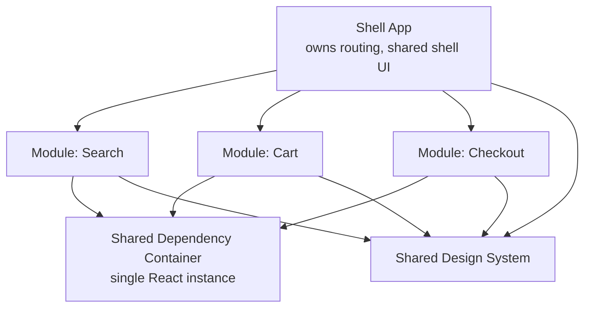
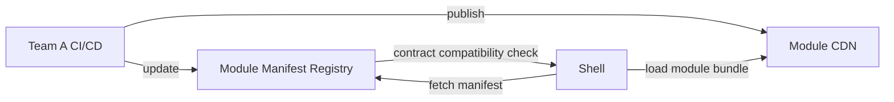

## Overview

- **Real-world analog:** independently deployed frontend modules composed into one product, as at large e-commerce platforms and enterprises with many autonomous frontend teams.
- **Difficulty:** Hard · **Asked at:** large enterprises, e-commerce platforms.
- The core challenge isn't splitting an app into pieces — it's letting genuinely independent teams ship independently *without* the composed product feeling fragmented, breaking on version mismatches, or duplicating a full framework runtime per module.

## Clarifying Questions & Requirements

> **Ask these first:**
> 1. How many teams/modules, and do they need independently *deployable* releases, or just independently *developed* code that still ships together?
> 2. Same framework/version across all modules, or genuinely heterogeneous (React here, Vue there)?
> 3. Do modules need to share application state, or is each one an isolated, self-contained feature with its own state?
> 4. Is this a full page composed of multiple micro-frontends simultaneously, or route-level (one micro-frontend owns a whole page)?

| | In scope | Out of scope |
|---|---|---|
| **Functional** | Independently deployable modules composed into one product, shared design system, cross-module navigation | A generic plugin marketplace for third-party-authored modules |
| **Non-functional** | No duplicate framework runtime shipped per module; consistent UX across module boundaries; one team's deploy can't silently break another's module | Zero-coordination deploys across breaking shared-dependency changes (some coordination is unavoidable) |

## ── FRONTEND TRACK (RADIO) ──

### R — Requirements

| | Requirement | Why it's not optional |
|---|---|---|
| **Functional** | Multiple independently-built modules render as one coherent page/app | The entire premise of the pattern — if it doesn't feel like one product, the composition has failed |
| **Functional** | Cross-module navigation and, where needed, shared state (e.g. logged-in user, cart contents) | Teams are independent; the *product* the user experiences is not |
| **Non-functional** | A single React (or other framework) instance across modules, not one per module | Shipping a full framework runtime per module multiplies bundle size and, worse, breaks anything relying on a single shared instance (context, hooks) |
| **Non-functional** | One module's independent deploy can't break another module purely through a shared-dependency version mismatch | This is the actual hard engineering problem this question tests — see Deep Dives |

### A — Architecture



- **The shell owns routing and the outer chrome** (nav, footer, auth state) and is the only piece that knows about *all* modules; individual modules don't need to know about each other, only about the shell's composition contract.
- **A shared dependency container, not per-module bundling of the framework**, is what makes "single React instance" actually true at runtime — each module's build marks React as an external dependency rather than bundling its own copy, and the shell (or a shared runtime layer) provides the single actual instance every module resolves against.

```ts
// Module Federation-style remote consumption — the module doesn't bundle React,
// it resolves it from the host's shared scope at runtime.
const CartModule = React.lazy(() => import('cart/CartWidget'));
// webpack/rspack config on the module's side:
// shared: { react: { singleton: true, requiredVersion: '^18.0.0' } }
```

### D — Data Model

| | Owner | Example |
|---|---|---|
| **Shell-owned state** | Current route, authenticated user, feature flags — genuinely cross-cutting | Passed down to modules via a defined shared-state contract, not ambient global mutation |
| **Module-owned state** | Everything internal to that module's own feature | Never reached into directly by another module or the shell |

```ts
// The shared-state contract is an explicit, versioned interface — not "reach into another
// module's internals," which is exactly what makes modules independently deployable at all.
type ShellContext = {
  user: { id: string; isAuthenticated: boolean } | null;
  cartItemCount: number;
  navigate: (path: string) => void;
};
```

> **Key insight:** the *shape* of `ShellContext` is itself a versioned contract between the shell and every module — changing it is exactly as consequential as a backend changing a public API response shape, and needs the same discipline (additive changes are safe, removing/renaming a field is a breaking change to every consuming module simultaneously).

### I — Interface / API

**Module composition API**

```
// Shell side — mounts a remote module by name
<RemoteModule name="cart" fallback={<CartSkeleton />} />

// Module side — the contract it must implement to be mountable by the shell
export function mount(container: HTMLElement, context: ShellContext): () => void {
  // renders into container, returns an unmount function
}
```

**Integration approaches — the shared contract with the backend track's deploy-topology discussion below:**

| Approach | Mechanism | Tradeoff |
|---|---|---|
| **Module Federation** (webpack/rspack) | Runtime remote loading, shared dependency resolution | Genuine runtime independence and a single shared React instance; more build-config complexity |
| **Build-time integration** | Modules published as packages, composed at the shell's build time | Simpler mental model; loses true independent *deploy* — a module change still needs the shell rebuilt |
| **iframes** | Full isolation, separate document/runtime per module | Maximum isolation (different frameworks, no version conflicts at all); genuinely hard to share state/styling/routing across the boundary, and accessibility (focus, screen reader) across iframe boundaries is a real, recurring problem |

### O — Optimizations

**Performance**
- Lazy-load modules that aren't on the current route/viewport — the whole point of independent modules is not paying for code the current page doesn't need.
- Cache the shared dependency bundle (React, the design system) aggressively and separately from each module's own code, since it changes far less often.

**Accessibility**
- A single, consistent focus-management strategy across module boundaries — a module that's internally accessible but whose mount/unmount doesn't correctly hand focus to/from the shell breaks keyboard navigation at exactly the seam between modules, which is easy to miss in isolated per-module testing.

**Networking**
- Modules fetch their own data independently rather than the shell prefetching for all of them — preserves independence, at the cost of some modules potentially waterfalling their own requests behind the shell's initial render.

**Resilience**
- A module that fails to load or throws at mount time degrades to a fallback/skeleton, not a whole-page crash — one team's bug should not be able to take down every other team's module on the same page.

### Frontend Deep Dives

**1. Shared-dependency version skew.** Module A was built against React 18.2, Module B against React 18.3 — if each bundles its own copy, you get two React instances on the same page, which breaks anything relying on a single instance (context providers spanning module boundaries, certain hook behavior) in confusing, hard-to-debug ways. The fix is `singleton: true` shared-dependency configuration (Module Federation) plus a `requiredVersion` range enforced at build/runtime — a module whose required version genuinely can't be satisfied by what the shell provides fails loudly at load time rather than silently double-loading React.

**2. A module deploying independently and breaking the shell's contract.** If Module A's team ships a change that assumes a new field on `ShellContext` the shell doesn't provide yet (deploy-order mismatch, since deploys are independent), the module breaks at runtime for every user, not just in a test environment. The fix: treat the shell↔module contract with the same additive-only, versioned discipline the backend track applies to a public API — and a module declares the contract version it expects, failing gracefully (not silently rendering broken) if the shell's version doesn't satisfy it.

**3. Style isolation without full iframe-level isolation.** Multiple independently-built modules' CSS can collide (the same class name meaning different things) unless each module's styles are genuinely scoped — CSS Modules, a build-time class-name-hashing step, or Shadow DOM for the module's root, rather than trusting every team to hand-namespace their own classes consistently, which reliably breaks down as the number of teams grows.

### Frontend Bottlenecks & Tradeoffs

| Bottleneck | Mitigation | Tradeoff accepted |
|---|---|---|
| Every module bundling its own React copy | Shared, singleton dependency resolution (Module Federation) | More build-config complexity, in exchange for one runtime instance and much smaller total bundle size |
| CSS collisions across independently-built modules | Scoped styles (CSS Modules / hashed class names / Shadow DOM) | Slightly more build tooling per module, in exchange for genuine style isolation |
| A module's bug crashing the whole composed page | Per-module error boundaries with fallback UI | The user sees a degraded module rather than a broken page — a real product tradeoff worth stating explicitly |

## ── BACKEND TRACK ──

### Requirements & Scope

- Serve/host each module's build artifacts independently, coordinate which versions are currently "live" for the shell to compose, and support independent deploy pipelines per team.

### Scale & Estimation

| | Estimate |
|---|---|
| Number of independently-deployed modules | 15-30 in a large org |
| Deploys/day across all teams | 20-plus, genuinely independent and asynchronous |
| Module bundle size budget | Tracked per-module, since an oversized module directly taxes every page it's composed into |

### API Design

Not a traditional request/response API — the contract is a **deployment/manifest protocol**:

```
GET /module-manifest/cart
  → { name: 'cart', version: '2.3.1', entryUrl: 'https://cdn/.../cart-2.3.1.js', requiredShellContextVersion: '3.x' }
```

- The shell fetches the current manifest for each module it needs to compose, rather than hardcoding a URL/version at the shell's own build time — this is exactly what makes independent deploys possible: a module team publishes a new version and updates the manifest, and the shell picks it up on the next page load with no shell rebuild required.

### Data Model & Storage

```
module_versions
  module_name       text
  version           text
  entry_url         text
  shell_contract_version  text   -- which ShellContext shape this module expects
  deployed_at       timestamp
  status            enum('active','rolled_back')
```

| Choice | Why |
|---|---|
| A manifest/registry service, not hardcoded module URLs | Decouples "which version is live" from the shell's own release cycle — the entire point of independent deployability |
| `shell_contract_version` tracked per module version | Lets the shell (or a gateway in front of it) refuse to compose a module whose contract expectation it can't satisfy, rather than composing it and breaking at runtime |

### High-Level Architecture



- The registry is the actual coordination point across independently-deploying teams — without it, "independent deploy" degrades into "every team has to know every other team's current URL/version by convention," which doesn't hold up as the org grows.

### Deep Dives

**1. Coordinating independent deploys without a central release train.** The whole point is that teams don't wait on each other — but that means the manifest registry has to be the single, always-current source of truth for "what's live right now," and rollback has to be per-module (revert one module's manifest entry) rather than a whole-app rollback, which would defeat the independence the architecture exists to provide.

**2. Contract versioning between shell and modules at deploy time, not just build time.** Because deploys are asynchronous, there's always a window where the shell's actual deployed contract version and a module's expected version can briefly disagree. The registry's compatibility check (from the manifest) is what catches this *before* composing a broken module into a live page, rather than discovering it from user-facing errors.

### Bottlenecks & Tradeoffs

| Bottleneck | Mitigation | Tradeoff accepted |
|---|---|---|
| No central coordination point across independent deploys | A manifest/registry service as the explicit source of truth | One more piece of shared infrastructure every team depends on — an acceptable, necessary centralization given what it prevents |
| A module and shell briefly disagreeing on contract version mid-deploy | Compatibility check against `shell_contract_version` before composing | A module can be temporarily un-composable (shows a fallback) rather than composed-and-broken, during a narrow deploy window |

## The Shared Contract

- **The "API" is a module manifest and a shell↔module runtime contract**, not a conventional network API — but it needs the exact same discipline: additive-only changes are safe, and a breaking contract change requires real coordination across every consuming module, the same way a backend's breaking API change requires coordinating every client.
- **Ownership boundary:** the shell owns composition, routing, and the shared-state contract's shape; each module owns everything inside its own boundary and its own independent deploy cadence.
- **Failure isolation:** a module that fails to load or violates its declared contract version degrades to a fallback in its own slot — it never takes down the shell or sibling modules.

## Interview Signals

| | Strong answer | Weak answer |
|---|---|---|
| **Frontend** | Explains shared-dependency singleton resolution and names version skew as a real, specific risk | Describes "each team builds their own part" with no discussion of how the framework runtime is shared |
| **Backend** | Treats the module manifest/registry as the actual coordination point for independent deploys | Assumes independent deploy "just works" with no registry or version-compatibility mechanism |
| **Both** | Discusses the tradeoff between Module Federation, build-time integration, and iframes explicitly, with reasons | Picks one approach without naming what was given up |

**Common failure modes:** treating "split into multiple repos" as equivalent to a real micro-frontend architecture; ignoring shared-dependency version skew entirely; no story for what happens when one module fails to load.

## Glossary Links

This question draws on: RADIO framework — each linked on first mention above. See Proposed glossary additions for Module Federation and version skew.
