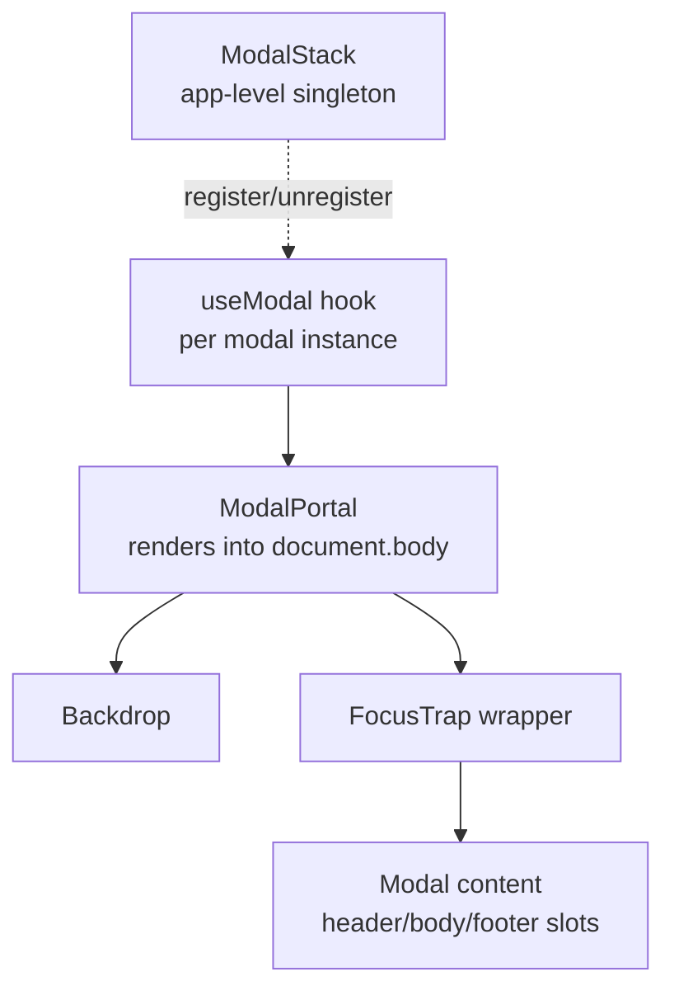

## Overview

- **Real-world analog:** Confirmation dialogs, lightboxes.
- **Difficulty:** Medium · **Asked at:** Meta, Amazon, GreatFrontEnd bank.
- The core challenge is entirely about correctness under composition: focus, scroll, and stacking all have to keep working when a second modal opens on top of the first, or when the modal lives deep inside an already-complex component tree.

## Clarifying Questions & Requirements

> **Ask these first:**
> 1. Can modals stack (a confirmation dialog opened from within another modal), or is only one ever open at a time?
> 2. Controlled (parent owns open/closed state) or uncontrolled (the modal manages its own), or does the API need to support both?
> 3. Does closing always need explicit confirmation, or is click-outside/Escape always allowed?
> 4. Any content inside the modal that itself needs to trap focus differently (a nested dropdown, a date picker)?

| | In scope | Out of scope |
|---|---|---|
| **Functional** | Focus trap, backdrop, scroll lock, Escape/click-outside close, stacking, composable header/body/footer | Animation/transition library choice, modal-specific routing (deep-linking to an open modal) |
| **Non-functional** | Focus never silently escapes to the page behind the modal; screen reader users always know a modal is open | Sub-16ms open/close animation performance guarantees |

## ── FRONTEND TRACK (RADIO) ──

### R — Requirements

| | Requirement | Why it's not optional |
|---|---|---|
| **Functional** | Portal-rendered overlay, backdrop, Escape/click-outside close, focus trap, composable content slots | This is a real accessibility-critical primitive reused across an entire product — getting it right once matters more than most components in this bank |
| **Non-functional** | Focus moves *into* the modal on open and *back to the trigger element* on close | The single most commonly-missed requirement in real implementations, and the easiest to test for in an interview |
| **Non-functional** | Body scroll is locked while any modal is open, and correctly restored when the *last* one closes | Naive scroll-locking breaks when a second modal opens and closes before the first — see Deep Dives |

### A — Architecture



- **`ModalPortal`** renders outside the triggering component's DOM subtree (via `createPortal`) specifically so the modal's `z-index`/stacking context and screen-reader tree position aren't dependent on where in the page the trigger button happens to live.
- **`ModalStack`** is a small app-level singleton tracking which modals are currently open, in open-order — this is what makes stacking, scroll-lock reference-counting, and "Escape closes only the topmost modal" all correct, rather than each modal instance managing global concerns independently and stepping on each other.

### D — Data Model

| | Owner | Example |
|---|---|---|
| **Client state** | Open/closed, which element triggered it (for focus restoration), stack position | Entirely local/ephemeral |

```ts
type ModalStackEntry = {
  id: string;
  triggerElement: HTMLElement | null; // to restore focus to on close
};

// module-level singleton, not component state — it needs to survive
// and coordinate across every modal instance in the tree simultaneously
const modalStack: ModalStackEntry[] = [];
```

### I — Interface / API

```
<Modal open={boolean} onClose={() => void} initialFocusRef={RefObject<HTMLElement>?}>
  <Modal.Header>...</Modal.Header>
  <Modal.Body>...</Modal.Body>
  <Modal.Footer>...</Modal.Footer>
</Modal>
```

- Controlled by default (`open`/`onClose` as explicit props) — a compound-component API (`Modal.Header`/`Body`/`Footer`) rather than a rigid `title`/`content`/`actions` prop trio, since real modal content varies too much for a fixed slot API not to become limiting quickly.
- `initialFocusRef` is an escape hatch for the (fairly common) case where the first focusable element isn't the right one to focus first (e.g. a destructive confirm dialog should default focus to Cancel, not Confirm).

There's no meaningful Network API for a modal itself — it's a pure presentation primitive. Whatever content it renders may have its own network dependency, but that's the content's concern, not the modal's.

### O — Optimizations

**Accessibility**
- `role="dialog"` and `aria-modal="true"` on the modal container; `aria-labelledby`/`aria-describedby` pointing at the actual heading/description elements inside it, not duplicated text.
- Focus trap: Tab and Shift+Tab both cycle *within* the modal only — never let focus silently move to something behind it that's supposedly inert.
- On close, focus returns to the exact element that opened the modal, not to `document.body` or the top of the page.

**Performance**
- Mount modal content lazily (only render its subtree when `open` first becomes true, or keep it unmounted entirely when closed) rather than always rendering it `display: none` — a page with many potential modals shouldn't pay the render cost for all of them up front.

**Resilience**
- If a modal's own content throws during render, the error boundary should be scoped to the modal, not the whole page — a broken confirmation dialog shouldn't take down the page behind it.

### Frontend Deep Dives

**1. The focus trap itself.** A naive focus trap listens for Tab and manually calls `.focus()` on the first/last focusable element when it detects the boundary — but "detects the boundary" is fragile if implemented by checking `document.activeElement` against a stale list of focusable elements (computed once on mount) rather than re-querying live, since a modal's content can change (an accordion expands, revealing new focusable elements) while it's open.

```ts
function trapFocus(container: HTMLElement, e: KeyboardEvent) {
  if (e.key !== 'Tab') return;
  const focusable = container.querySelectorAll<HTMLElement>(
    'button, [href], input, select, textarea, [tabindex]:not([tabindex="-1"])'
  ); // re-queried live, every keypress — not cached at mount time
  const first = focusable[0];
  const last = focusable[focusable.length - 1];
  if (e.shiftKey && document.activeElement === first) {
    e.preventDefault();
    last.focus();
  } else if (!e.shiftKey && document.activeElement === last) {
    e.preventDefault();
    first.focus();
  }
}
```

**2. Scroll-lock reference counting across stacked modals.** Locking scroll by setting `document.body.style.overflow = 'hidden'` on open and clearing it on close breaks the moment a second modal opens and closes while the first is still open — the second modal's close handler blindly clears `overflow`, unlocking scroll even though the first modal is still open behind it. The fix is a reference count (or reusing `ModalStack.length` directly) — scroll unlocks only when the *stack*, not any individual modal, becomes empty.

**3. Escape closing only the topmost modal.** With two modals stacked, pressing Escape should close the second one, not both, and not the first one instead of the second. This only works correctly if there's a single, shared keydown listener consulting `ModalStack`'s current top entry — not each modal instance independently listening for Escape and each deciding, on its own, whether it's "the one" to close, which produces race conditions in which handler fires first.

### Frontend Bottlenecks & Tradeoffs

| Bottleneck | Mitigation | Tradeoff accepted |
|---|---|---|
| Stale focusable-element list in the trap | Re-query on every Tab keypress, not once at mount | Marginally more work per keypress — negligible in practice, and correctness matters more here than micro-perf |
| Naive scroll-lock breaking under stacking | Reference-count via a shared `ModalStack`, not per-instance state | Requires a small app-level singleton instead of fully independent modal instances |
| Rendering all potential modal content eagerly | Mount lazily on first open | The very first open of a modal pays a small extra render cost that subsequent opens don't |

## ── BACKEND TRACK ──

This is a pure frontend primitive — there is no backend component to a modal dialog at all. Whatever action a modal's content triggers (submitting a form, confirming a delete) has its own backend concern entirely separate from the modal mechanism itself.

## The Shared Contract

Not applicable — there is no client/server boundary for this component. This section is intentionally omitted from the skeleton for this question rather than padded with an invented contract.

## Interview Signals

| | Strong answer | Weak answer |
|---|---|---|
| **Frontend** | Names the scroll-lock-under-stacking bug and the stale-focusable-list bug unprompted | Describes a modal that works correctly for exactly one instance at a time and stops there |
| **Frontend** | Uses a portal and explains *why* (stacking context, DOM position independence) | Renders the modal inline and doesn't address z-index/stacking-context risk |
| **Backend** | Correctly identifies there's no real backend component here | Invents unnecessary backend "modal state" persistence |

**Common failure modes:** building a focus trap that works once but breaks under stacking; forgetting to restore focus on close; locking scroll with a boolean instead of a reference count.

## Glossary Links

No existing glossary terms apply — this question's hard problems (focus trapping, scroll-lock reference counting, portal rendering) are DOM/accessibility implementation techniques rather than the kind of cross-cutting system-design vocabulary the shared glossary tracks.

**Proposed glossary additions:** none.
