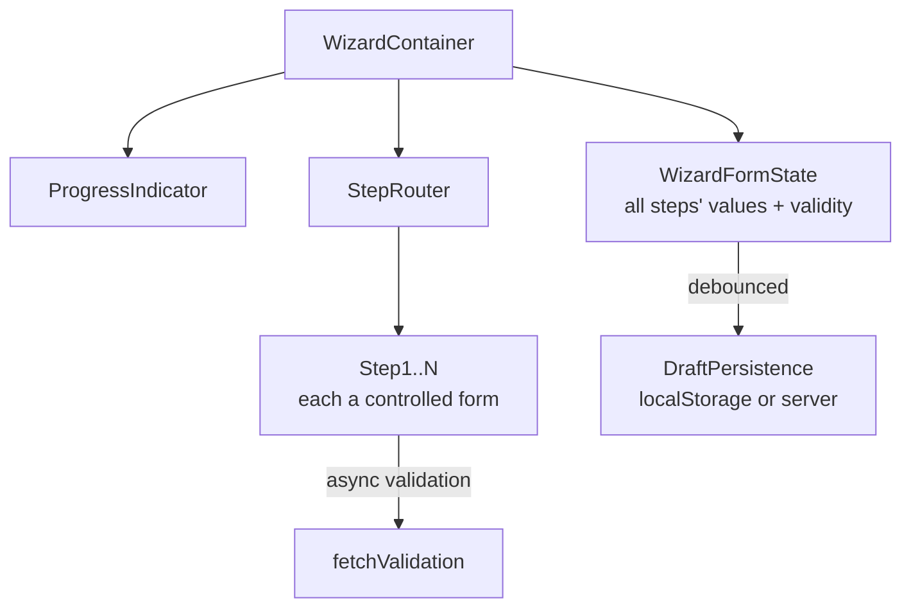

## Overview

- **Real-world analog:** Checkout, onboarding flows.
- **Difficulty:** Medium · **Asked at:** Amazon, Stripe, fintech.
- The core challenge is state management across time and navigation, not any single step's UI — the form has to hold correct, validated state across steps a user might revisit, skip backward through, or abandon and resume days later.

## Clarifying Questions & Requirements

> **Ask these first:**
> 1. Can a user navigate backward and change an earlier answer, and if so, does that ever invalidate a later step (e.g. changing country invalidates a state/province already selected)?
> 2. Does progress need to survive a page reload or a return visit days later (a real "resumability" requirement, common in checkout/onboarding)?
> 3. Is validation purely client-side, or does any step need a server round-trip (e.g. checking an email isn't already registered) before allowing "Next"?
> 4. Is step order fixed, or can steps be conditionally skipped based on earlier answers?

| | In scope | Out of scope |
|---|---|---|
| **Functional** | Per-step validation, progress indicator, back/forward nav, draft persistence, async field validation | Payment processing internals, a visual form-builder for defining the steps themselves |
| **Non-functional** | Never allows submission of invalid data; never silently loses a user's progress | Sub-100ms server-side validation latency guarantees |

## ── FRONTEND TRACK (RADIO) ──

### R — Requirements

| | Requirement | Why it's not optional |
|---|---|---|
| **Functional** | Step components, progress indicator, validated forward navigation, backward navigation without data loss, draft save | The functional list is short, but "validated forward navigation" and "draft save" both carry real state-management weight |
| **Non-functional** | Changing an earlier answer that invalidates a later one is surfaced immediately, not discovered silently at final submit | A real, commonly-tested correctness requirement — the country/state example above is the canonical case |
| **Non-functional** | An accessibility-conformant error summary and focus management on validation failure | This is one of the most concretely testable a11y requirements in this whole bank |

### A — Architecture



- **`WizardFormState` holds every step's data simultaneously**, not just the current step's — this is what makes cross-step invalidation (the country/state example) and final-submit validation both possible, since a design that discards each step's state on navigating away can't re-validate it later without re-collecting it.
- Steps are rendered by a `StepRouter` keyed by current step index/id — often backed by actual URL routing (`/onboarding/step-2`) so back/forward *browser* navigation (not just in-wizard buttons) works correctly too, a detail worth naming explicitly since it's easy to build a wizard that only handles its own Next/Back buttons and breaks on the browser's back button.

### D — Data Model

| | Owner | Example |
|---|---|---|
| **Client state** | All steps' field values, per-field validity/errors, current step index, "dirty" flags | The wizard's own in-progress state |
| **Server state** (if resumable) | The persisted draft, keyed by user/session | Only touches the network on debounced save, not per-keystroke |

```ts
type WizardState = {
  currentStepIndex: number;
  steps: {
    [stepId: string]: {
      values: Record<string, unknown>;
      errors: Record<string, string>;
      status: 'untouched' | 'valid' | 'invalid' | 'validating';
    };
  };
};
```

> **Key insight:** validity is tracked **per step**, not just globally as "can I submit" — this is what makes the progress indicator able to show which specific step has an error, and what makes cross-step invalidation traceable back to a specific step rather than surfacing as a vague final-submit failure.

### I — Interface / API

**Component API**

```
<Wizard steps={StepDef[]} onComplete={(values) => void} persistDraft={boolean}>
  <Step id="account" validate={(values) => ValidationResult}>...</Step>
  <Step id="address" validate={(values) => ValidationResult} dependsOn={['account']}>...</Step>
</Wizard>
```

`dependsOn` is the explicit hook for cross-step invalidation — a step declares which earlier steps' values it depends on, and the wizard re-validates it automatically if any of those change, rather than every step's component independently trying to detect a relevant earlier change.

**Network API** — the shared contract with the backend track below:

| Action | Transport | Shape |
|---|---|---|
| Async field validation (e.g. email uniqueness) | `POST /validate/:field` | `{ value }` → `{ valid, message? }` |
| Save draft | `POST /drafts/:id` | Debounced, full or partial step state |
| Submit | `POST /submissions` | Full validated payload, all steps |

### O — Optimizations

**Performance**
- Debounce both async field validation (don't fire a uniqueness check on every keystroke) and draft-save requests — the exact same debounce discipline autocomplete applies to search input, applied here to form input.
- Lazy-mount step components — don't render/validate step 5's form fields while the user is still on step 1.

**Accessibility**
- On a failed validation attempt to advance, focus moves to a real error summary region (`role="alert"` or a focused heading listing the errors), not silently to the first invalid field with no announcement — a screen reader user needs to be told *that* an error occurred, not just have focus silently relocated.
- The progress indicator communicates current/completed/upcoming step state to assistive technology (`aria-current="step"`), not just visually via color/styling.

**Resilience**
- Draft persistence survives a full page reload (localStorage at minimum, a server-side draft for genuine cross-device resumability) — abandoning a checkout on step 3 and returning later shouldn't mean starting over.
- A failed async validation call (network error, not a validation failure) is distinguished from an actual invalid-value failure — the UI shouldn't tell a user their email is "invalid" because the validation *request* failed, not because the email itself failed the check.

### Frontend Deep Dives

**1. Cross-step invalidation without a tangled web of manual checks.** The `dependsOn` declaration from the Interface section is the concrete mechanism: when step "account"'s values change, the wizard looks up every other step that declared a dependency on it and re-runs *their* validation against the new values, surfacing a fresh error on the dependent step if it now fails — without this, cross-step invalidation either doesn't happen at all (a real, commonly-shipped bug: change country to one with no matching state, submit anyway with a stale state value) or gets implemented as ad-hoc, hard-to-maintain manual wiring between specific step pairs.

```ts
function revalidateDependents(state: WizardState, changedStepId: string, stepDefs: StepDef[]) {
  for (const def of stepDefs) {
    if (def.dependsOn?.includes(changedStepId) && state.steps[def.id]?.status !== 'untouched') {
      const result = def.validate(collectValuesFor(state, def.dependsOn.concat(def.id)));
      state.steps[def.id] = { ...state.steps[def.id], ...toStepValidity(result) };
    }
  }
}
```

**2. Resumability across a genuinely long gap.** A draft resumed days later has to handle the case where something about the *form itself* changed in the meantime (a field was added, a validation rule tightened) — the draft's saved shape may no longer match the current step definitions. A robust resume path re-validates the entire restored draft against current rules before showing it as "resumed successfully," surfacing any now-invalid fields as errors on the relevant step rather than either silently accepting stale-but-now-invalid data or discarding the whole draft outright.

**3. Distinguishing "the value is invalid" from "the validation check itself failed."** An async validator (checking email uniqueness, say) can fail for two structurally different reasons — the email genuinely is taken, or the network request errored/timed out — and conflating them produces a confusing, wrong error message. The fix is a three-state validation status (`valid` / `invalid` / `validation-error`), not a boolean, with the UI presenting a distinct, retry-able message for the network-failure case rather than reusing the "this value is invalid" copy for an error that has nothing to do with the value entered.

### Frontend Bottlenecks & Tradeoffs

| Bottleneck | Mitigation | Tradeoff accepted |
|---|---|---|
| Ad-hoc, manually-wired cross-step validation checks | Explicit `dependsOn` declarations + automatic dependent revalidation | Step definitions have to explicitly declare their dependencies upfront |
| A stale draft resumed against changed form rules | Re-validate the full restored draft against current rules before display | A resumed draft can occasionally surface new errors on fields that were valid when saved |
| Async validation failures read as "value is invalid" | Three-state validation status distinguishing network failure from real invalidity | Slightly more validation-state plumbing than a simple boolean |

## ── BACKEND TRACK ──

### Requirements & Scope

- Serve async field validation checks; persist drafts for resumability; accept and validate a final full submission server-side (never trusting client-side validation alone).

### Scale & Estimation

| | Estimate |
|---|---|
| Draft saves | Debounced client-side to roughly one save per few seconds of active editing per user, not per keystroke |
| Async validation calls | Bursty per field interaction, not sustained high QPS — modest relative to most other questions in this bank |

### API Design

```
POST /validate/email        {value} → { valid: boolean, message?: string }
POST /drafts/:id             {stepId, values} → { savedAt }
GET  /drafts/:id             → { steps: {...}, currentStepIndex }
POST /submissions            {allStepsValues} → { id } | 422 { errors: [...] }
```

- **The final submit is re-validated server-side in full**, independent of whatever the client already checked — client-side validation is a UX convenience (fast feedback), never the actual enforcement boundary; a client can always be bypassed, so the server has to be the real gatekeeper on the final write.

### Data Model & Storage

```
drafts
  id            uuid PK
  user_id       uuid, indexed
  step_values   jsonb    -- keyed by step id, matches the client's WizardState shape
  updated_at    timestamp

submissions
  id            uuid PK
  user_id       uuid
  payload       jsonb
  status        enum('pending','validated','rejected')
  created_at    timestamp
```

| Choice | Why |
|---|---|
| **`jsonb` for `step_values`** | The exact field shape varies per step and can evolve over time (per the resumability deep dive) — a rigid, fully-normalized schema would need a migration for every form-field change, where a flexible document column tolerates evolving shape naturally |
| **Draft and submission as separate tables** | A draft is mutable, frequently overwritten, ephemeral working state; a submission is an immutable, validated, final record — conflating them risks a half-finished draft being mistaken for a real submission |

### High-Level Architecture

A straightforward request/response service is genuinely sufficient here — draft saves and validation checks are simple CRUD-shaped operations against a datastore, with no real-time or fan-out component. The one real architectural decision worth naming is **where async validation logic lives**: inline in the submission service for simple checks (format, uniqueness against one table), or delegated to a separate service if a check needs to call a third party (e.g. an address-verification API, a fraud-check service) — the latter needs its own timeout/fallback handling so a slow third party doesn't block the whole form.

### Deep Dives

**1. Never trusting client-side validation for the final write.** Even with a well-built client-side validation layer (the frontend track's entire Deep Dives section), the server has to independently re-validate every field on final submission — a modified/bypassed client, a stale cached JS bundle enforcing an old validation rule, or a direct API call skipping the UI entirely are all real, common ways invalid data reaches the server if it isn't the actual enforcement point.

**2. Draft-schema evolution over time.** As the form's fields change (a new required field added, an old one removed), old saved drafts don't automatically match the current shape. The practical fix is either versioning the draft schema explicitly (`step_values` includes a `schemaVersion`, and the read path migrates old versions on load) or, more simply, accepting `jsonb`'s natural tolerance for extra/missing keys and re-validating fully on resume (the frontend track's resumability deep dive) rather than requiring the stored shape to be perfectly current at all times.

### Bottlenecks & Tradeoffs

| Bottleneck | Mitigation | Tradeoff accepted |
|---|---|---|
| A slow third-party validation call (e.g. address verification) blocking form progress | A reasonable timeout with a documented fallback (skip the check, or degrade to a simpler local rule) | Occasionally weaker validation than the third-party check would provide, in exchange for the form never hanging indefinitely |
| Draft schema drifting from current form definition over time | `jsonb` storage tolerant of shape changes + full re-validation on resume | No hard schema enforcement at the database level for draft contents |

## The Shared Contract

- **Transport:** plain REST for all three flows (validate, save draft, submit) — no real-time component to this question.
- **Ownership boundary:** the client owns fast, provisional validation feedback; the server owns the actual enforcement — every rule the client checks, the server re-checks independently on final submit, without exception.
- **Draft shape:** both tracks need to agree the draft's stored shape can evolve, and that resuming a draft always re-validates fully against *current* rules rather than trusting the shape as saved.

## Interview Signals

| | Strong answer | Weak answer |
|---|---|---|
| **Frontend** | Names cross-step invalidation as a real, explicit mechanism (`dependsOn`), not an afterthought | Doesn't address what happens when an earlier answer invalidates a later step |
| **Frontend** | Distinguishes a network-failed validation from a genuinely invalid value | Shows the same "invalid" message regardless of failure cause |
| **Backend** | States plainly that server-side re-validation on submit is mandatory, independent of client checks | Trusts the client's validation as sufficient for the final write |
| **Both** | Discusses resumability's schema-drift problem unprompted | Assumes a resumed draft always matches the current form shape |

**Common failure modes:** no cross-step invalidation when an earlier answer changes; trusting client-side validation as the actual enforcement boundary; losing progress on reload with no draft persistence; conflating a network failure with a genuine validation failure.

## Glossary Links

No existing glossary terms apply directly to this question's core mechanics.

**Proposed glossary additions:** none — cross-step dependency validation and draft-schema evolution are real patterns but specific enough to multi-step forms that a standalone glossary entry isn't warranted from this question alone.
