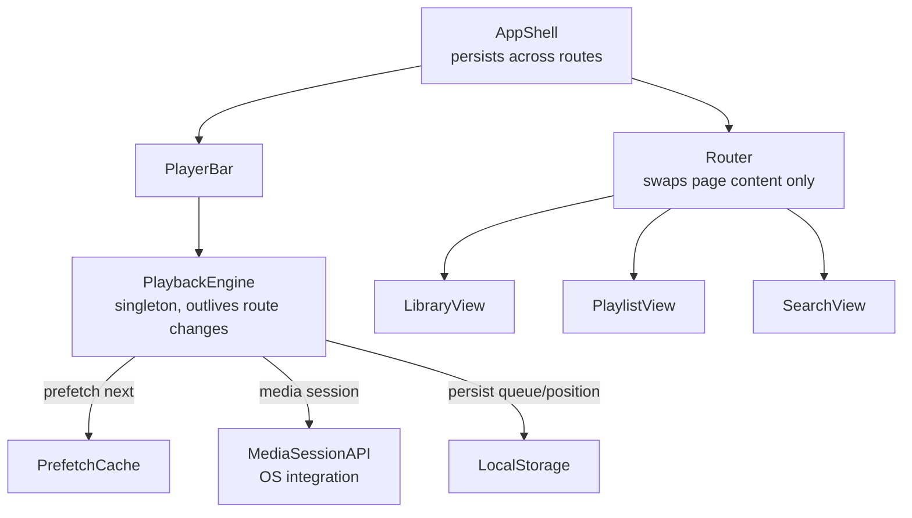
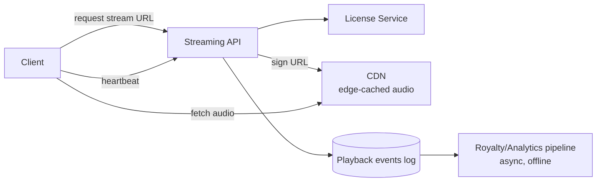

## Overview

- **Real-world analog:** Spotify — persistent playback across navigation.
- **Difficulty:** Hard · **Asked at:** Spotify-style companies, GreatFrontEnd bank.
- The core challenge isn't playing an audio file — it's keeping exactly one continuous playback session alive and gapless while the user navigates through an entire single-page application around it, and making that session smart enough to prefetch what's coming next before the current track even ends.

## Clarifying Questions & Requirements

> **Ask these first:**
> 1. Is offline download/playback in scope, or streaming-only for this pass?
> 2. Gapless playback (zero silence between tracks) as a hard requirement, or acceptable to have a brief gap?
> 3. Does playback need to survive a full page reload, or only in-app navigation (SPA route changes)?
> 4. Multi-device "continue playback" handoff (start on phone, continue on laptop) in scope?

| | In scope | Out of scope |
|---|---|---|
| **Functional** | Persistent player, queue management, library/playlist browsing, search, offline download | Social features (collaborative playlists, following), recommendation-algorithm internals, podcast-specific playback (chapters, speed control) |
| **Non-functional** | Playback never interrupts on in-app navigation; the next track is ready to play with no perceptible gap | Cross-device live handoff mid-track (a valid, harder deep-dive extension) |

## ── FRONTEND TRACK (RADIO) ──

### R — Requirements

| | Requirement | Why it's not optional |
|---|---|---|
| **Functional** | A player bar that persists across every route change, queue view, library/playlist browsing, search, offline downloads | The player surviving navigation is the single defining architectural constraint of this entire product category |
| **Functional** | Playback controls integrate with OS-level media controls (lock screen, hardware media keys, car Bluetooth) | Users expect to control playback without the app in the foreground — this is a baseline expectation, not an enhancement |
| **Non-functional** | Zero audio interruption when navigating between pages within the app | A player that restarts or glitches on every route change fails the product's core promise immediately and visibly |
| **Non-functional** | The next queued track begins with no perceptible gap after the current one ends | This is specifically what "gapless playback" requires engineering effort for — it doesn't happen by default with a naive `<audio>` element swap |
| **Non-functional** | Playback degrades gracefully on a poor connection — buffering shows real progress, doesn't silently stall | Mobile streaming happens constantly on imperfect connections; silent stalls read as the app being broken, not the network |

### A — Architecture



- **`PlaybackEngine` lives at the `AppShell` level, above the router — this is the single most important architectural decision in the whole question.** The router swaps page *content* (library view, playlist view, search results) in and out; it never touches the player, because the player and the audio element it owns are siblings of the router's output, not descendants of any specific route. A design that puts the `<audio>` element inside a route-specific component recreates it (and interrupts playback) on every navigation — this is the single most common way a shallow answer to this question fails.
- **`PrefetchCache` starts fetching the next queued track's audio data before the current track finishes** — not on track-end, which would guarantee a gap while the fetch happens. This is the mechanism the Deep Dives section below expands on for real gapless playback.
- A sketch of why the player has to be outside the router, made concrete:

```tsx
function AppShell() {
  return (
    <>
      <PlaybackEngineProvider>  {/* mounted once, for the app's whole lifetime */}
        <Router>
          <Route path="/library" element={<LibraryView />} />
          <Route path="/playlist/:id" element={<PlaylistView />} />
        </Router>
        <PlayerBar />           {/* sibling of the router's output, not nested inside a route */}
      </PlaybackEngineProvider>
    </>
  );
}
```

### D — Data Model

| | Owner | Example |
|---|---|---|
| **Server state** | Track metadata, playlist contents, library, licensing/availability | Fetched per view; playback URLs are short-lived signed URLs, not permanent |
| **Client state** | Current queue, playback position, volume, offline-download status per track | Playback position is client state synced periodically for cross-device resume, not continuously streamed |

```ts
type PlaybackState = {
  currentTrackId: string | null;
  queue: string[];              // ordered track ids, current + upcoming
  positionMs: number;
  isPlaying: boolean;
  bufferHealth: 'empty' | 'buffering' | 'ready'; // drives UI, distinct from isPlaying
};

type DownloadedTrack = { trackId: string; blobRef: string; downloadedAt: number; expiresAt: number };
```

> **Key insight:** `bufferHealth` and `isPlaying` are deliberately separate fields. A track can be "playing" in intent (the user pressed play) while actually buffering (nothing audible yet) — collapsing these into one boolean produces a UI that either shows a spinner forever during a brief network hiccup or shows "playing" while the user hears silence, both of which read as broken.

### I — Interface / API

**Component API**

```
<PlayerBar state={PlaybackState} onPlayPause={() => void} onSeek={(ms: number) => void} onSkip={(dir: 'next'|'prev') => void} />
<QueueView queue={Track[]} onReorder={(from: number, to: number) => void} />
<TrackRow track={Track} isDownloaded={boolean} onDownloadToggle={() => void} />
```

**Network API** — the shared contract with the backend track below:

| Action | Transport | Shape |
|---|---|---|
| Get streaming URL | `GET /tracks/:id/stream` | Returns a short-lived signed URL, not a permanent one — see Shared Contract |
| Sync playback position | `POST /playback/heartbeat` | `{ trackId, positionMs }`, sent periodically (every ~10-15s), not per-second |
| Fetch queue/playlist | `GET /playlists/:id` | REST, includes track metadata needed to render the queue without N further requests |
| Download for offline | `GET /tracks/:id/download` | Returns an encrypted, license-bound blob, not a raw playable file — see Deep Dives |

### O — Optimizations

**Performance**
- Prefetch the next track's audio (and, ideally, its album art and metadata) once the current track is roughly 80-90% through, so the swap at track-end has zero network latency on the critical path.
- Virtualize long lists (a library of thousands of tracks, a large playlist) — same reasoning as every other list-heavy question in this bank.
- Debounce the position-heartbeat sync (every 10-15 seconds, not every position-update tick) — playback position doesn't need sub-second server sync for this product's actual use case (resuming on another device).

**Accessibility**
- Every playback control has a labeled, keyboard-operable equivalent, and current playback state (`playing`/`paused`/track name) is exposed via `aria-live` region updates for screen reader users who aren't watching the screen.
- Media Session API integration (below) is itself an accessibility win as much as a convenience feature — it's how a screen-reader or switch-control user controls playback via OS-level affordances rather than having to navigate back into the app.

**Networking**
- Adaptive bitrate selection based on measured connection quality (lower bitrate on a poor connection rather than stalling entirely) — the same underlying idea the video-streaming question in this bank covers in more depth.
- Signed, short-lived streaming URLs mean a client can't just cache and indefinitely reuse a raw stream URL — see Shared Contract.

**Resilience**
- A stalled buffer shows real, honest progress (or an explicit "poor connection" state), never a spinner with no information and no fallback.
- If prefetch of the next track fails, the current track finishing still triggers a *visible*, in-progress fetch rather than silently doing nothing — the user should never wonder whether playback just stopped for no reason.

### Frontend Deep Dives

**1. Gapless playback with the Web Audio API.** A naive implementation swaps the `<audio>` element's `src` on track-end, which introduces a real, audible gap while the new source loads and starts decoding — unacceptable for genres (DJ mixes, classical movements) where gapless is a hard requirement. Fix: use the Web Audio API to decode the *next* track's audio buffer ahead of time (during the prefetch window) and schedule its playback to start at the exact sample the current track ends, via `AudioBufferSourceNode.start(currentTrack.endTime)` — this requires holding two decoded buffers in memory briefly and precise scheduling, not just an element swap.

```ts
async function scheduleGaplessNext(audioCtx: AudioContext, nextTrackBuffer: AudioBuffer, currentEndTime: number) {
  const source = audioCtx.createBufferSource();
  source.buffer = nextTrackBuffer;
  source.connect(audioCtx.destination);
  source.start(currentEndTime); // scheduled precisely, not "play now"
  return source;
}
```

**2. Surviving a full page reload without losing playback state.** In-app navigation is solved by the AppShell architecture above, but a hard reload genuinely destroys the `PlaybackEngine` instance and stops audio entirely — there's no way around that within a single tab. The fix that matters is *resuming correctly after reload*, not preventing the interruption: `PlaybackState` (queue, position, track id) persists to `localStorage` on every heartbeat, and on app boot, the player rehydrates from it and — if the product wants reload to feel seamless — auto-resumes playback from the last known position, rather than silently forgetting what was playing.

**3. Preventing a double-play from a Media Session API + in-app control race.** The user can press the hardware media-key pause button and the in-app pause button in quick succession (e.g., a car Bluetooth control firing slightly delayed relative to a tap in the app). Without care, this produces a play → pause → play flicker as both events process independently. Fix: `PlaybackEngine` is a single state machine with one authoritative `isPlaying` bit; every control surface (Media Session API callbacks, in-app buttons, keyboard shortcuts) dispatches an *intent* (`requestPlay`/`requestPause`) to that one state machine rather than directly mutating playback state, and the state machine is idempotent to a repeated identical intent — calling `requestPause` while already paused is a no-op, not a toggle.

### Frontend Bottlenecks & Tradeoffs

| Bottleneck | Mitigation | Tradeoff accepted |
|---|---|---|
| Decoding two full audio buffers simultaneously for gapless playback | Hold only a short lead-in window of the next track decoded ahead, not the entire file, if memory is a constraint | Slightly more complex buffer management in exchange for bounded memory use |
| Position-sync heartbeat frequency vs. cross-device resume accuracy | A ~10-15 second heartbeat interval | A device picking up playback on another device can be off by up to one heartbeat interval — acceptable for this product's actual use case |
| Prefetching the next track speculatively when the user might skip past it anyway | Prefetch only once meaningfully close to track-end, not the entire queue upfront | A small amount of wasted bandwidth on tracks that get skipped moments before they'd have played, in exchange for zero-gap playback on tracks that don't |

## ── BACKEND TRACK ──

### Requirements & Scope

- Serve licensed audio via short-lived signed URLs, track playback for royalty accounting and cross-device resume, support adaptive-bitrate delivery, gate offline downloads by license/DRM.
- Must never allow a signed streaming URL to be indefinitely reusable or shareable outside the authenticated session that requested it.

### Scale & Estimation

| | Estimate |
|---|---|
| DAU | 100M |
| Avg listening time/user/day | 90 minutes |
| Peak concurrent streams | ~100M × (90/1440 avg fraction actively listening) × 3 (peak concentration) ≈ **~19M concurrent streams** at peak |
| Avg track size (streamed, compressed) | ~4MB per track (~3.5 min at a mid bitrate) |
| Peak bandwidth | ~19M concurrent × ~128kbps avg bitrate ≈ **~2.4 Tbps** aggregate — this is why a CDN, not origin servers, has to carry essentially all of this |

### API Design

```
GET  /tracks/:id/stream          → {url: <signed CDN URL, short TTL>, bitrateOptions: [...]}
POST /playback/heartbeat         {trackId, positionMs} → 204
GET  /playlists/:id
GET  /tracks/:id/download        → {encryptedBlobUrl, licenseToken}
```

- The signed streaming URL's short TTL (minutes, not hours) is the backend half of the shared-contract security property — a URL leaked or cached beyond its window simply stops working.

### Data Model & Storage

```
tracks
  id PK, title, artist_id, duration_ms, license_region_mask

playback_events
  id PK, user_id, track_id, played_at, duration_ms_played
  -- append-only, feeds royalty accounting and recommendation pipelines downstream, not queried live by the player

playlists
  id PK, owner_id, track_ids[], updated_at

licenses
  track_id, region, available boolean, expires_at
```

| Choice | Why |
|---|---|
| **Audio files served via CDN with short-lived signed URLs, not directly from an origin store** | At the bandwidth scale estimated above, serving directly from origin is both financially and architecturally unworkable — this has to be CDN-fronted, and the signing step is what keeps access gated to authenticated, licensed sessions |
| **`playback_events` as an append-only log, decoupled from any live-serving path** | Royalty accounting and recommendation systems need every play event, but neither is on the critical path of actually playing a track — decoupling means a slow analytics pipeline can never add latency to playback |
| **`licenses` keyed by `(track_id, region)`** | Music licensing is genuinely region-specific — the same track can be available in one country and not another, and this has to be checked before issuing a streaming URL, not discovered as a playback failure |

### High-Level Architecture



- The **CDN carries essentially all actual audio bandwidth** — the origin/API tier's job is authorization (is this user licensed for this track in this region) and URL-signing, never proxying audio bytes itself.
- **Royalty/analytics processing is fully decoupled and asynchronous**, reading from the append-only event log on its own schedule — it has zero ability to affect playback latency or availability regardless of how backed up it gets.

### Deep Dives

**1. Signed URL security without breaking legitimate playback.** A signed URL needs a short enough TTL that a leaked/shared link stops working quickly, but long enough that normal playback (including a paused-and-resumed track, or a slow network taking a while to fully buffer) doesn't get cut off mid-stream. Fix: the TTL governs *when the URL can be first requested from*, not an active connection's duration — once the CDN has started serving a response to a request that was valid at request-time, that specific in-flight transfer isn't interrupted by the URL's TTL expiring moments later; a *new* request with an expired URL is what actually gets rejected, and the client is expected to fetch a fresh signed URL if it needs to re-request (e.g., a seek that requires a new range request past a certain point).

**2. Regional licensing checked before, not after, serving audio.** A track licensed in the US but not the EU must never be streamable to an EU-located, US-VPN'd, or account-region-mismatched request. Fix: license/region check happens at streaming-URL issuance time (the `/stream` endpoint), not as a post-hoc audit — the URL is simply never issued for a track/region combination that fails the license check, which is a cheaper and more correct enforcement point than trying to block already-issued URLs after the fact.

**3. Offline download without enabling piracy.** A raw, permanently-playable downloaded file defeats the entire licensing model. Fix: downloaded content is encrypted, bound to a license token tied to the user's active subscription status — playback of a downloaded track requires the app to hold a currently-valid license token (checked periodically, even offline, against a locally-cached expiry, forcing an online re-check if the app hasn't verified the subscription in some window) rather than the raw decrypted file being independently playable outside the app's licensed context.

### Bottlenecks & Tradeoffs

| Bottleneck | Mitigation | Tradeoff accepted |
|---|---|---|
| Aggregate bandwidth at tens of millions of concurrent streams | CDN edge caching carries nearly all traffic, origin only signs URLs | Origin capacity planning is almost entirely about auth/signing throughput, not bandwidth — a very different scaling problem than most of the questions in this bank |
| Regional licensing checks adding latency to stream-URL issuance | Cache license lookups aggressively per (track, region), invalidate on license changes (which are infrequent) | A license revocation can take a short propagation window to take effect for already-cached lookups |
| Royalty/analytics event volume at scale | Fully async, decoupled from the playback critical path entirely | Royalty reporting can lag actual plays by a meaningful window (hours), which is acceptable since it was never a real-time requirement |

## The Shared Contract

- **Ownership boundary:** the backend is authoritative for *what's licensed and where*; the frontend is authoritative for *smooth, gapless local playback experience* — neither track second-guesses the other's domain (the frontend never tries to work around a license check; the backend never tries to manage buffering/prefetch behavior).
- **Security boundary:** streaming URLs are short-lived and signed specifically so the frontend's `PrefetchCache` has to actively re-request access rather than being able to cache a URL indefinitely — both tracks agree this is a deliberate constraint, not an oversight to work around.
- **Sync cadence:** playback-position heartbeats are periodic (10-15s), not continuous — both tracks agree cross-device resume accuracy within that window is an acceptable tradeoff, not a gap to eliminate.
- **Error propagation:** a license/region failure on `/stream` returns a specific, distinguishable error the frontend maps to "not available in your region," never a generic playback failure indistinguishable from a network problem.

## Interview Signals

| | Strong answer | Weak answer |
|---|---|---|
| **Frontend** | Places the playback engine above the router explicitly and explains why; discusses real gapless-playback mechanics (Web Audio API scheduling), not just "preload the next track" | Puts the audio element inside a route component, causing playback interruption on navigation, without noticing |
| **Backend** | Reasons about signed-URL TTL as a request-time gate, not a connection-duration limit; checks licensing before issuing access, not after | Treats offline download as "just cache the file" without addressing licensing/DRM at all |
| **Both** | Explicitly discusses the architectural implication of "player must survive navigation" as the single decision shaping the whole frontend answer | Discusses playback features without ever addressing what happens on route change |

**Common failure modes:** nesting the player inside a routed page; assuming preloading the next track's URL alone achieves gapless playback (it doesn't — decoding and precise scheduling are still required); treating regional licensing as an afterthought rather than a request-time gate; conflating "playing" intent with actual audible playback state.

## Glossary Links

This question draws on: RADIO framework, presence, consistency model — each linked on first mention above.

## Proposed Glossary Additions

- **Signed URL (short-lived)** — a URL with an embedded expiry and cryptographic signature, granting time-bounded access to a resource without requiring a fresh auth check on every byte-range request. Used here for licensed audio delivery; the same underlying pattern is broadly applicable to any question needing gated, time-bounded access to a CDN-served resource — a strong candidate for a real registry entry.
- **Media Session API** — the browser API letting a web app register OS-level media controls (lock screen, hardware keys, car Bluetooth) and metadata for the currently-playing content, referenced directly in this question's Architecture and Deep Dives sections.
