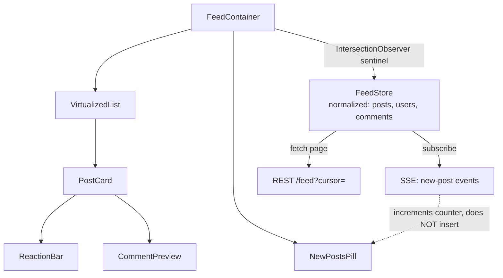
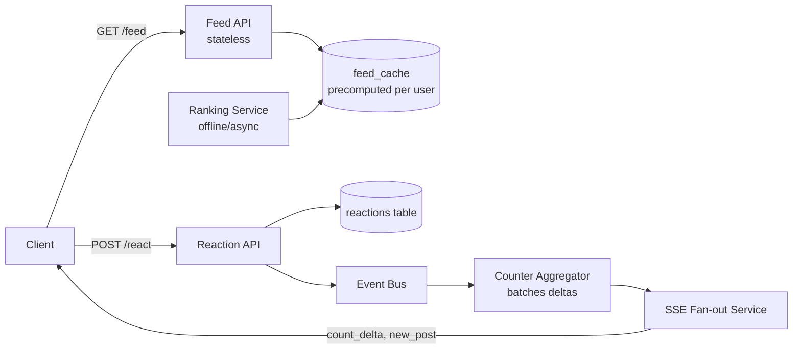

## Overview

- **Real-world analog:** Facebook, Twitter/X, LinkedIn — a social feed with infinite scroll.
- **Difficulty:** Medium · **Asked at:** Meta (flagship), LinkedIn, ByteDance, GreatFrontEnd bank.
- The core challenge isn't rendering a list of posts — it's keeping a DOM-bounded, infinitely-scrolling list correct while new posts arrive in real time, reactions update optimistically, and the same underlying entities (a user, a shared link, a comment) appear in dozens of places without drifting out of sync with each other.

## Clarifying Questions & Requirements

> **Ask these first:**
> 1. Is ranking algorithmic (a scoring service decides order) or chronological? This changes whether "new post" insertion can just prepend or has to re-request.
> 2. Do reactions/comments need sub-second real-time counts, or is "eventually consistent within a few seconds" acceptable?
> 3. Single feed type, or multiple surfaces (home feed, profile feed, group feed) sharing the same posts?
> 4. Is this web only, or does scroll-position/read-state need to survive an app backgrounding and resuming (mobile)?

| | In scope | Out of scope |
|---|---|---|
| **Functional** | Infinite-scroll feed, reactions/comments with counts, new-post notifications, media (images/video thumbnails) | Post composition/editing UI, ads insertion logic, the ranking algorithm itself |
| **Non-functional** | Feed stays responsive with an unbounded scroll history; reactions feel instant; new content doesn't silently reorder what's already on screen | Sub-second global fan-out to millions of followers (that's the backend track's problem, not a frontend-observable requirement) |

## ── FRONTEND TRACK (RADIO) ──

### R — Requirements

| | Requirement | Why it's not optional |
|---|---|---|
| **Functional** | Virtualized, infinitely-scrolling post list; reactions/comments with live counts; a "new posts" affordance instead of silent reordering | A feed that silently reorders while you're reading it is one of the most-hated real product failures in this category — it has to be solved, not deferred |
| **Functional** | Shared entities (author, a re-shared post, a comment's author) render consistently everywhere they appear | The same user's name/avatar showing stale in one card and fresh in another is a data-model bug, not a styling one |
| **Non-functional** | Scroll position survives navigating away and back (open a post, hit back, land where you were) | Losing scroll position on back-navigation is one of the most common, most avoidable feed complaints |
| **Non-functional** | DOM node count stays bounded regardless of how far the user scrolls | An unbounded DOM eventually makes the tab unresponsive — this is a hard requirement, not a nice-to-have |

### A — Architecture



- **`FeedStore` is normalized by entity, not by feed position** — `posts`, `users`, and `comments` are three separate keyed maps, and a feed "page" is just an ordered list of post ids referencing into them. A re-shared post and its original both point at the *same* underlying post entity.
- **New posts never auto-insert.** The SSE stream only increments a counter shown on `NewPostsPill` ("12 new posts") — inserting live would reorder content mid-read, which is exactly the failure mode Requirements ruled out. The user's explicit tap on the pill is what actually prepends and scrolls to top.
- The virtualization + cursor-fetch loop, sketched concretely:

```ts
class FeedController {
  private cursor: string | null = null;
  private loading = false;

  async loadNextPage() {
    if (this.loading || this.cursor === 'END') return;
    this.loading = true;
    const res = await fetch(`/feed?cursor=${this.cursor ?? ''}&limit=20`);
    const { posts, nextCursor } = await res.json();
    this.store.mergePosts(posts);           // normalize into postsById/usersById
    this.store.appendPageOrder(posts.map(p => p.id));
    this.cursor = nextCursor ?? 'END';
    this.loading = false;
  }
}
```

This is deliberately a *controller* separate from the virtualization component — `VirtualizedList` only knows "call `onEndReached`," it has no idea a cursor or a store exists. That separation is what lets the same feed component power a profile feed and a group feed by swapping the controller's fetch URL, not by forking the component.

### D — Data Model

| | Owner | Example |
|---|---|---|
| **Server state** | Post content, author, reaction counts, comment previews | Fetched per page, kept fresh via SSE deltas for counts |
| **Client state** | Which reaction the current user has applied (optimistic until confirmed), "new posts" counter, scroll anchor | Never persisted server-side as-is — the server's copy of "did I react" is the source of truth once reconciled |

```ts
type Store = {
  postsById: Record<string, Post>;
  usersById: Record<string, User>;
  pageOrder: string[]; // post ids, in feed order — the ONLY place order lives
};

type Post = {
  id: string;
  authorId: string;          // reference into usersById, never a duplicated user object
  text: string;
  reactionCount: number;
  myReaction: 'like' | 'love' | null; // optimistic — see Deep Dives
  commentPreviewIds: string[];
};
```

> **Key insight:** `pageOrder` is a flat array of ids, completely separate from the entities themselves. Reordering, deduping, or inserting posts is an array operation on ids — it never touches (or risks corrupting) the actual post/user data those ids point to.

**Why normalized, concretely:** if the same user shows up as the author of three posts currently on screen, and their profile picture changes, one write to `usersById[authorId]` updates all three cards. A denormalized shape (each post carrying its own copy of `{ authorName, authorAvatar }`) would need three separate patches, and it's exactly the kind of thing that silently drifts when one of the three gets missed.

### I — Interface / API

**Component API**

```
<Feed source={'home' | 'profile' | 'group'} sourceId={string} />
<VirtualizedList items={string[]} renderItem={(id) => ReactNode} onEndReached={() => void} />
<PostCard postId={string} />
<ReactionBar postId={string} myReaction={Reaction | null} onReact={(r: Reaction) => void} />
<NewPostsPill count={number} onClick={() => void} />
```

`Feed`'s `source`/`sourceId` props are what let one component tree serve home/profile/group feeds — the `FeedController` sketched above is instantiated per-source, not hardcoded to one endpoint.

**Network API** — the shared contract with the backend track below:

| Action | Transport | Shape |
|---|---|---|
| Load feed page | `GET /feed?cursor=<cursor>&limit=20` | REST, cursor-paginated |
| React to post | `POST /posts/:id/react` `{ reaction }` | REST, idempotent by `(userId, postId)` |
| New-post signal | SSE event | `{ type: 'new_post', count }` — a count, not the post itself, see Architecture |
| Live count delta | SSE event | `{ type: 'count_delta', postId, reactionCount }` |

### O — Optimizations

**Performance**
- Virtualize the list unconditionally — a feed has no natural upper bound on scroll depth, so this isn't an optimization for scale, it's a correctness requirement past a few hundred posts.
- Lazy-load and blur-up media below the fold; never fetch full-resolution images for cards that haven't entered the viewport yet.
- Prefetch the next page slightly before `onEndReached` actually fires (e.g. at 80% scroll depth) so the fetch is already in flight by the time the user reaches the bottom.

**Accessibility**
- The "new posts" pill is announced via `aria-live="polite"` once, not on every SSE tick — announcing every incoming count update would be constant noise for a screen reader user.
- Reaction buttons are real `<button>` elements with accessible names ("Like this post by Jane Doe"), not icon-only divs with a click handler.
- Infinite scroll has a real, reachable "load more" fallback for keyboard/switch-access users who can't trigger a scroll-based `IntersectionObserver` the way a mouse-wheel user does.

**Networking**
- SSE, not WebSocket, for the new-post/count-delta stream — the client never needs to push anything over this channel, only receive, so a simpler one-way connection is the right tool (see Shared Contract).
- Batch count-delta events server-side rather than emitting one per single reaction — covered from the client's receiving side in Deep Dives.

**Resilience**
- A failed reaction request rolls the optimistic `myReaction` back and surfaces a brief, specific error — never a silent revert with no explanation.
- If the SSE connection drops, the client falls back to a slow poll (e.g. every 30s) rather than the feed simply going stale with no visible degradation.

### Frontend Deep Dives

**1. Optimistic reactions with rollback.** Tapping "like" has to update the UI (icon fill, count +1) before the network round-trip completes — waiting for confirmation on every reaction makes the whole feed feel sluggish. The rollback path is the part shallow answers skip:

```ts
async function react(postId: string, reaction: Reaction) {
  const prev = store.postsById[postId].myReaction;
  const prevCount = store.postsById[postId].reactionCount;
  store.patchPost(postId, { myReaction: reaction, reactionCount: prevCount + (prev ? 0 : 1) });
  try {
    await api.react(postId, reaction);
  } catch {
    store.patchPost(postId, { myReaction: prev, reactionCount: prevCount }); // roll back exactly
  }
}
```

The subtlety: the rollback restores the *exact* prior count, not `count - 1` — if a `count_delta` SSE event arrived from someone else's reaction in the meantime, a blind decrement would under-count. Capturing `prevCount` before mutating and restoring it verbatim avoids that.

**2. Deduplicating a post that appears in two different pages.** Ranking can legitimately return the same post twice across two page fetches (a re-share bumped it, or ranking shifted between requests). Appending blindly renders a duplicate card. The fix: `appendPageOrder` filters against a `Set` of ids already in `pageOrder` before appending — cheap, and it has to happen at the id-array level described in the Data Model, not per-render, or the check itself becomes an O(n) scan on every scroll frame.

**3. Reconciling a live count delta against an in-flight optimistic update.** If the user reacts to a post at the same moment a `count_delta` SSE event arrives for that same post (someone else reacted a beat earlier), applying both naively double-counts. The fix: `count_delta` events update `reactionCount` but never touch `myReaction`, and the optimistic reaction path always computes its `+1`/`-1` relative to the count *at the moment the tap happened*, not relative to whatever the count is when the request resolves — the two updates are on genuinely independent fields precisely so they can't stomp on each other.

### Frontend Bottlenecks & Tradeoffs

| Bottleneck | Mitigation | Tradeoff accepted |
|---|---|---|
| Unbounded DOM growth on scroll | Virtualization | Off-screen post state (e.g. "was this comment thread expanded") has to be preserved in the store, not the DOM, since the DOM node gets torn down |
| One SSE event per single reaction across a viral post | Server batches count deltas (e.g. one update per second per post) | Live counts lag by up to ~1s during a spike — acceptable, since exact real-time counts were never a stated requirement |
| Duplicate posts across paginated fetches during active ranking shifts | Dedupe against a seen-id set on append | A small, permanently-growing set in memory for the session's scroll depth — negligible relative to the post data itself |

## ── BACKEND TRACK ──

### Requirements & Scope

- Serve a ranked, paginated feed per user; accept reactions/comments with idempotent writes; fan out lightweight "something changed" signals without pushing full payloads to every client.
- Ranking algorithm internals are explicitly out of scope — the backend track covers serving and fan-out, not the scoring model.

### Scale & Estimation

| | Estimate |
|---|---|
| DAU | 300M |
| Avg feed page loads/user/day | 15 |
| Peak feed requests/sec | ~300M × 15 / 86,400 × 4 (peak multiplier) ≈ **~210K req/sec** |
| Avg post size (text + metadata, excl. media) | ~1KB |
| New posts/day | ~50M |
| Reactions/day | ~2B (reactions vastly outnumber posts) |

### API Design

Server-side view of the same contract the frontend track defined above:

```
GET  /feed?cursor=<cursor>&limit=20 → { posts: Post[], nextCursor }
POST /posts/:id/react {reaction} → 204, idempotent per (userId, postId)
SSE  /feed/stream → new_post {count}, count_delta {postId, reactionCount}
```

- Feed pages are pre-computed per user by a ranking service and cached, not computed synchronously on request — the API layer's job is serving a precomputed, paginated list, not ranking on the request path.
- `react` is idempotent on `(userId, postId)`: reacting twice with the same reaction is a no-op, and switching reaction type is an upsert, not an insert — this is what lets the frontend safely retry a failed request without double-counting.

### Data Model & Storage

```
posts
  id            uuid PK
  author_id     uuid, indexed
  text          text
  media_urls    text[]
  created_at    timestamp

reactions
  post_id       uuid
  user_id       uuid
  reaction      enum('like','love',...)
  PRIMARY KEY (post_id, user_id)   -- enforces one reaction per user per post, idempotently

feed_cache
  user_id       uuid
  post_ids      uuid[]   -- precomputed ranked order, refreshed periodically
  cursor_map    jsonb
```

| Choice | Why |
|---|---|
| **Reaction counts denormalized onto a counter, not `COUNT(*)` on `reactions`** | At 2B reactions/day, counting rows per post on every feed read is not viable — a maintained counter (incremented async off the write path) is the only workable read path |
| **`feed_cache` precomputed per user, not ranked at request time** | Ranking is expensive and its inputs (recency, engagement signals) don't need to be recalculated on every single page load — precompute-and-refresh amortizes that cost |
| **`reactions` primary keyed on `(post_id, user_id)`** | Makes "did this user already react" and "change my reaction" both a single upsert, which is exactly the idempotency the frontend's optimistic-reaction retry path depends on |

### High-Level Architecture



- The **Ranking Service** runs asynchronously, refreshing `feed_cache` on a schedule/trigger basis — it's decoupled entirely from the request path, so a slow ranking run never becomes a slow feed load for a user.
- The **Counter Aggregator** exists specifically so reaction writes don't have to synchronously notify every viewer — it batches deltas over a short window before pushing to the SSE fan-out, which is the server-side half of the frontend's "counts lag slightly during a spike" tradeoff.

### Deep Dives

**1. Fan-out cost of a viral post.** A post crossing into millions of impressions generates a reaction/comment rate that would overwhelm a naive per-event SSE push. Fix: the Counter Aggregator batches deltas per post over a fixed window (e.g. 1 second) and emits one aggregated `count_delta` per window, not one per reaction — this is the exact mechanism the frontend's Bottlenecks table accepts a ~1s lag for.

**2. Feed staleness vs. ranking cost.** Recomputing every user's ranked feed on every request is too expensive at 210K req/sec; never recomputing means the feed goes stale. Fix: `feed_cache` is refreshed on a trigger basis (new relevant activity from followed accounts) plus a periodic ceiling (e.g. at least every few minutes), not on every read — this is the same precompute-and-invalidate tradeoff a CDN makes with cached pages, applied to a personalized ranking output instead of a static asset.

**3. Idempotent reactions under retry.** A frontend retry (from the optimistic-rollback path) or a duplicate request from network flakiness must not double-count. Fix: the `(post_id, user_id)` primary key on `reactions` makes the write a pure upsert — retrying the identical request is provably a no-op, which is precisely what makes the frontend's blind-retry-on-failure strategy safe to implement without server-side deduplication logic on the client's part.

### Bottlenecks & Tradeoffs

| Bottleneck | Mitigation | Tradeoff accepted |
|---|---|---|
| Synchronous per-request ranking at 210K req/sec | Precomputed `feed_cache`, refreshed async | Feed can be a few minutes stale relative to the absolute latest ranking signal |
| Reaction-count reads via `COUNT(*)` at 2B reactions/day | Maintained counter column, incremented off the write path | Counter can very briefly lag the true row count during the async increment window |
| Per-reaction SSE push during a viral spike | Windowed batching in the Counter Aggregator | Live counts on the client lag by the batch window (≈1s) |

## The Shared Contract

- **Transport:** SSE, not WebSocket, for the live stream — the client only ever *receives* (new-post counts, count deltas); it never needs to push anything over this channel, since reactions/comments go through ordinary REST `POST`s. This is the textbook case for choosing `server-sent-events` over `websocket`.
- **Ownership boundary:** the client owns *when* a reaction visually applies (optimistically); the server owns the *authoritative count and whether the reaction actually persisted*. The client never trusts its own optimistic count as final — it's provisional until either a `count_delta` confirms the new steady state or an error rolls it back.
- **Pagination:** cursor-based, for the same reason chat history is — offset pagination breaks the moment ranking or new posts shift what "page 3" even means between requests.
- **Error propagation:** a failed reaction request rolls back client-side state and surfaces a specific, actionable message — it never silently reverts with no explanation, and a failed page load surfaces a retry action rather than an infinite spinner.

## Interview Signals

| | Strong answer | Weak answer |
|---|---|---|
| **Frontend** | Explicitly separates "new post arrived" (a count) from "insert it now" (a user action); reasons about dedup across paginated fetches | Auto-inserts new posts live, without noticing that reorders content mid-read |
| **Backend** | Explains why ranking is precomputed and cached rather than computed per-request | Designs the feed as if ranking is free to run synchronously on every page load |
| **Both** | Treats reaction counts as an eventually-consistent, batched signal, not a real-time-guaranteed one | Assumes every reaction must be pushed to every viewer instantly, with no discussion of the fan-out cost |

**Common failure modes:** live-inserting new posts and silently reordering the feed mid-scroll; denormalizing user/author data per-post instead of normalizing it; computing reaction counts with `COUNT(*)` at read time; forgetting that the same post can legitimately appear across two paginated fetches during active ranking changes.

## Glossary Links

This question draws on: cursor-based pagination, optimistic UI, Server-Sent Events, idempotency, consistency model — each linked on first mention above. See "Proposed glossary additions" for terms new to this question.

**Proposed glossary additions:** normalized state (client-side entity normalization — the same pattern this question and Chat/Messaging both rely on, worth a real glossary entry rather than only explained inline per-question).
