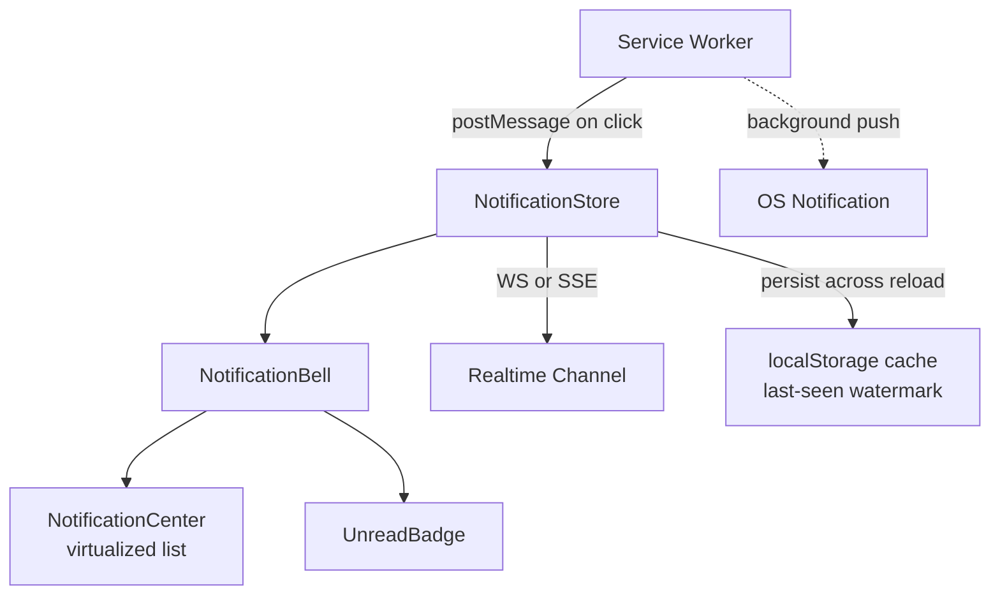
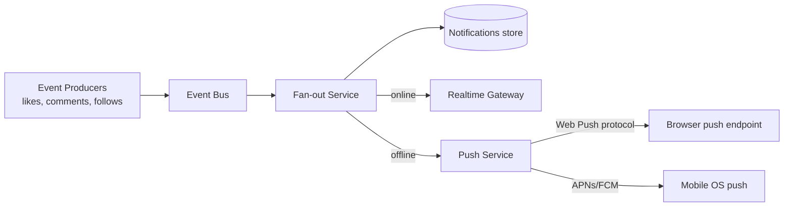

## Overview

- **Real-world analog:** in-app + push notifications, as in Meta's or LinkedIn's notification bell.
- **Difficulty:** Medium · **Asked at:** Meta, most product companies.
- **Backend counterpart:** [Notification System](/backend-interviews/c/notification-service) covers the multi-channel fan-out, provider integration, and idempotent delivery this chapter's UI sits on top of.
- The core challenge is keeping a badge count and a notification list *correct and consistent* across an in-app real-time surface, a background push notification, and read/unread state — without over-notifying and without letting the count drift from reality.

## Clarifying Questions & Requirements

> **Ask these first:**
> 1. In-app only, or does this include OS-level push notifications while the app is closed?
> 2. Should related notifications group ("Alice and 4 others liked your post"), or does every event get its own entry?
> 3. Is there a notification preferences/muting system in scope, or just delivery and display?
> 4. Read state — per-notification, or just a single "seen up to" watermark like the chat course's read receipts?

| | In scope | Out of scope |
|---|---|---|
| **Functional** | Real-time in-app notifications, badge counts, grouping/deduping, mark-as-read, background push via Service Worker | Notification preference/muting UI, email digests |
| **Non-functional** | Badge count is always accurate (never stuck stale), real-time delivery while the app is open | Guaranteed push delivery within a strict SLA (OS-level push is best-effort by nature) |

## ── FRONTEND TRACK (RADIO) ──

### R — Requirements

| | Requirement | Why it's not optional |
|---|---|---|
| **Functional** | A notification bell/badge with an accurate unread count, a scrollable notification center, real-time arrival while the tab is open | The badge count is the single most-scrutinized number in this UI — if it's ever wrong, users notice immediately |
| **Functional** | Grouped/deduped notifications ("Alice and 4 others...") rather than one row per raw event | Un-grouped notifications for a popular post would flood the list with near-duplicate entries |
| **Non-functional** | Marking as read is instant in the UI, and doesn't require a full list re-fetch | A full re-fetch on every read action is wasteful and adds visible latency to a very frequent action |

### A — Architecture



- **`NotificationStore` computes the badge count derived from state**, not as an independently-tracked counter — the count is always `notifications.filter(n => !n.read).length` (or a server-provided count reconciled on load), never a value incremented/decremented by hand at each event, which drifts the moment any single increment/decrement is missed.
- **The Service Worker is a separate execution context** — it can receive a push event and show an OS notification even when no tab is open, but it can't directly touch React state; it communicates back to any open tab via `postMessage` (e.g. "user clicked this notification, navigate here"), and if no tab is open, it stores enough info to reconcile when the app is next opened.

### D — Data Model

| | Owner | Example |
|---|---|---|
| **Server state** | Notification content, read status, grouping | Fetched on load, updated via realtime events |
| **Client state** | Which notifications are currently visible/expanded, scroll position in the notification center | Never sent to the server |

```ts
type Notification = {
  id: string;
  groupKey: string;           // notifications with the same groupKey collapse into one row
  actorIds: string[];         // who triggered it — grows as more actors join the same group
  type: 'like' | 'comment' | 'follow' | 'mention';
  targetId: string;
  read: boolean;
  createdAt: number;
};

type NotificationState = {
  byId: Record<string, Notification>;
  order: string[];             // most-recent-first
  lastSeenWatermark: number;   // timestamp — everything after this is "new since last visit"
};
```

> **Key insight:** grouping happens by `groupKey`, computed the same way on client and server (e.g. `${type}:${targetId}:${hourBucket}`) — an incoming event either creates a new notification row or merges into an existing group by appending to `actorIds`, exactly the same de-dup problem the chat course's read-receipt batching solves, applied to display grouping instead of network calls.

### I — Interface / API

**Component API**

```
<NotificationBell unreadCount={number} onOpen={() => void} />
<NotificationCenter notifications={Notification[]} onMarkRead={(id) => void} onMarkAllRead={() => void} />
<NotificationRow notification={Notification} />
```

**Network API** — the shared contract with the backend track below:

| Action | Transport | Shape |
|---|---|---|
| Initial load | `GET /notifications?limit=30` | REST, includes current unread count |
| Real-time new notification | WebSocket/SSE event | `{ type: 'notification', notification: Notification }` |
| Mark as read | `POST /notifications/:id/read` | Optimistic client-side, reconciled on response |
| Mark all read | `POST /notifications/read-all` | Sets a server-side watermark, not one row at a time |
| Background push registration | Web Push API `PushManager.subscribe()` | Subscription object sent to `POST /push-subscriptions` |

### O — Optimizations

**Performance**
- Virtualize the notification center list — same reasoning as any long list, unread history can run into the thousands over time.
- Debounce badge-count re-renders if notifications arrive in a rapid burst (e.g. a viral post), rather than re-rendering the badge on every single event.

**Accessibility**
- The unread badge's count is exposed to assistive tech via `aria-label` (e.g. "12 unread notifications"), not just a visual number — a badge that's purely a colored dot with a number inside a `<span>` with no label is invisible to a screen reader.
- New real-time notifications do **not** auto-announce via `aria-live` by default (that would be disruptive for a background, ambient feature) — the badge count updating is enough; the content is available on demand when the user opens the center.

**Networking**
- Prefer a push-based channel (WebSocket/SSE) over polling while the tab is open — polling every few seconds for something this latency-sensitive wastes requests and still has a delay window; but polling remains a reasonable fallback for clients that can't hold a persistent connection.

**Resilience**
- Mark-as-read is optimistic and idempotent client-side (marking an already-read notification read again is a no-op, not an error) — the same reasoning `idempotency` applies to any retried mutation.

### Frontend Deep Dives

**1. Badge count reconciliation across multiple open tabs/devices.** If a user has two tabs open and reads a notification in one, the other tab's badge is now stale unless something propagates the change. The fix: the same realtime channel that delivers new notifications also delivers read-state changes (`{ type: 'read', notificationId }` or a watermark bump), and every open tab subscribes to it — not just the tab that performed the read action. This is structurally the same multi-device-sync problem the chat course's requirements section calls out, applied to read state instead of messages.

**2. Grouping notifications that arrive over time, not all at once.** "Alice liked your post" arriving, then five minutes later "Bob liked your post" — these need to merge into one grouped row ("Alice and Bob liked your post") *after* the first one has already been rendered and possibly already read. The store has to support mutating an existing notification's `actorIds` in place (and, if it was already marked read, deciding whether adding a new actor should flip it back to unread — a real product decision, not just an implementation detail) rather than only ever appending new rows.

**3. Reconciling a background push with in-app state on app open.** A push notification can arrive and be tapped while the app was fully closed — on open, the app has to fetch current state and reconcile against whatever the Service Worker already knew (via `postMessage` or a stored deep link), rather than assuming the in-app store is the source of truth from a cold start.

### Frontend Bottlenecks & Tradeoffs

| Bottleneck | Mitigation | Tradeoff accepted |
|---|---|---|
| Badge re-rendering on every individual event during a burst | Debounce badge updates, not the underlying data | Badge visually lags the true count by a small window during a burst, acceptable since it's a summary indicator |
| Polling for real-time updates on clients that can't hold a socket | Fall back to a longer poll interval only for those clients | Slightly delayed delivery for a minority of clients, in exchange for not requiring every client to support persistent connections |

## ── BACKEND TRACK ──

### Requirements & Scope

- Ingest events from many producing services (likes, comments, follows), fan them out to the right recipients, track read state, and deliver to both an open-tab realtime channel and offline push.

### Scale & Estimation

| | Estimate |
|---|---|
| Events/day system-wide | 2B |
| Avg fan-out per event | ~1.2 recipients (mostly 1:1, some broadcast-style) |
| Peak events/sec | ~2B / 86,400 × 4 ≈ **~90K/sec** |
| Notification retention | 90 days rolling |
| Push delivery success rate (industry-typical) | ~85-95% — push is inherently best-effort |

### API Design

```
GET  /notifications?limit=30&before=<cursor>
POST /notifications/:id/read
POST /notifications/read-all
WS   notification → {id, groupKey, actorIds, type, targetId, read, createdAt}
POST /push-subscriptions   {endpoint, keys}   -- Web Push subscription
```

- `read-all` sets a server-side watermark timestamp rather than writing a row per notification — marking thousands of historical notifications read one row at a time is unnecessary write amplification for an action that's semantically "everything before now."

### Data Model & Storage

```
notifications
  id            uuid PK
  recipient_id  uuid, indexed
  group_key     text
  actor_ids     uuid[]
  type          enum
  target_id     uuid
  created_at    timestamp

read_state
  recipient_id     uuid PK
  last_read_at     timestamp     -- watermark; anything after this is unread
  read_overrides   uuid[]        -- individually-marked-read notifications newer than the watermark

push_subscriptions
  id            uuid PK
  user_id       uuid, indexed
  endpoint      text
  keys          jsonb
```

| Choice | Why |
|---|---|
| Watermark + override list, not a `read: boolean` per row | Marking "all read" is O(1) (bump the watermark) instead of O(n) rows updated; individual reads on newer notifications are the rare exception, tracked separately |
| `group_key` computed identically client and server | Both sides need to agree on grouping boundaries so the frontend's incremental merge (Deep Dive #2) matches what a fresh server fetch would return |
| Push subscriptions in their own table, keyed by user, multiple per user | A user has multiple devices/browsers, each with its own push subscription — fan-out to push has to iterate all of them, not assume one |

### High-Level Architecture



- The **fan-out service** decides, per recipient, whether they're currently online (route to the realtime gateway) or offline (route to push) — this presence check is the same pattern the chat course uses, reused here for a different delivery decision.
- Push delivery goes through the browser's own push endpoint (Web Push protocol) or the OS's native push service (APNs/FCM) for mobile — the backend never has a direct connection to a closed app; it hands off to infrastructure it doesn't control and accepts best-effort delivery.

### Deep Dives

**1. Grouping at write time versus read time.** Grouping could be computed lazily every time a client fetches (read-time), or maintained incrementally as events arrive (write-time, mutating an existing group row's `actor_ids`). Read-time is simpler but re-does the grouping work on every fetch; write-time is more efficient per-read but means the fan-out service has to look up "is there already an open group for this key" on every incoming event, which is itself a real query. Most systems at this scale use write-time grouping with a short group-open window (e.g. group additions to the same key within a rolling few hours), closing the group once it goes stale.

**2. Idempotent fan-out under retry.** If the fan-out service crashes and retries processing the same event, it must not create a duplicate notification or double-append an actor to a group — the event needs a stable id, and fan-out writes are keyed/deduped on it, the same idempotency discipline the chat course applies to message sends.

**3. Push subscription churn.** Push subscriptions expire, get revoked, or go stale (uninstalled app, cleared browser data) — a real system needs to detect delivery failures against a subscription (the push service returns an error) and prune it, rather than accumulating dead subscriptions indefinitely and wasting delivery attempts against them forever.

### Bottlenecks & Tradeoffs

| Bottleneck | Mitigation | Tradeoff accepted |
|---|---|---|
| Read-time grouping recomputing on every fetch | Write-time incremental grouping | More complex write path, cheaper reads — worth it given reads vastly outnumber writes here |
| Fan-out to a very large broadcast audience (e.g. a celebrity's post) | Cap direct fan-out, batch/shard delivery similar to the chat course's large-group fan-out problem | Slight delivery delay for very large audiences, acceptable given notifications aren't a hard real-time guarantee |
| Stale push subscriptions accumulating | Prune on delivery failure | Occasional legitimate delivery is lost if a subscription silently changed without a clean error, an accepted best-effort tradeoff inherent to push |

## The Shared Contract

- **Transport:** realtime channel (WebSocket/SSE) for in-app delivery while online; Web Push / native OS push for offline — two genuinely different transports for the same logical event, and the frontend has to reconcile state arriving from either.
- **Ownership boundary:** the client owns local read-state optimism (instant UI feedback on mark-as-read); the server owns the authoritative watermark and grouping boundaries.
- **Grouping contract:** both sides compute `groupKey` identically — this isn't just a display convenience, it's the thing that lets the frontend's incremental merge match a server-side fresh fetch.
- **Error propagation:** a failed mark-as-read reverts the optimistic UI change and surfaces a retry, rather than leaving the client and server read-state silently diverged.

## Interview Signals

| | Strong answer | Weak answer |
|---|---|---|
| **Frontend** | Derives the badge count from state rather than tracking it as an independent counter; discusses multi-tab consistency | Treats the badge as a manually incremented/decremented number |
| **Backend** | Distinguishes write-time vs read-time grouping and picks one with a stated reason | Never addresses grouping as a real design decision at all |
| **Both** | Explains presence-based routing between realtime delivery and push | Assumes every notification goes out the same way regardless of whether the user is online |

**Common failure modes:** treating the badge count as independently maintained state instead of derived; ignoring multi-device/multi-tab consistency; forgetting push is inherently best-effort and can't be treated as guaranteed delivery.

## Glossary Links

This question draws on: WebSocket, Server-Sent Events, Presence, Idempotency, Read receipt (the same watermark pattern), Cursor-based pagination — each linked on first mention above. See Proposed glossary additions for Web Push API and Service Worker.
