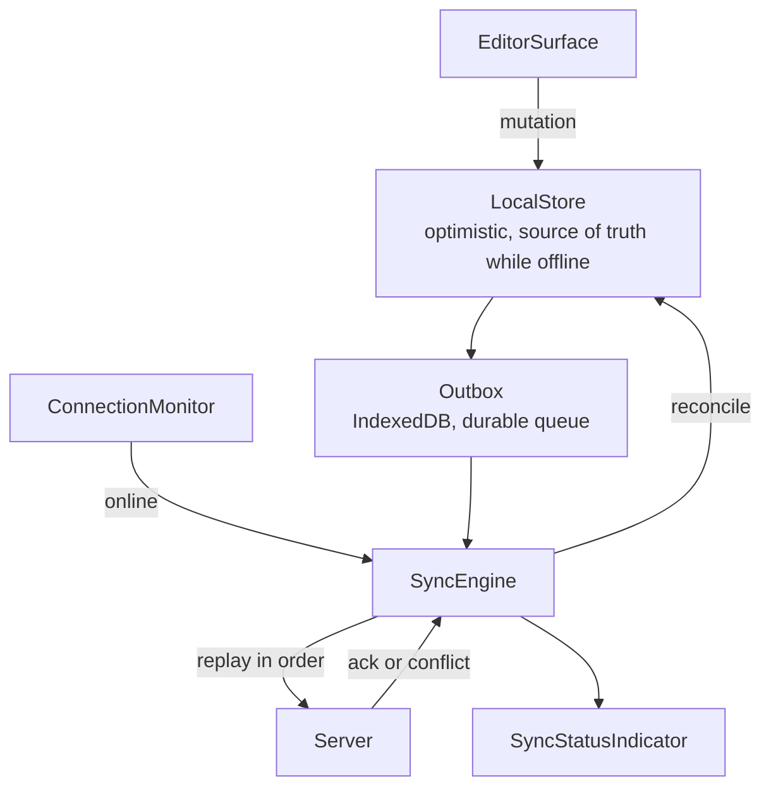
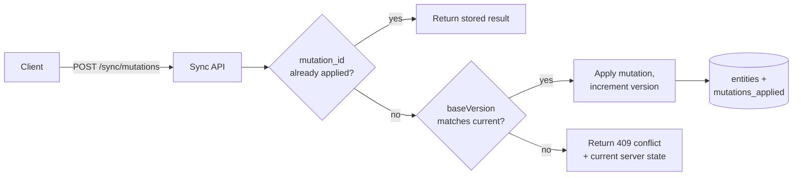

## Overview

- **Real-world analog:** Notion, Linear, email clients, field/mobile-web apps.
- **Difficulty:** Hard · **Mechanism family:** Consistency & reconciliation — local truth diverging from server truth, then merging.
- The core challenge isn't detecting that the network is gone — it's what happens after: a user edits for an hour with no connection, then reconnects, and every one of those edits has to replay onto whatever the server's state has become in the meantime, correctly, exactly once.

## Clarifying Questions & Requirements

> **Ask these first:**
> 1. What's actually being edited offline — a single document per user, or shared/collaborative state multiple people might also be changing?
> 2. Is "offline" a rare edge case to tolerate gracefully, or a first-class, expected mode (field workers, spotty mobile)?
> 3. When a real conflict happens, is silent auto-resolution acceptable, or does the user need to be asked?
> 4. Is delete a real operation in scope? (It changes the replay story significantly — see Deep Dives.)

| | In scope | Out of scope |
|---|---|---|
| **Functional** | Local-first editing while offline, a durable local queue of pending changes, automatic replay + conflict resolution on reconnect, visible sync status | Real-time multi-user *concurrent* editing while both parties are online simultaneously (that's `collaborative-editor`'s territory — this question assumes conflicts are discovered *after the fact*, on reconnect, not resolved live) |
| **Non-functional** | Zero data loss across an arbitrarily long offline period; replay is idempotent even if it's interrupted and retried | Instant real-time cursor-level collaboration |

## ── FRONTEND TRACK (RADIO) ──

### R — Requirements

| | Requirement | Why it's not optional |
|---|---|---|
| **Functional** | Every mutation made offline is captured, persisted locally, and survives a full page reload or app restart before it's synced | The entire premise of "offline-first" breaks if a closed tab loses unsynced work |
| **Functional** | On reconnect, queued mutations replay automatically, in the order they were made, with visible sync status | A user shouldn't have to manually trigger "sync now" for basic correctness |
| **Non-functional** | Replaying the same queue twice (e.g. after an interrupted replay) produces the same end state as replaying it once | Network conditions on reconnect are often still flaky — a replay that itself gets interrupted and retried is the normal case, not an edge case |
| **Non-functional** | A genuine conflict (the same record changed both locally and on the server while offline) is detected and resolved deterministically or surfaced to the user — never silently dropped | Silently losing one side of a conflicting edit is the single worst outcome this question can produce |

### A — Architecture



- **`LocalStore` is the source of truth while offline** — the UI never blocks on network state; every read and write goes through the local store first, and the `Outbox` is a durable side-effect of writing to it, not a separate step the user has to think about.
- **`SyncEngine` is the only thing that ever talks to the network for mutations** — `EditorSurface` and every other component only ever touch `LocalStore`, which keeps the offline/online distinction invisible to the rest of the app.

```ts
class Outbox {
  private db: IDBDatabase;

  async enqueue(mutation: Mutation) {
    // mutation.id is a client-generated UUID — the idempotency key for replay
    await this.db.transaction('outbox', 'readwrite').objectStore('outbox').add(mutation);
  }

  async drain(send: (m: Mutation) => Promise<SyncResult>) {
    const pending = await this.getAllOrderedByCreatedAt();
    for (const mutation of pending) {
      const result = await send(mutation); // must be safe to call twice — see Deep Dives
      if (result.status === 'applied' || result.status === 'already-applied') {
        await this.remove(mutation.id);
      } else if (result.status === 'conflict') {
        await this.markConflicted(mutation.id, result.serverState);
        break; // stop draining — see Deep Dives on ordering
      }
    }
  }
}
```

Draining stops at the first real conflict rather than skipping past it, because later queued mutations in the same document may have been written *assuming* the conflicted one already applied — replaying out of order past a conflict risks compounding the problem.

### D — Data Model

| | Owner | Example |
|---|---|---|
| **Local-authoritative state** | Every field of the document as the user has edited it, while offline | The only state the UI reads from — never blocked on network |
| **Server-authoritative state** | The last-synced version, and whatever else changed there while this client was offline | Only consulted during reconciliation, never read directly by the UI |

```ts
type Mutation = {
  id: string;              // client-generated, the idempotency key
  entityId: string;
  type: 'update' | 'delete';
  payload: Record<string, unknown>;
  baseVersion: number;     // the version this mutation assumed it was editing against
  createdAt: number;       // local ordering within the outbox
};

type SyncStatus = 'synced' | 'pending' | 'syncing' | 'conflict';
```

> **Key insight:** `baseVersion` is what makes conflict *detection* possible at all. Without it, the server has no way to distinguish "this mutation is safe to apply" from "this mutation was made against state that's since changed underneath it" — it would have to guess, or worse, always assume the incoming write wins.

**Tombstones for deletes:** a deleted record isn't simply removed from local state — it's marked with a tombstone (`{ deleted: true, deletedAt }`) and kept until sync confirms the server has processed the delete. Removing it immediately would mean a delete made offline, if the delete mutation itself needs retry, has nothing left locally to retry *from*.

### I — Interface / API

**Component API**

```
<SyncStatusIndicator status={'synced' | 'pending' | 'syncing' | 'conflict'} pendingCount={number} />
<ConflictResolutionModal
  conflict={{ local: Entity, remote: Entity }}
  onResolve={(choice: 'local' | 'remote' | 'merged', merged?: Entity) => void}
/>
```

**Network API** — the shared contract with the backend track below:

| Action | Transport | Shape |
|---|---|---|
| Replay a mutation | `POST /sync/mutations` | `{ id, entityId, type, payload, baseVersion }` → `{ status: 'applied' \| 'already-applied' \| 'conflict', serverState?, newVersion? }` |
| Fetch current server state (for conflict UI) | `GET /entities/:id` | Returns current server version, used to populate the conflict modal |

### O — Optimizations

**Performance**
- Batch multiple queued mutations for the *same* entity into a single replay request where safe (e.g. three field edits to the same document collapse to one `update` with the final field values), rather than replaying each individually — reduces round-trips without changing the outcome.
- Persist the outbox with IndexedDB, not `localStorage` — `localStorage` is synchronous and size-limited in a way that becomes a real problem for a queue that might hold a meaningful volume of offline edits.

**Resilience**
- `ConnectionMonitor` uses both the browser's `navigator.onLine` (a hint, not fully reliable) and an actual failed-request signal as corroboration — `navigator.onLine` alone produces false positives (reports "online" on a captive portal or a technically-connected-but-unreachable network).
- Sync status is always visible, not just surfaced on error — a user offline for an hour should be able to glance at the UI and know their work is queued, not silently wonder if it's safe to close the tab.

**Consistency**
- Every mutation carries an idempotency key (its own `id`) so a replay interrupted mid-flight and retried can't double-apply — this is the single load-bearing property that makes "just retry the outbox" a safe default action.

### Frontend Deep Dives

**1. Replay is not "just re-send the requests."** The naive mental model — queue requests while offline, fire them all when back online — breaks on three separate axes simultaneously: **order** (mutations must replay in the sequence they were made, not fire concurrently and race), **idempotency** (a replay interrupted by another network drop, then retried, must not double-apply anything already accepted), and **conflicts** (the server's state may have genuinely diverged while offline, and a mutation with a stale `baseVersion` can't just be blindly applied on top of it). All three have to be designed together — solving order without idempotency, or idempotency without conflict detection, still leaves a real correctness gap.

**2. Choosing a conflict strategy, and knowing when each fits.**

| Strategy | Fits when | Doesn't fit when |
|---|---|---|
| **Last-write-wins** | Low-stakes fields, single-user documents where "conflict" is rare and low-cost | Any field where silently discarding one side's edit is a real problem |
| **Field-level merge** | Structured data where non-overlapping fields can merge automatically (I changed the title, they changed the color) | Free-text fields, where "merging" two edits to the same paragraph has no sane automatic answer |
| **User-prompted resolution** | Genuine, overlapping edits to the same field, where an automatic choice would guess wrong roughly as often as it guesses right | High-frequency, low-stakes conflicts — prompting a user constantly trains them to click through without reading |

A real answer to this question names which strategy fits which *part* of the data model, rather than picking one strategy for the whole app.

**3. Tombstones and idempotent delete replay.** A delete replayed twice must be safe — the second attempt should resolve to `already-applied`, not throw or re-trigger side effects (like re-sending a "this was deleted" notification). Keeping a tombstone locally until sync confirms the delete, rather than removing the record immediately, is what makes the delete itself retriable using the exact same idempotency-key mechanism as every other mutation, instead of needing special-cased delete logic.

### Frontend Bottlenecks & Tradeoffs

| Bottleneck | Mitigation | Tradeoff accepted |
|---|---|---|
| A very long offline session produces a large outbox | Collapse multiple edits to the same entity into one replay mutation | Slightly more complex outbox-draining logic, in exchange for far fewer round-trips |
| `navigator.onLine` false positives | Corroborate with actual request failure/success, not the flag alone | A few seconds' delay in correctly detecting true offline state, acceptable given it avoids acting on a false "online" signal |
| Conflict resolution UI interrupting the user's flow | Only prompt for genuine, overlapping-field conflicts; auto-resolve everything else | A small number of true conflicts still require a user decision — irreducible without silently guessing wrong sometimes |

## ── BACKEND TRACK ──

### Requirements & Scope

- Accept replayed mutations from a client that may be arbitrarily far behind the server's current state, detect genuine conflicts via version comparison, and respond deterministically (`applied`, `already-applied`, or `conflict`) so the client can act correctly regardless of how many times a given mutation is retried.

### Scale & Estimation

| | Estimate |
|---|---|
| Users with meaningful offline usage | A minority of DAU in most products — design for burstiness (many clients reconnecting after a regional outage), not sustained high volume |
| Mutations per reconnect | Typically tens, occasionally hundreds for a long offline session |
| Peak replay burst | A shared network outage recovering (e.g. an office's wifi coming back) can produce thousands of clients replaying simultaneously — this is the real capacity-planning number, not steady-state traffic |

### API Design

Server-side view of the same contract the frontend track defined above:

```
POST /sync/mutations
  body: { id, entityId, type, payload, baseVersion }
  → 200 { status: 'applied', newVersion }
  → 200 { status: 'already-applied', newVersion }   // idempotent replay, not an error
  → 409 { status: 'conflict', serverState, serverVersion }
```

- `id` (the client-generated mutation id) is the idempotency key the server checks *before* touching `entityId`'s state at all — this single check is what makes retried replay safe.
- `baseVersion` is compared against the entity's current `version` — a match means it's safe to apply; a mismatch means genuine divergence happened and the server returns `409 conflict` with its current state rather than guessing.

### Data Model & Storage

```
mutations_applied
  mutation_id     uuid PK       -- the idempotency key
  entity_id       uuid, indexed
  applied_at      timestamp
  result_version  bigint

entities
  id              uuid PK
  version         bigint        -- incremented on every successful mutation
  data            jsonb
  deleted_at      timestamp NULL  -- tombstone, mirrors the client model
```

| Choice | Why |
|---|---|
| **`mutations_applied` keyed by the client-generated mutation id** | A retried replay is a lookup, not a re-execution — if the id is already present, return `already-applied` with the stored result and do nothing else, which is what makes replay genuinely idempotent rather than "usually fine" |
| **`version` as a simple incrementing integer per entity**, not a timestamp | A version number is unambiguous to compare for equality (`baseVersion === entities.version`); a timestamp invites the same clock-trust problems covered elsewhere in this course |
| **`deleted_at` as a tombstone column**, not a hard delete | Mirrors the client's tombstone model — a hard delete would make a retried delete mutation's idempotency check ambiguous (is "not found" a successful delete-replay, or an error?) |

### High-Level Architecture



- Deliberately a simple, synchronous request/response API, not a queue-based one — the client already owns the queue (the `Outbox`); the server's job is just to answer each replayed mutation correctly and idempotently, not to run its own separate durable queue for the same data.

### Deep Dives

**1. Making "already-applied" a first-class, non-error response.** A client that successfully replayed a mutation but never received the acknowledgment (a dropped response after a successful write) will retry it. The server must recognize the mutation id as already-processed and return the *same* success result, not a `409` or a generic error — treating a duplicate-but-legitimate retry as a conflict would incorrectly surface a conflict-resolution prompt to the user for something that isn't actually in conflict.

**2. Choosing what "conflict" means precisely.** Naive version comparison (`baseVersion !== currentVersion`) is a necessary but not sufficient conflict definition — if the server-side change since `baseVersion` touched a completely different field than the incoming mutation, a stricter implementation can merge automatically instead of surfacing a conflict at all. This is a real design choice with a real cost: field-level conflict detection is more implementation complexity in exchange for meaningfully fewer user-facing conflict prompts, and the right tradeoff depends on how structured the data actually is (highly structured records benefit; free-text documents mostly don't).

> **Signature gotcha:** treating replay as "just re-send the requests." Order, idempotency, and conflict detection are the entire problem — a design that only handles the happy path of "client comes back online, sends its queue, done" hasn't actually solved this question.

### Bottlenecks & Tradeoffs

| Bottleneck | Mitigation | Tradeoff accepted |
|---|---|---|
| Thousands of clients replaying simultaneously after a shared outage | Idempotent, stateless-per-request API scales horizontally with no coordination needed between requests | None significant — this is precisely why the idempotency-key design was chosen over a stateful queue-processing approach |
| `mutations_applied` growing unboundedly over time | TTL/archive entries older than a reasonable replay window (e.g. 30 days) — a client offline longer than that has bigger problems than a stale idempotency cache | A mutation id replayed after the archive window (extremely unlikely in practice) would be treated as new rather than a duplicate |

## The Shared Contract

- **Transport:** plain REST, not WebSocket/SSE — this is a request/response reconciliation problem, not a live stream; the client already has a durable local queue, so there's no need for a persistent connection.
- **Ownership boundary:** the client owns *what the user intended* (the queued mutations, in order); the server owns *whether each one can actually apply* (via `baseVersion` comparison) and *deduplication* (via the mutation id). Neither side blindly trusts the other's account of history.
- **Idempotency is the load-bearing contract term.** Both tracks agree every mutation carries a client-generated id, and the server's very first check on any replay is "have I seen this id before" — this single agreement is what makes the rest of the design (retry-safe replay, safe delete replay) work at all.
- **Error propagation:** a genuine conflict returns `409` with the server's current state attached, so the frontend can render a real conflict-resolution UI rather than a generic error — a bare error code with no state to act on would force the client to make a second round-trip just to find out what actually happened.

## Interview Signals

| | Strong answer | Weak answer |
|---|---|---|
| **Frontend** | Treats order, idempotency, and conflicts as three separate problems that each need solving, not one "sync" step | Says "queue the requests and send them when back online" with no discussion of what happens if a request fails mid-replay |
| **Backend** | Makes "already-applied" a real, first-class success response, not an afterthought | Only designs the success path for a mutation that's never been seen before |
| **Both** | Names a specific conflict strategy per data shape, and justifies it | Picks one global conflict strategy ("last write wins") without considering whether it's actually safe for every field |

**Common failure modes:** treating offline sync as "just retry the failed requests"; forgetting deletes need the exact same idempotency treatment as updates; designing conflict *detection* without ever designing what happens *after* a conflict is detected; assuming `navigator.onLine` is a reliable signal on its own.

## Glossary Links

This question draws on: Idempotency, Consistency model, Offline queue — each linked on first mention above.
