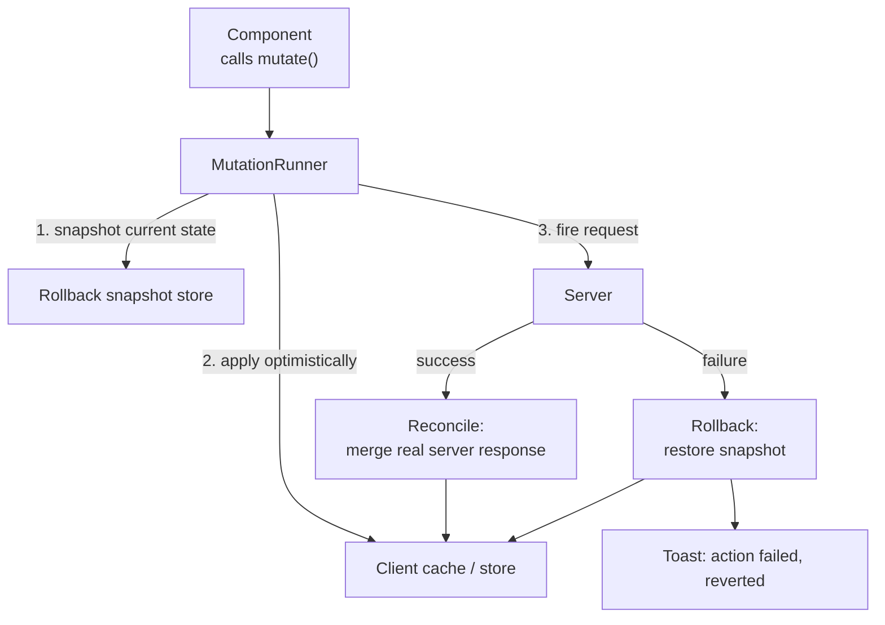

## Overview

- **Real-world analog:** every product with a mutation — explicitly probed at Meta and Stripe as its own topic, separate from any specific feature.
- **Difficulty:** Medium-Hard · **Mechanism family:** Consistency & reconciliation — showing success before the server has actually confirmed it.
- This question is the **generalized** version of a pattern this course already uses inside specific questions — `chat-messaging`'s optimistic send, `news-feed`'s optimistic reactions, `poll-widget`'s optimistic vote. Here, the pattern itself is the whole question: when you show an action as done instantly and it then fails, how do you cleanly undo it — including everything that *derived* from it?

## Clarifying Questions & Requirements

> **Ask these first:**
> 1. Are we designing one mutation in isolation, or a general-purpose mutation layer many features share? (The answer changes whether this is a component design or an infrastructure design.)
> 2. Do mutations have side effects on *other* visible state — derived counts, related lists, cached aggregates — or only the one entity being changed?
> 3. Can multiple optimistic mutations be in flight for the same entity at once (e.g. rapid double-clicking a like button)?
> 4. Should a failure retry automatically, or always surface to the user?

| | In scope | Out of scope |
|---|---|---|
| **Functional** | A reusable optimistic-update lifecycle: apply locally → confirm or roll back → reconcile with the server's actual response | Any one specific feature's business logic — this question is about the mechanism, not a particular mutation |
| **Non-functional** | Rollback restores *all* affected state, not just the field the user directly changed; correct behavior under a burst of concurrent in-flight mutations | Offline queuing/replay (that's `offline-first-sync` — this question assumes the network is present, just not instantaneous) |

## ── FRONTEND TRACK (RADIO) ──

### R — Requirements

| | Requirement | Why it's not optional |
|---|---|---|
| **Functional** | Every mutation follows the same lifecycle: optimistic apply → server confirms or rejects → reconcile | Consistency across features is the entire value of generalizing this — a one-off implementation per feature drifts and re-introduces the same bugs repeatedly |
| **Functional** | On failure, rollback restores *every* piece of state the optimistic update touched — not just the primary value | This is the actual hard part of the question; almost every shallow implementation gets this specific piece wrong |
| **Non-functional** | A burst of rapid optimistic mutations against the same entity resolves correctly, without the UI flickering between stale intermediate states | A user double-clicking "like" is not a hypothetical edge case, it's routine behavior |
| **Non-functional** | Failure is visible and actionable, never a silent revert the user has no way to notice happened | A UI that quietly undoes an action with no signal reads, to the user, as the action having simply not worked at all |

### A — Architecture



- **`MutationRunner` is a shared utility, not per-feature code.** Every optimistic mutation in the app — a like, a vote, an archive, a rename — goes through the same three-step lifecycle (snapshot, apply, reconcile-or-rollback), which is exactly what makes this a generalized answer rather than a re-solved-per-feature one.
- **The snapshot captures more than the single changed field.** This is the crux of the whole question — see Deep Dives.

```ts
type MutationLifecycle<T> = {
  optimisticUpdate: (current: T) => T;   // pure function: how state should look immediately
  request: () => Promise<T>;             // the actual network call
  onSettled?: (result: T | Error) => void;
};

async function runOptimisticMutation<T>(
  store: Store<T>,
  key: string,
  lifecycle: MutationLifecycle<T>
) {
  const snapshot = store.getSnapshot(key);       // captures the FULL affected subtree, not one field
  store.apply(key, lifecycle.optimisticUpdate);

  try {
    const serverResult = await lifecycle.request();
    store.reconcile(key, serverResult);          // replace optimistic guess with real server truth
    lifecycle.onSettled?.(serverResult);
  } catch (err) {
    store.restore(key, snapshot);                // full rollback, not a partial undo
    lifecycle.onSettled?.(err as Error);
  }
}
```

### D — Data Model

| | Owner | Example |
|---|---|---|
| **Optimistic (unconfirmed) state** | Whatever the local mutation predicted the result would be | Displayed immediately, replaced the instant the server responds |
| **Confirmed state** | The server's actual response | Becomes the new baseline once reconciled |

```ts
type Snapshot<T> = {
  primary: T;                          // the entity directly being mutated
  derived: Record<string, unknown>;    // everything computed FROM the primary value, captured at snapshot time
};
```

> **Key insight:** the snapshot has to capture **derived state along with the primary value**, not just the primary value alone. Liking a post optimistically increments both the post's own `likeCount` *and* a separate "posts you've liked" cached list elsewhere in the store — a rollback that only restores `likeCount` while leaving the post still present in that derived list produces a UI that's now internally inconsistent with itself, which is frequently worse than the original failure.

### I — Interface / API

**Component API**

```
useMutation<T>({
  optimisticUpdate: (current: T) => T,
  request: () => Promise<T>,
  onError?: (err: Error) => void,
}): { mutate: () => void, status: 'idle' | 'pending' | 'error' }
```

- Deliberately shaped as a hook, not a per-feature function, so any component in the app gets the same rollback-safe behavior by construction rather than by remembering to reimplement it correctly.

**Network API** — the shared contract with the backend track below:

| Action | Transport | Shape |
|---|---|---|
| Any mutation | `POST/PATCH /<resource>` | Body includes a client-generated idempotency key; response is the server's authoritative resulting state, not just a bare success flag |
| Failure | Non-2xx response | A structured error body the client can distinguish from a network failure (see Deep Dives) |

### O — Optimizations

**Performance**
- `optimisticUpdate` is a pure function applied synchronously — the UI updates in the same tick as the user's action, with zero perceived latency, which is the entire point of the pattern.
- Reconciliation replaces, rather than merges field-by-field, the optimistic guess with the server's real response — simpler and strictly more correct, since the server's response is authoritative and any local guess was always provisional.

**Resilience**
- A burst of rapid mutations against the same entity (double-clicking like) is coalesced: the second click's snapshot is taken *after* the first click's optimistic update has already applied, so rollback of the second unwinds only to the first's optimistic state, not all the way back to the pre-burst original — otherwise a failed second click would incorrectly also undo a successful first one.
- Failure always produces a visible, dismissible signal (a toast with the actual reverted state shown) — never a silent revert.

**Accessibility**
- The failure toast is announced via `aria-live="assertive"` — unlike a chat message, a failed action the user just took is exactly the kind of interruption-worthy event assertive live regions exist for.

### Frontend Deep Dives

**1. Rolling back *only* the field you changed, while derived state stays wrong.** This is the signature failure mode of a shallow implementation of this pattern. A "like" mutation that optimistically increments `likeCount` and adds the post to a locally-cached "liked posts" list, but on failure only decrements `likeCount`, leaves the post still incorrectly present in the liked-posts list — a real, visible inconsistency, not a cosmetic one. The fix requires the snapshot/restore step to operate on *every* piece of state the optimistic update touched, which means `optimisticUpdate` and the rollback logic have to be written as genuinely symmetric operations, not independently.

**2. The `onSettled` reconcile step, and why it's a separate step from both success and failure.** A pattern many implementations skip: even on success, the optimistic guess and the server's actual response can differ in small ways (server-computed fields, normalization the client couldn't have predicted). A dedicated reconcile step replaces the optimistic guess with the real response rather than assuming "success" means "the guess was exactly right" — this matters more the more complex the mutated entity is.

**3. Handling a burst of concurrent optimistic mutations against the same entity.** Naive implementations that snapshot against a fixed "original" state break under rapid repeated actions — a second mutation's failure incorrectly rolls back a first mutation's success too. The fix chains snapshots: each mutation snapshots the state as it stood *immediately before its own optimistic update*, so each one's rollback only unwinds its own change, leaving any already-succeeded prior mutations intact.

### Frontend Bottlenecks & Tradeoffs

| Bottleneck | Mitigation | Tradeoff accepted |
|---|---|---|
| Naive rollback only reverting the directly-changed field | Snapshot the full affected subtree (primary + derived), restore all of it together | More bookkeeping per mutation type, in exchange for actual consistency on failure |
| Concurrent mutations against the same entity | Chain snapshots per-mutation rather than one fixed original state | Slightly more complex snapshot management, correctness under bursts in exchange |
| Distinguishing a real rejection from a network failure that might still have succeeded server-side | Idempotency key lets a retry safely resolve ambiguity instead of guessing | Requires backend cooperation (see Backend Track) — this mechanism can't be entirely frontend-owned |

## ── BACKEND TRACK ──

### Requirements & Scope

- The backend track for this question is intentionally light — the hard problem here is almost entirely client-side. The backend's real job is making clean rollback *possible* in the first place: idempotent mutation endpoints and unambiguous error responses, not a large architecture story.

### API Design

```
PATCH /posts/:id/like
  headers: { Idempotency-Key: <client-generated> }
  → 200 { likeCount, likedByCurrentUser: true }
  → 409 { error: 'already-liked' }   -- structured, distinguishable from a transient failure
```

- **Idempotency keys, not just at the transport level but as an explicit response contract.** A request that times out client-side, where the server actually succeeded, is ambiguous to the client — did it fail, or did the response just not arrive? A retried request carrying the same idempotency key returns the *same* result rather than double-applying, which is what lets the client safely retry instead of having to guess whether to roll back or not.
- **The response body is always the authoritative resulting state**, not a bare `{ success: true }` — this is what the frontend track's reconcile step needs to correct any small drift between the optimistic guess and reality.

### Data Model & Storage

No dedicated schema beyond whatever the specific resource already needs — this question deliberately doesn't invent new backend infrastructure. The one addition genuinely worth naming:

```
idempotency_keys
  key             uuid PK        -- client-generated
  endpoint        text
  response_body   jsonb          -- cached, returned verbatim on retry
  created_at      timestamp
```

| Choice | Why |
|---|---|
| **A shared idempotency-key table/middleware**, not per-endpoint logic | The whole point of generalizing this pattern is that every mutation gets the same retry-safety, not a bespoke implementation per feature |

### High-Level Architecture

A dedicated diagram is unnecessary here — this question doesn't introduce new services or infrastructure. The only structural piece worth naming: an idempotency-key check as shared middleware in front of every mutating endpoint, so retry-safety is a property of the platform, not something each feature team re-derives.

### Deep Dives

**1. Making the error response distinguishable, not just present.** A generic `500` on failure forces the client to treat every error identically — always roll back, always show the same generic message. A structured error response (a specific `409 already-liked`, versus a `500` genuine server error, versus a network-level timeout with no response at all) lets the frontend's `onSettled` handler make a real decision: some failures mean "don't roll back, this actually already succeeded"; others genuinely mean "revert."

### Bottlenecks & Tradeoffs

| Bottleneck | Mitigation | Tradeoff accepted |
|---|---|---|
| A client retry racing the original request's still-in-flight processing | Idempotency-key middleware serializes on the key, second request waits for the first's result rather than double-processing | A small amount of added latency on the rare colliding-retry case, in exchange for correctness |

## The Shared Contract

- **Ownership boundary:** the client owns the *optimistic guess and its rollback*; the server owns the *authoritative resulting state* returned in every response, success or structured failure alike — the client's reconcile step exists specifically because the server's answer, not the client's guess, is what state should ultimately reflect.
- **Idempotency is the contract term that makes rollback trustworthy.** Without a server-side idempotency guarantee, a client can never fully distinguish "this genuinely failed, roll back" from "this succeeded but the response was lost" — the two tracks have to agree on this mechanism together for either side's design to actually be safe.
- **Error propagation:** structured, not generic — a bare failure/success boolean is not enough information for the frontend to decide whether a rollback is even the correct response.

## Interview Signals

| | Strong answer | Weak answer |
|---|---|---|
| **Frontend** | Explicitly calls out that rollback must restore *derived* state, not just the primary field, and gives a concrete example of what breaks otherwise | Describes "update the UI, then undo it if it fails" with no mention of anything beyond the single directly-changed value |
| **Backend** | Explains why idempotency keys matter specifically *for rollback correctness*, not just as general good API hygiene | Never connects the backend design to the frontend's actual rollback problem at all |
| **Both** | Frames this explicitly as the generalized version of a pattern used elsewhere, and names the specific failure mode (partial rollback) that motivates generalizing it | Treats this as a trivial, already-obvious pattern with nothing more to say than "just use optimistic updates" |

**Common failure modes:** rolling back only the value the user directly changed while derived/cached state elsewhere drifts; no handling for a burst of rapid mutations against the same entity; no distinction between "genuinely failed" and "succeeded but the response was lost," forcing an incorrect guess on every network hiccup.

## Glossary Links

This question draws on: Optimistic UI, Idempotency, Normalized state — each linked on first mention above.
