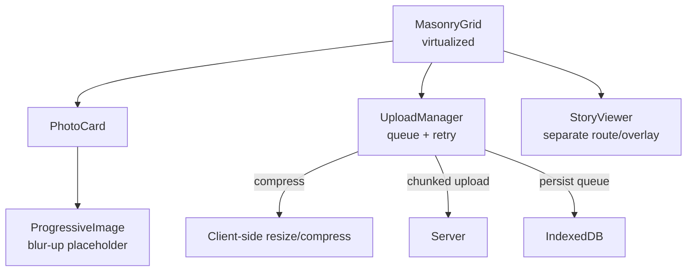
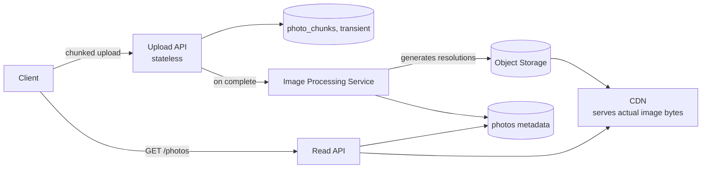

## Overview

- **Real-world analog:** Instagram, Pinterest — an image-heavy feed or masonry grid.
- **Difficulty:** Medium-Hard · **Asked at:** Meta/Instagram, Pinterest, GreatFrontEnd bank.
- The core challenge is that this question is really two problems glued together: laying out a grid of variable-aspect-ratio images efficiently (a genuinely different problem from a uniform feed), and handling the *upload* path — compression, progress, retry — for content that's large, slow to transfer, and produced by the same user who's about to scroll through everyone else's.

## Clarifying Questions & Requirements

> **Ask these first:**
> 1. Feed layout (Instagram-style, roughly uniform aspect ratio) or masonry (Pinterest-style, genuinely variable aspect ratios)? This significantly changes the layout algorithm.
> 2. Multi-image posts/carousels — in scope, or single image per post for the base question?
> 3. Stories (ephemeral, full-screen, auto-advancing) — in scope as a separate surface, or out of scope entirely?
> 4. Client-side image editing (filters, crop) before upload — in scope, or is upload assumed to be of an already-final image?

| | In scope | Out of scope |
|---|---|---|
| **Functional** | Masonry/grid layout, image upload with compression/progress/retry, infinite scroll, story-viewer carousel | Client-side filters/editing UI, video posts, algorithmic ranking of what's shown |
| **Non-functional** | Layout stays smooth while scrolling a large, variable-aspect-ratio grid; uploads survive a flaky connection without losing the user's content; images never cause layout jank as they load | Guaranteed sub-second global CDN propagation of a freshly uploaded image (a real backend concern, not a frontend-observable requirement) |

## ── FRONTEND TRACK (RADIO) ──

### R — Requirements

| | Requirement | Why it's not optional |
|---|---|---|
| **Functional** | Masonry/grid feed, blur-up progressive image loading, upload flow with compression and resumable progress, story-viewer | Upload is not a secondary feature here — it's the other half of the product, and it has its own hard problem (a large binary transfer that must survive real-world network conditions) |
| **Non-functional** | Grid layout never reflows visibly once an image has claimed its position, even before the image itself has loaded | This is the single most common visible bug in this category — content jumping around as images load in is a real, testable failure mode |
| **Non-functional** | An upload in progress survives the user navigating away and a brief network drop | Losing someone's photo upload because they switched apps or hit a dead zone is one of the worst possible failures for a product whose entire purpose is capturing that moment |
| **Non-functional** | DOM node count stays bounded on an infinitely-scrolling grid | Same virtualization requirement as every other infinite-scroll surface in this course, applied to a 2D masonry layout instead of a uniform list |

### A — Architecture



- **`MasonryGrid` computes layout from known aspect ratios, not from measuring loaded images.** The server returns each photo's `width`/`height` alongside its URL specifically so the grid can reserve the correct space *before* the image has downloaded — this is what makes the "never reflows visibly" requirement achievable at all; measuring the actual `` element after load and then repositioning everything is the naive approach that causes the jank this requirement rules out.
- **`UploadManager` is a queue, not a fire-and-forget request per upload.** Uploads persist to IndexedDB immediately on selection, before the network request even starts, so a crashed tab or a killed mobile app doesn't lose a queued upload — the queue is drained opportunistically as connectivity allows.
- A sketch of the masonry column-assignment algorithm — the part that's genuinely different from a uniform feed's layout:

```ts
function assignToColumns(items: PhotoMeta[], columnCount: number): PhotoMeta[][] {
  const columns: PhotoMeta[][] = Array.from({ length: columnCount }, () => []);
  const columnHeights = new Array(columnCount).fill(0);

  for (const item of items) {
    const shortest = columnHeights.indexOf(Math.min(...columnHeights));
    columns[shortest].push(item);
    // Height contribution uses the item's REAL aspect ratio, known up front —
    // not a guess, and not something measured after the image loads.
    columnHeights[shortest] += item.width > 0 ? item.height / item.width : 1;
  }
  return columns;
}
```

Assigning each new item to the currently-*shortest* column (not round-robin) is what keeps the overall grid balanced — a naive round-robin assignment produces visibly uneven column heights once aspect ratios vary as much as real photo content does.

### D — Data Model

| | Owner | Example |
|---|---|---|
| **Server state** | Photo metadata (dimensions, URLs at multiple resolutions), post/story content | Fetched per page; dimensions specifically are load-bearing for layout, not just display |
| **Client state** | Upload queue (pending/in-progress/failed items), compression settings, current story-viewer position | Local until an upload completes and the resulting photo enters server state |

```ts
type Photo = {
  id: string;
  width: number;
  height: number;              // real aspect ratio, known before the image itself loads
  urls: { thumbnail: string; full: string }; // multiple resolutions — see Optimizations
};

type UploadItem = {
  localId: string;             // exists before the server assigns a real photo id
  file: File;
  status: 'queued' | 'compressing' | 'uploading' | 'done' | 'failed';
  progress: number;            // 0-1
  retryCount: number;
};
```

> **Key insight:** `Photo.width`/`height` are treated as load-bearing layout data, not just descriptive metadata — the masonry algorithm above depends on having them *before* any image bytes have arrived, which is only possible because the server returns them alongside the URL rather than expecting the client to infer them from the loaded image.

**The reconciliation problem this data model exists to solve:** an upload is optimistically shown in the user's own grid (as a `queued`/`uploading` placeholder card) before the server has actually processed it — once the server responds with the real photo id and confirmed dimensions, the placeholder is replaced in place, the same optimistic-then-reconcile shape every real-time question in this course shares, applied to an upload instead of a message or an edit.

### I — Interface / API

**Component API**

```
<MasonryGrid photos={Photo[]} columnCount={number} onEndReached={() => void} />
<PhotoCard photo={Photo} onOpen={() => void} />
<ProgressiveImage src={string} placeholderSrc={string} aspectRatio={number} />
<UploadButton onFilesSelected={(files: File[]) => void} />
<UploadProgressBar item={UploadItem} onRetry={(localId: string) => void} />
<StoryViewer storyIds={string[]} startIndex={number} onClose={() => void} />
```

**Network API** — the shared contract with the backend track below:

| Action | Transport | Shape |
|---|---|---|
| Load grid page | `GET /photos?cursor=<cursor>&limit=30` | REST, cursor-paginated, returns dimensions inline |
| Upload photo | `POST /photos` multipart, chunked for large files | Returns `{ id, urls, width, height }` on success |
| Upload progress | Client-observed (`XMLHttpRequest.upload.onprogress` or fetch streaming) | Not server-pushed — progress is inherent to the upload request itself |
| Load story | `GET /stories/:userId` | Returns an ordered list of story items with expiry |

### O — Optimizations

**Performance**
- Serve (and request) multiple resolutions per image — a grid thumbnail never loads the full-resolution asset; only the opened, full-screen view does.
- Blur-up placeholders (a tiny, inlined low-res preview shown immediately, replaced by the real thumbnail once loaded) mask load latency without contributing to the layout-jank problem the Architecture section already solved structurally.
- Virtualize the masonry grid the same way a uniform feed does — bound DOM nodes regardless of scroll depth, just across a column-aware layout instead of a single list.

**Accessibility**
- Every photo needs real alt text — either author-provided or a sensible fallback — since an image-only product is otherwise close to unusable for a screen reader user by default.
- The story viewer supports keyboard advance/dismiss (not just tap-zones), and auto-advance timing respects `prefers-reduced-motion` where the transition itself is animated.
- Upload progress and errors are announced via `aria-live`, not conveyed by a progress bar's visual fill alone.

**Networking**
- Compress images client-side before upload (resize to a sensible max dimension, re-encode at a reasonable quality) — uploading an unmodified 12MB phone-camera photo when the served version will be far smaller wastes real user bandwidth and upload time for no benefit.
- Chunk large uploads so a partial failure can resume from where it left off rather than restarting the entire transfer.

**Resilience**
- A failed upload stays in the queue as `failed` with a visible retry action — never silently dropped, and never silently retried forever with no user-visible state.
- The upload queue persists across a page reload/app restart (IndexedDB) — a user who closes the tab mid-upload should be able to reopen it and resume, not lose the photo.

### Frontend Deep Dives

**1. Preventing layout jank from asynchronous image loads.** The most common visible bug in this category: images loading in and shifting everything below them, because the grid didn't reserve real space up front. The fix is architectural, not a CSS patch — because the server returns real `width`/`height` per photo, the masonry algorithm computes every column's layout *before* a single image byte has arrived, and each `PhotoCard` renders a correctly-sized placeholder box from that computed layout immediately. The image itself just fades into a box that was already the right size and already in its final position.

**2. Client-side compression without blocking the UI thread.** Resizing and re-encoding a large photo synchronously on the main thread visibly freezes the tab, especially on lower-end mobile devices, right at the moment a user expects an instant "upload started" response. The fix: compression runs in a Web Worker (or via `OffscreenCanvas`), so the main thread stays responsive and the upload can show a "compressing" status immediately while the actual CPU-bound work happens off-thread.

**3. Resuming a chunked upload after a partial failure.** A multi-megabyte upload that fails at 80% shouldn't restart from zero — the fix chunks the upload and tracks which chunks the server has confirmed, so a retry only re-sends chunks after the last acknowledged one. This is meaningfully different from, and harder than, a simple "retry the whole request" strategy, and it's the specific mechanism that makes the "survives a brief network drop" non-functional requirement actually true rather than aspirational.

**4. Reconciling an optimistic upload placeholder with the server's confirmed result.** The grid shows an `uploading`/`queued` placeholder card the instant a file is selected, using locally-known (but not yet server-verified) dimensions read from the file itself. Once the server responds with the confirmed `id`/`urls`/dimensions, the placeholder is replaced by matching on `localId` — the same clientId-to-real-id reconciliation pattern chat and news feed both use, applied here to an upload instead of a message or a reaction.

### Frontend Bottlenecks & Tradeoffs

| Bottleneck | Mitigation | Tradeoff accepted |
|---|---|---|
| Layout shifting as images asynchronously load | Reserve layout space from server-provided dimensions before any image byte arrives | Requires the API to always return accurate dimensions — a data-completeness dependency, not just a frontend concern |
| Large image compression freezing the main thread | Run compression in a Web Worker | Slightly more complex build/bundling setup for worker code |
| Full multi-megabyte upload restart on any failure | Chunked upload with resume-from-last-confirmed-chunk | More server-side bookkeeping (tracking confirmed chunks per upload) required to support it |
| Unbounded DOM growth on a large masonry grid | Virtualize by visible row-range across all columns | Off-screen photo state (e.g. "was this one already fully loaded") has to live in the store, not the DOM |

## ── BACKEND TRACK ──

### Requirements & Scope

- Accept and durably store uploaded photos at multiple resolutions, serve paginated grid metadata (including dimensions), and support resumable/chunked upload for large files.
- Story content additionally needs a TTL/expiry mechanism, distinct from permanent photo storage.

### Scale & Estimation

| | Estimate |
|---|---|
| DAU | 500M |
| Uploads/day | ~100M photos |
| Peak upload rate | ~100M / 86,400 × 4 (peak multiplier) ≈ **~4,600 uploads/sec** |
| Avg original file size | ~3MB (phone camera photo) |
| Storage/day (all resolutions, post-processing) | ~100M × ~1.5MB avg stored (post-compression, multiple resolutions) ≈ **~150TB/day** |
| Read:write ratio | Extremely read-heavy — a single upload is viewed far more times than it's written, dominated by grid/feed reads |

### API Design

Server-side view of the same contract the frontend track defined above:

```
POST /photos/init → {uploadId, chunkSize}           -- begin a chunked upload
PUT  /photos/:uploadId/chunk/:index → 204            -- idempotent per (uploadId, index)
POST /photos/:uploadId/complete → {id, urls, width, height}
GET  /photos?cursor=<cursor>&limit=30 → {photos: Photo[], nextCursor}
GET  /stories/:userId → {items: StoryItem[]}          -- filtered to non-expired items only
```

- The chunked-upload flow (`init` → repeated `chunk` → `complete`) is the server-side counterpart to the frontend's resumable-upload deep dive — each chunk `PUT` is idempotent on `(uploadId, index)`, so a retried chunk after a flaky connection can't corrupt the assembled file.
- `complete` is the point at which the server has enough of the file to generate the multiple resolutions the frontend requests — the client never uploads pre-resized variants itself; the server derives them once, authoritatively.

### Data Model & Storage

```
photos
  id              uuid PK
  owner_id        uuid, indexed
  width           int
  height          int
  storage_key     text        -- points into object storage, not stored inline
  created_at      timestamp

photo_chunks      -- transient, cleared on complete
  upload_id       uuid
  chunk_index     int
  received_at     timestamp
  PRIMARY KEY (upload_id, chunk_index)

stories
  id              uuid PK
  owner_id        uuid, indexed
  storage_key     text
  expires_at      timestamp   -- TTL — a story past this is filtered from all reads
```

| Choice | Why |
|---|---|
| **Image bytes in object storage, never inline in the relational store** | At 150TB/day, storing binary blobs in the primary datastore would make it unusable for its actual job (fast metadata queries) — this mirrors video streaming's segment/metadata separation |
| **`photo_chunks` is transient and cleared post-`complete`** | It only needs to exist long enough to support resumability during an in-progress upload — retaining it indefinitely would grow storage for no benefit once the file is assembled |
| **`stories.expires_at` as a real filter condition, not an application-level convention** | Expiry has to be enforced at the read layer, not trusted to every client to respect voluntarily — a query that doesn't filter on `expires_at` is a real bug, not a style choice |

### High-Level Architecture



- The **Image Processing Service** runs asynchronously off the upload path — generating multiple resolutions is real CPU work that shouldn't block the client's `complete` response longer than necessary; a common pattern is returning a fast initial response once the original is stored, with derived resolutions becoming available moments later (and the frontend's progressive/blur-up loading absorbs that gap gracefully).
- Read traffic is served through a **CDN** in front of object storage, for the same reason video's segments are — at this read:write ratio, serving image bytes from the primary API tier directly would be the wrong tier for the job.

### Deep Dives

**1. Chunked upload assembly and idempotency.** Chunks can arrive out of order or be retried after a timeout the client assumed failed but the server actually received. Fix: `photo_chunks` keyed on `(upload_id, chunk_index)` makes re-sending a chunk a pure upsert-or-no-op, and `complete` verifies all expected chunk indices are present before assembling — the same idempotency-by-primary-key pattern used throughout this course's backend tracks, applied to file chunks instead of messages or reactions.

**2. Generating multiple resolutions without blocking upload completion.** Waiting for full image processing (resize, re-encode into several sizes) before acknowledging a successful upload adds real, avoidable latency to the moment a user cares about most — knowing their upload succeeded. Fix: acknowledge completion once the original is durably stored, process resolutions asynchronously, and let the frontend's existing blur-up/progressive-loading UI absorb the short gap before all resolutions are ready — this is a case where a backend-side async design decision directly enables a frontend UX pattern that was already needed anyway.

**3. Enforcing story expiry correctly under caching.** A CDN or cache layer serving story content has to respect `expires_at` too, not just the origin database query — a cached response for a story that's since expired would serve genuinely-expired ephemeral content, which for this specific feature is a real product/trust violation, not just a staleness inconvenience. Fix: story URLs/cache entries carry a TTL matching `expires_at` exactly, so the caching layer itself naturally stops serving them at the right time rather than relying on every read path independently re-checking the expiry column.

### Bottlenecks & Tradeoffs

| Bottleneck | Mitigation | Tradeoff accepted |
|---|---|---|
| 150TB/day of binary storage growth | Object storage, never inline in the relational datastore | An extra network hop from metadata service to object storage on every full-resolution read, mitigated by CDN caching |
| Image processing latency blocking perceived upload success | Async resolution generation after a fast "original stored" acknowledgment | Full-resolution derived images aren't immediately available; the frontend's progressive loading absorbs this |
| Cached story content outliving its intended expiry | TTL-matched cache entries, not just a database column check | Requires cache-layer configuration to stay in lockstep with the expiry semantics — a real operational coupling to get right |

## The Shared Contract

- **Transport:** plain HTTP(S) for both grid reads and uploads — no persistent connection needed, since neither direction requires continuous bidirectional push; upload progress is inherent to the request itself, not a separately-pushed signal.
- **Ownership boundary:** the client owns *when* an upload placeholder appears (optimistically, the instant a file is selected) and *derives* preliminary dimensions from the raw file; the server owns the *confirmed*, authoritative dimensions and generated resolutions once processing completes — the placeholder is provisional until that confirmation replaces it.
- **Pagination:** cursor-based, consistent with every other infinite-scroll surface in this course, and dimensions are returned inline with each page specifically so client-side layout never has to wait on a separate request.
- **Error propagation:** a failed chunk upload retries that chunk specifically, not the whole file; a failed `complete` (e.g. missing chunks) surfaces a specific, retryable error rather than silently discarding the user's queued upload.

## Interview Signals

| | Strong answer | Weak answer |
|---|---|---|
| **Frontend** | Explains that layout-jank prevention requires the API to provide dimensions up front, not just client-side CSS tricks | Proposes fixing image-load jank with only client-side placeholder styling, without addressing where the dimensions come from |
| **Backend** | Separates fast upload acknowledgment from async resolution processing explicitly | Assumes all resolutions must be generated synchronously before responding to the client |
| **Both** | Treats chunked, resumable upload as a real, load-bearing requirement given realistic mobile network conditions | Designs upload as a single atomic request with no resumability, then treats failures as an edge case |

**Common failure modes:** not reserving grid layout space before images load, causing visible jank; compressing images synchronously on the main thread; treating an upload as an atomic all-or-nothing request with no chunking or resume; forgetting that story content needs expiry enforced at the caching layer, not just the database.

## Glossary Links

This question draws on: cursor-based pagination, optimistic UI, idempotency — each linked on first mention above. No new glossary terms were introduced by this question; masonry layout and chunked/resumable upload are explained inline where introduced, as they're specific enough to this question's domain that a standalone glossary entry would duplicate what's already covered in context.
