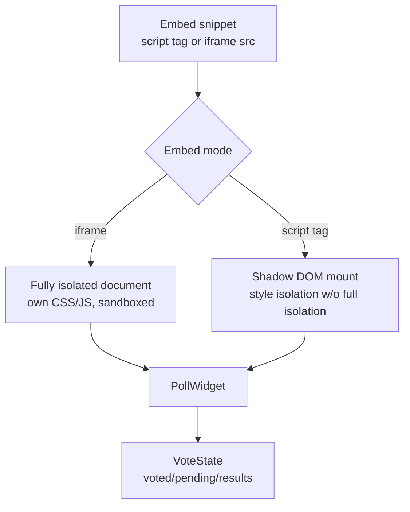
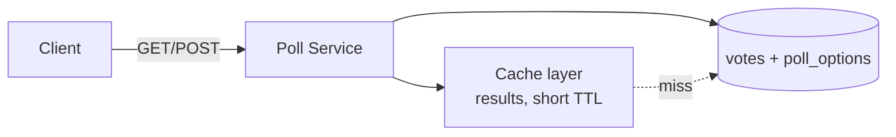

## Overview

- **Real-world analog:** Twitter polls, embedded surveys.
- **Difficulty:** Medium · **Asked at:** GreatFrontEnd bank, ad-tech/media companies.
- **Backend counterpart:** [Polling / Voting App](/backend-interviews/c/polling-voting) covers the database-constraint mechanism that makes double-voting impossible server-side.
- The core challenge is unusual for a component question: it has to run correctly inside *someone else's* page, under constraints (sandboxing, bundle size, no assumptions about the host page's CSS/JS) that a normal first-party component never has to deal with.

## Clarifying Questions & Requirements

> **Ask these first:**
> 1. Embedded via `<iframe>`, a `<script>` snippet that injects DOM, or both need to be supported?
> 2. How is a voter identified across the anonymous web — cookie, IP-based, account-based, or "best effort, not perfectly enforced"?
> 3. Does the theming need to match the host page automatically, or is it configured explicitly by the embedder?
> 4. Real-time result updates as others vote, or only refresh on the voter's own action?

| | In scope | Out of scope |
|---|---|---|
| **Functional** | Vote, optimistic result update, double-vote prevention, configurable theme, iframe and script-tag embed modes | Full survey logic (branching questions, multi-question flows), fraud-proof voter identity |
| **Non-functional** | Tiny bundle size — an embed loads on someone else's page, often above their own content | Perfect vote-fraud prevention (a "best effort" bar, discussed explicitly below, not a hard guarantee) |

## ── FRONTEND TRACK (RADIO) ──

### R — Requirements

| | Requirement | Why it's not optional |
|---|---|---|
| **Functional** | Question, options, vote action, live-ish result bars, "already voted" state | The functional surface is genuinely small — the hard parts are all non-functional |
| **Non-functional** | Loads and renders without depending on or conflicting with the host page's own CSS/JS | This is what actually makes "embeddable" different from "a normal component" |
| **Non-functional** | Bundle size stays minimal (tens of KB, not hundreds) | Every embed is extra weight on someone else's page load, not a controlled first-party context |

### A — Architecture



- **iframe mode** gets full style/script isolation for free (the strongest sandboxing) at the cost of postMessage-based communication with the host page for anything cross-boundary (resizing to fit content, passing analytics events).
- **Script-tag mode** mounts into the host page's own DOM — Shadow DOM (`attachShadow`) is the right tool here specifically to prevent the host page's global CSS from leaking in (and the widget's CSS from leaking out), without the full isolation (and postMessage overhead) an iframe requires.

### D — Data Model

| | Owner | Example |
|---|---|---|
| **Server state** | Vote counts, whether *this* voter has already voted | Fetched on load, updated optimistically on vote |
| **Client state** | Selected option (before submit), local "just voted" flag | Ephemeral, cleared on reload (server state is the real source of truth for "has voted") |

```ts
type PollState = {
  options: { id: string; label: string; count: number }[];
  totalVotes: number;
  voterStatus: 'not-voted' | 'voted' | 'pending';
  votedOptionId: string | null; // so a returning voter sees their own choice highlighted
};
```

### I — Interface / API

**Component API**

```
<PollWidget
  pollId={string}
  theme={'light' | 'dark' | 'auto'}
  onVote={(optionId: string) => void}
/>
```

**Network API** — the shared contract with the backend track below:

| Action | Transport | Shape |
|---|---|---|
| Fetch poll + voter status | `GET /polls/:id` | REST — includes current results and whether this voter has already voted |
| Cast vote | `POST /polls/:id/vote` | `{ optionId }`, idempotent — see Deep Dives |

### O — Optimizations

**Performance**
- Ship a genuinely minimal bundle — no large UI framework runtime if avoidable for the embed specifically, even if the surrounding host product uses one; a poll widget doesn't need React's full runtime cost sitting on top of someone else's page.
- Lazy-load the embed itself (the `<script>` snippet loads asynchronously and doesn't block the host page's own render) — an embed that's synchronous-blocking on someone else's page is a hard "no" for any real embedding partner.

**Resilience**
- If the vote request fails, roll back the optimistic UI update and show a retry affordance — the same optimistic-update-with-rollback pattern the Data Model implies, made explicit here since a poll's entire interaction is exactly one action.

**Networking**
- Result updates (if "live-ish" is in scope) poll on a modest interval or use SSE — a WebSocket is disproportionate infrastructure for a widget whose only server-push need is "vote counts changed," a use case SSE fits well.

### Frontend Deep Dives

**1. Sandboxing a script-tag embed safely.** A widget that mounts via injected `<script>` runs with the same privileges as the host page's own code unless deliberately constrained — it can read the host page's cookies, DOM, and global variables. Shadow DOM solves *style* leakage but not script-level isolation; a widget that needs stronger isolation guarantees (e.g. for a genuinely untrusted embedding context) has to actually use an iframe, accepting the postMessage communication overhead that comes with it. The interview-relevant judgment call: script-tag/Shadow DOM is the right choice for *style* isolation with a cooperative host; iframe is the right choice when the widget needs real security boundaries, not just visual ones.

**2. Optimistic vote with rollback, done correctly for a one-shot action.** Unlike a chat message (which can be resent), a vote is typically a single, non-repeatable action from the UI's perspective — so "rollback" here specifically means reverting the *local* optimistic tally increment and the `voted` state back to `not-voted`, re-enabling the option buttons, on a failed request — not queuing a retry automatically, since retrying a vote automatically without the user's awareness risks a double-count if the original request actually succeeded server-side but the response was lost.

```ts
async function vote(optionId: string) {
  const rollbackState = { ...pollState };
  setPollState((s) => incrementOptimistically(s, optionId)); // instant UI feedback
  try {
    await postVote(pollId, optionId);
  } catch {
    setPollState(rollbackState); // revert, and re-show the vote action
    showRetryAffordance();
  }
}
```

**3. Theming that doesn't fight the host page.** An `auto` theme mode that tries to detect the host page's background color/dark-mode state is genuinely hard to do reliably (reading computed styles across a Shadow DOM boundary, or not at all across an iframe boundary) — a more honest, more commonly-shipped real answer is an explicit `theme` prop the embedder sets at integration time, with `prefers-color-scheme` as the *only* automatic fallback, rather than attempting to introspect the host page's actual rendered styles.

### Frontend Bottlenecks & Tradeoffs

| Bottleneck | Mitigation | Tradeoff accepted |
|---|---|---|
| Full isolation (iframe) vs. simple styling (script tag) | Offer both embed modes, chosen per integration's trust level | Two code paths to maintain instead of one |
| Bundle size discipline conflicting with a rich framework's runtime cost | Minimal/no-framework build for the embed bundle specifically | More constrained implementation than the rest of the product might otherwise use |
| Automatic theme detection across an isolation boundary | Explicit `theme` prop + `prefers-color-scheme` fallback only | Slightly more embedder setup, in exchange for actually working reliably |

## ── BACKEND TRACK ──

### Requirements & Scope

- Store poll options and vote counts; enforce a "best-effort" one-vote-per-voter constraint; serve current results fast, since a poll widget is read-heavy relative to its (single) write action per voter.

### Scale & Estimation

| | Estimate |
|---|---|
| A single embedded poll (e.g. on a popular article) | Could see a burst of thousands of votes in a short window if the host page itself goes viral |
| Read:write ratio | Very high — every page load of the embed reads current results; a given visitor votes at most once |
| Vote write | A simple counter increment, not a complex write — the entire backend design pressure is *read* volume and *duplicate-vote* prevention, not write complexity |

### API Design

```
GET  /polls/:id             → { options: [...], totalVotes, voterStatus }
POST /polls/:id/vote        {optionId} → { options: [...], totalVotes } (idempotent per voter)
```

- `POST /vote` is idempotent **per voter identity**, not per request — a retried request from the *same* voter for the *same* option is a no-op returning current state, not a double-count; this is a slightly different idempotency shape than a client-generated request id (chat's model), because the natural dedup key here is "this voter, this poll," not "this specific request."

### Data Model & Storage

```
polls
  id            uuid PK
  question      text
  created_at    timestamp

poll_options
  id            uuid PK
  poll_id       uuid, indexed
  label         text
  vote_count    bigint     -- denormalized counter, not COUNT(*) on every read

votes
  poll_id       uuid
  voter_key     text       -- cookie id / account id / IP-hash, best-effort
  option_id     uuid
  PRIMARY KEY (poll_id, voter_key)   -- enforces one vote per voter at the DB level
```

| Choice | Why |
|---|---|
| **`vote_count` denormalized on `poll_options`** | Read volume vastly exceeds write volume — recomputing `COUNT(*)` over `votes` on every page load doesn't hold up; incrementing a counter on write is far cheaper than aggregating on every read |
| **`(poll_id, voter_key)` as a primary key on `votes`** | The database itself enforces one-vote-per-voter via a uniqueness constraint, rather than relying entirely on application-level logic that a race condition could bypass |

### High-Level Architecture



- A cache layer in front of results absorbs read volume for a viral poll — results don't need to be perfectly real-time to the vote, and a short TTL (a few seconds) is an acceptable staleness window for this specific product.

### Deep Dives

**1. "Best-effort" duplicate-vote prevention, honestly scoped.** A fully rigorous anti-fraud voter identity system is out of scope for this question (per Clarifying Questions above) — the realistic, commonly-accepted approach for an embeddable poll is a cookie- or account-based `voter_key`, enforced via the DB's uniqueness constraint. This is trivially defeated by clearing cookies or using a different browser, and a strong answer says so plainly rather than overselling it as fraud-proof — the honest framing is "this prevents accidental/casual double-voting, not determined abuse," which is the actual real-world bar most embeddable polls target.

**2. A viral spike hitting one specific poll.** Unlike most of this bank's questions, load here concentrates on a *single row* (one poll's vote counter) rather than being naturally distributed — a hot poll on a viral article can see a disproportionate share of a whole system's write traffic land on one counter. Fix: batch/buffer vote increments in the cache layer and flush to the durable counter periodically (or use an atomic increment operation, e.g. Redis `INCR`, ahead of the database) rather than writing directly to the DB row on every single vote — this is the same hot-key problem a viral social-feed post's like-counter faces, just triggered by an embed instead of a feed.

### Bottlenecks & Tradeoffs

| Bottleneck | Mitigation | Tradeoff accepted |
|---|---|---|
| Read volume for a viral poll's results | Short-TTL cache in front of the counter | Results can be a few seconds stale — acceptable for this product |
| A single hot vote-counter row under a traffic spike | Buffer increments in a fast in-memory store, flush periodically | A brief window where the durable count lags the true count |
| Duplicate-vote prevention being only best-effort | DB-level uniqueness constraint on `(poll_id, voter_key)` | Doesn't stop a determined abuser clearing cookies — accepted as out of scope per Clarifying Questions |

## The Shared Contract

- **Transport:** plain REST — no real-time push required unless "live-ish" results are explicitly in scope, in which case SSE (not WebSocket) fits the one-directional server-to-client update pattern.
- **Idempotency key:** voter identity (`voter_key`), not a client-generated request id — a genuinely different idempotency shape than Chat/Messaging's, worth naming explicitly as a contrast when discussing **idempotency** generally.
- **Ownership boundary:** the client owns optimistic display and rollback-on-failure; the server owns the authoritative count and the one-vote-per-voter constraint — the client's optimistic increment is *always* provisional and gets overwritten by the server's actual returned totals on response, successful or not.

## Interview Signals

| | Strong answer | Weak answer |
|---|---|---|
| **Frontend** | Distinguishes iframe vs. script-tag/Shadow-DOM isolation tradeoffs explicitly | Assumes one embed mode covers every integration need |
| **Backend** | Names the hot-single-row problem for a viral poll unprompted | Designs as if vote writes are evenly distributed across many rows, like most other write-heavy questions in this bank |
| **Both** | States plainly that duplicate-vote prevention is best-effort, not fraud-proof | Oversells cookie-based dedup as a real security guarantee |

**Common failure modes:** ignoring bundle-size/isolation constraints specific to embeds; treating vote-counter writes as evenly distributed load instead of a hot-key risk; overselling anti-fraud guarantees the design doesn't actually provide.

## Glossary Links

This question draws on: **Idempotency** (linked on first mention above) — worth noting as a genuinely different idempotency *key* shape (voter identity) than Chat/Messaging's client-generated request id, which is a useful contrast to draw out loud in an interview.

**Proposed glossary additions:** none — the hot-single-row/buffered-increment pattern is real and reusable but narrow enough that it's better introduced properly if a future question (e.g. a viral social feed's like counter) needs it too, rather than added prematurely here.
