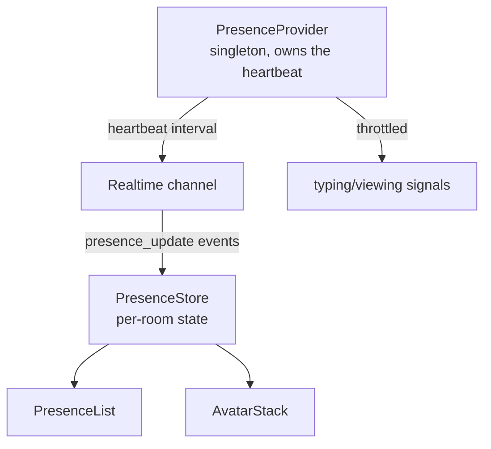
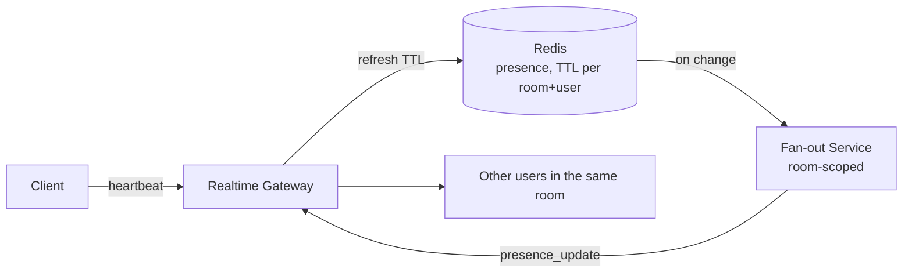

## Overview

- **Real-world analog:** Slack's online dots, Figma's "who's here," Google Docs' avatar stack, multiplayer anything.
- **Difficulty:** Medium-Hard · **Asked at:** Slack, Figma, Google Docs, multiplayer-tool companies.
- Presence gets treated as "easy" — it's just a green dot — which is exactly why it's under-covered and under-rehearsed. The real question is how you show 40 people "currently viewing" accurately, in real time, without a message storm, when the underlying signal (is this tab actually still open and attentive) is inherently unreliable and fuzzy.

## Clarifying Questions & Requirements

> **Ask these first:**
> 1. Binary online/offline only, or richer states (active, idle, typing, viewing-this-specific-document)?
> 2. What's the acceptable staleness window — is "online 10 seconds ago" close enough to "online now"?
> 3. Does presence need to be scoped per-document/per-room, or is it a single global online/offline status?
> 4. Does a clean logout need to differ from a crashed tab/lost connection in the UI, or are both just "went offline"?

| | In scope | Out of scope |
|---|---|---|
| **Functional** | Online/offline/typing/viewing states, scoped per-document or per-room, shown as a live-updating list/avatar stack | Rich presence integrations (calendar status, custom status messages) |
| **Non-functional** | Presence is timely (seconds-scale staleness, not minutes) without generating a message per user per second | A tab closing without a clean disconnect must not leave a permanent "ghost" — self-expiry is a hard requirement, not a nice-to-have |

## ── FRONTEND TRACK (RADIO) ──

### R — Requirements

| | Requirement | Why it's not optional |
|---|---|---|
| **Functional** | A live-updating presence list/avatar stack per room or document, distinguishing at least online/offline (richer state — typing, viewing — as a stretch) | The whole point is the *list changing live*, not a static roster fetched once |
| **Non-functional** | The client must not itself flood the network with presence signals — no emitting a heartbeat or status change on every keystroke | A well-behaved presence client is a resource-control problem as much as a real-time one |
| **Non-functional** | A tab closing abruptly (crash, force-quit, laptop lid closed) must eventually be reflected as offline, without relying on that tab sending any final "I'm leaving" message | The single hardest constraint of this whole question — you cannot assume a clean goodbye |

### A — Architecture



- **`PresenceProvider` owns exactly one outbound heartbeat**, app-wide — not one per open room/document a user happens to have open. A single periodic tick reports "I'm alive, and here are the rooms I currently care about," rather than N independent heartbeats for N open rooms, which would multiply outbound traffic by however many tabs/panels a power user happens to have open.
- Typing/viewing signals are explicitly throttled at the source — a user actively typing doesn't emit a fresh signal on every keystroke, only on a bounded interval (a pattern this course's chat-messaging question also uses for its own typing indicator, generalized here to any high-frequency presence signal).

```ts
class PresenceProvider {
  private readonly heartbeatMs = 15_000;
  private rooms = new Set<string>();

  start() {
    setInterval(() => {
      this.channel.send({ type: 'heartbeat', rooms: [...this.rooms] });
    }, this.heartbeatMs);
  }

  // Called when a user opens/closes a room's presence-tracked view.
  setRooms(rooms: string[]) {
    this.rooms = new Set(rooms);
  }
}
```

This is deliberately simple on the client — the actual hard problem (staleness detection, ghost cleanup, fan-out) is a backend concern, matching the direction this question's own real difficulty points.

### D — Data Model

```ts
type PresenceEntry = {
  userId: string;
  status: 'online' | 'idle' | 'offline';
  lastSeenAt: number;      // from the server, used only to render "last seen 2m ago"
};

type RoomPresence = Record<string, PresenceEntry>; // keyed by userId, per room
```

> **Key insight:** presence is explicitly **not durable state** — there's no `presence` row anyone expects to survive a server restart or be queried historically as ground truth. It's a live, self-expiring signal, and the client's `RoomPresence` map is a cache of that ephemeral signal, correctly cleared and rebuilt on reconnect rather than trusted to persist across a connection drop.

### I — Interface / API

**Component API**

```
<PresenceList entries={PresenceEntry[]} />
<AvatarStack userIds={string[]} maxVisible={number} />
```

**Network API** — the shared contract with the backend track below:

| Action | Transport | Shape |
|---|---|---|
| Heartbeat | WebSocket event | `{ type: 'heartbeat', rooms: string[] }`, fire-and-forget |
| Presence update (incoming) | WebSocket event | `{ type: 'presence_update', roomId, userId, status }` |
| Typing/viewing signal | WebSocket event | `{ type: 'activity', roomId, kind: 'typing' | 'viewing' }`, throttled client-side |

### O — Optimizations

**Networking**
- One heartbeat, app-wide, reporting all currently-relevant rooms in a single message — never one heartbeat per open room.
- Throttle outbound activity signals (typing, viewing) to roughly one per second at most, not per keystroke or per scroll event.

**Resilience**
- On reconnect, treat the entire local `RoomPresence` cache as stale and request a fresh snapshot rather than assuming it's still accurate — a connection drop of unknown duration means any locally-cached presence state could be arbitrarily out of date.
- Render a distinct "reconnecting" state for the presence list itself during a drop, rather than silently continuing to show the last-known (now unverified) roster as if it were still live.

### Frontend Deep Dives

**1. Distinguishing "stale because still catching up" from "confirmed offline."** Immediately after a reconnect, the client hasn't yet received a fresh presence snapshot — showing the old cached roster as confirmed-online is misleading (some of those users may have left while disconnected), but clearing it to empty is equally misleading (most of them are probably still there). The fix: a distinct `reconnecting` UI state for the presence list — greyed/muted rendering of the last-known roster until a fresh snapshot arrives — rather than either extreme.

**2. Rendering a presence list that changes size and order in real time without visual thrash.** A naive re-render of a sorted, resizing avatar stack on every single presence event (someone joins, someone's status flips) can cause visible layout shift multiple times a second during a busy period. The fix: batch incoming presence deltas over a short window (a few hundred milliseconds, the same coalescing idea this course's live-counter question uses for a different kind of high-frequency update) before committing a re-sort/re-render, rather than re-laying-out the list on every individual event.

### Frontend Bottlenecks & Tradeoffs

| Bottleneck | Mitigation | Tradeoff accepted |
|---|---|---|
| One heartbeat per open room for a power user with many tabs/panels | Single app-wide heartbeat reporting all rooms at once | Slightly more complex client-side room-tracking bookkeeping, in exchange for outbound traffic that doesn't scale with open-room count |
| Presence list visually thrashing during a busy period | Batch presence deltas over a short window before re-rendering | A few hundred milliseconds of perceived lag on individual join/leave events — imperceptible, and strictly better than visible layout jitter |
| Stale cached roster immediately post-reconnect | Explicit "reconnecting" UI state, request a fresh snapshot | A brief, honestly-communicated period where the list looks muted rather than fully live |

## ── BACKEND TRACK ──

### Requirements & Scope

- Maintain ephemeral, self-expiring presence state per user per room, at a scale where naive full fan-out (every user's presence broadcast to every other user in the same room) becomes the actual bottleneck — and detect "went offline" reliably even when a client never sends an explicit disconnect signal.

### Scale & Estimation

| | Estimate |
|---|---|
| Concurrent users in a large shared room/document | Up to a few hundred realistically (Figma/Docs-scale), occasionally low thousands |
| Naive full fan-out cost | N users, each needing to see N-1 others — O(N²) messages per state change, the actual scaling wall this question is testing |
| Heartbeat interval | 10-15 seconds typical |
| Staleness tolerance | A user is considered offline after roughly 2-3 missed heartbeat intervals (30-45 seconds), not instantly on one missed beat, to tolerate a single dropped packet |

### API Design

```
WS   heartbeat        {rooms: string[]}                      → (no ack required, fire-and-forget)
WS   presence_update  → {roomId, userId, status}
WS   activity         {roomId, kind}                         → (throttled client-side, fire-and-forget)
```

- No REST endpoint for presence at all — it's entirely a real-time-channel concern; there's no meaningful "GET current presence" that isn't immediately stale the moment it's returned, so the design doesn't pretend otherwise.

### Data Model & Storage

```
presence   -- entirely in an in-memory/TTL store, never the durable relational DB
  room_id       text
  user_id       text
  status        enum('online','idle')
  expires_at    timestamp    -- refreshed on every heartbeat, native TTL expiry
  PRIMARY KEY (room_id, user_id)
```

| Choice | Why |
|---|---|
| **Entirely TTL-backed in-memory storage (Redis), never written to the durable relational database at all** | Presence has no long-term value once expired — there's no product requirement to query "who was online in this room three days ago" — so there's no reason to pay durable-write cost for data whose entire lifecycle is measured in seconds |
| **Native TTL expiry, refreshed per heartbeat, not an application-level sweep job** | The same reasoning this course's seat-booking question applies to hold expiry: a sweep on a polling interval leaves users looking falsely online for up to the sweep interval after they've actually gone stale; native expiry releases the moment the TTL is actually due |
| **Presence scoped per (room, user), not a single global per-user status** | A user can be simultaneously "viewing" one document and "idle" in another open tab — a single global status can't represent that; scoping to the pair is what makes per-room presence lists actually correct |

### High-Level Architecture



- The **Fan-out Service is room-scoped**, not global — a presence change in room A is only ever broadcast to the (bounded) set of users actually subscribed to room A, which is what keeps the real fan-out cost proportional to room size rather than total connected-user count across the whole system.

### Deep Dives

**1. The O(N²) fan-out problem, and why room-scoping alone doesn't fully solve it.** Naive full fan-out means N users in a room each need to learn about N-1 others' status changes — for a 200-person room, that's up to ~40,000 message deliveries per state change if handled with zero batching. Room-scoping bounds N to "people actually in this room" rather than the whole system, which helps enormously, but the real fix for a genuinely large room is *also* batching: coalescing presence deltas over a short server-side window (mirroring the frontend's own batching) before fanning out, so a burst of several people joining or leaving in quick succession produces one batched update per interval, not one message delivery per individual event per subscriber.

**2. Detecting "went offline" with no explicit signal.** A crashed tab, a force-quit browser, or a laptop lid closing mid-session sends no disconnect message at all — the only reliable signal is the *absence* of an expected heartbeat. This is precisely what the TTL mechanism exists to solve: presence isn't marked offline by any explicit "goodbye" event, it's marked offline by the TTL simply expiring because nothing refreshed it — the system's default assumption is "everyone will eventually stop saying hello without warning," not "everyone will politely say goodbye."

> **Signature gotcha:** treating presence as durable state that persists until explicitly cleared. It's ephemeral and must self-expire, or you get ghosts — users who show as permanently online because whatever process was supposed to mark them offline never ran, or never had the chance to.

**3. Choosing heartbeat interval and staleness tolerance as a real tradeoff, not an arbitrary number.** A short heartbeat interval (every 2-3 seconds) makes presence very timely but multiplies outbound traffic and server-side TTL-refresh load by a large factor across every connected client; a long interval (every minute) is cheap but means a user who's actually left can appear online for up to a minute. The 10-15 second interval with a 2-3-missed-beat tolerance before declaring offline is a deliberate middle point — timely enough to feel real-time to a human, infrequent enough not to be a meaningful load source even at high concurrent-user counts, and tolerant of a single dropped heartbeat without falsely flipping someone offline.

### Bottlenecks & Tradeoffs

| Bottleneck | Mitigation | Tradeoff accepted |
|---|---|---|
| O(N²) fan-out in a large room | Room-scoped fan-out plus server-side batching of presence deltas | Presence updates land on a short batched cadence rather than instantly per event — imperceptible to users, and the entire point of the design |
| A crashed client never sending a clean disconnect | TTL-based expiry driven by heartbeat absence, not an explicit goodbye message | A bounded delay (a few missed heartbeat intervals) before a crashed user is shown as offline — an accepted, necessary cost of not being able to trust an explicit signal that may never arrive |
| Heartbeat traffic at high concurrent-connection counts | A single app-wide heartbeat per client (not per room), tuned interval | A deliberately coarse staleness tolerance rather than sub-second presence accuracy — correct for this data, per the consistency spectrum this course's field guide lays out |

## The Shared Contract

- **Transport:** WebSocket, chosen over SSE because heartbeats are a genuine client-to-server push, not just a server-to-client stream — the same bidirectional-need reasoning this course's chat-messaging question applies to its own transport choice.
- **Ownership boundary:** the client reports raw liveness (heartbeats, activity signals); the server owns the *interpretation* of that signal into online/idle/offline status and the TTL-driven expiry logic — the client never independently declares another user offline, it only ever renders what the server's fan-out reports.
- **Consistency posture:** explicitly the "pure ephemeral motion" row of this course's consistency spectrum — last-write-wins, best-effort, self-expiring. Presence is never treated as data worth strong consistency or durable storage.

## Interview Signals

| | Strong answer | Weak answer |
|---|---|---|
| **Frontend** | Uses a single app-wide heartbeat, not one per open room; explicitly handles the reconnect-stale-cache problem | Emits a heartbeat or status signal per keystroke/scroll with no throttling discussion |
| **Backend** | Names the O(N²) fan-out problem explicitly and proposes both room-scoping and batching, not just one of the two | Proposes a single global presence broadcast with no discussion of fan-out cost at room scale |
| **Both** | Treats presence as inherently ephemeral, self-expiring state from the start, not an afterthought bolted onto a durable model | Designs a `users.status` column with no expiry mechanism, then has to retrofit staleness handling |

**Common failure modes:** modeling presence as durable, persisted state; no TTL/expiry mechanism, leading to permanent "ghosts"; naive full fan-out with no discussion of the N² cost at real room sizes; heartbeating or emitting activity signals with no throttling.

## Glossary Links

This question draws on: Presence, WebSocket, Server-Sent Events, Consistency model — each linked on first mention above.
