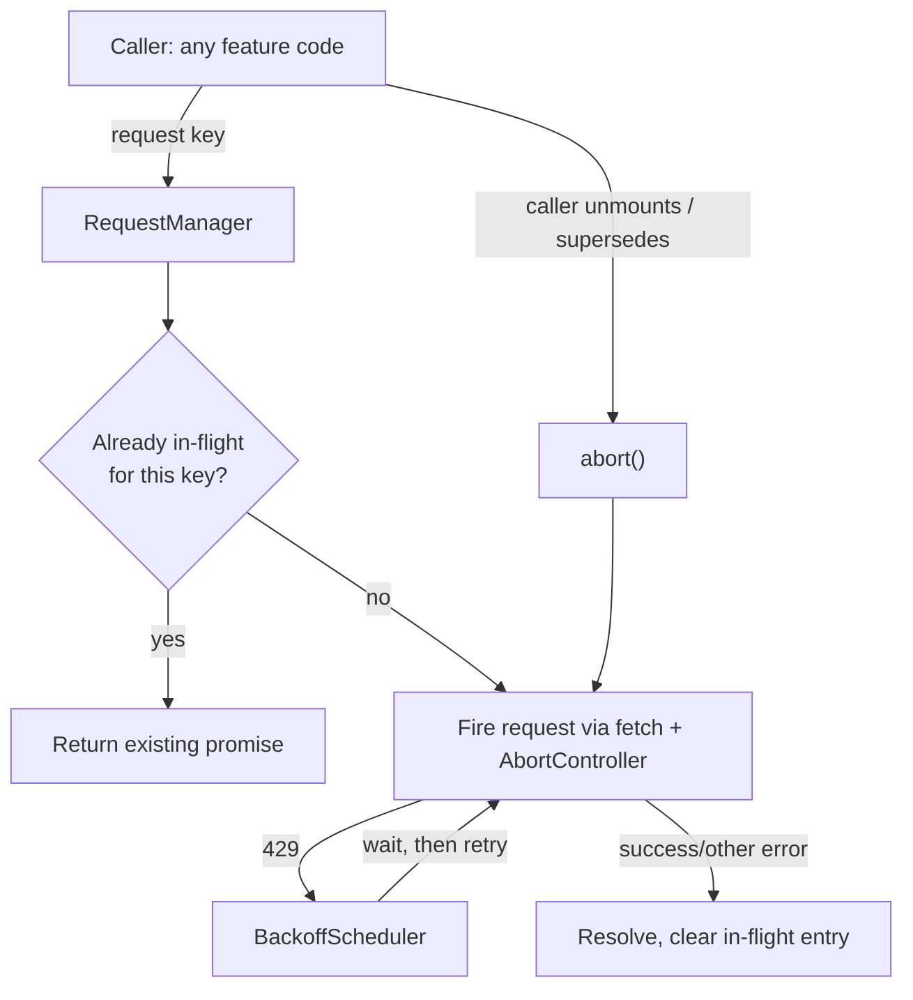

## Overview

- **Real-world analog:** API-heavy dashboards, autocomplete-heavy products, Stripe-style SDKs.
- **Difficulty:** Medium · **Mechanism family:** Resource control — bounding outbound work from the client.
- **Backend counterpart:** [Rate Limiter](/backend-interviews/c/rate-limiter) covers server-side enforcement (this chapter is explicitly scoped to client-side cooperative behavior only); [Multi-Datacenter Rate Limiter](/backend-interviews/c/global-rate-limiter) extends it across regions.
- The core challenge isn't calling an API — it's making sure the client never hammers it: no duplicate in-flight requests for the same thing, and graceful, cooperative behavior the moment the server says "slow down."

## Clarifying Questions & Requirements

> **Ask these first:**
> 1. Is this a general-purpose client library/SDK other teams will use, or one specific feature's request logic?
> 2. Does the server expose real rate-limit signals (`429` + `Retry-After`), or does the client have to guess conservatively with no feedback?
> 3. Are the requests idempotent reads, or do some have side effects (where a duplicate matters more)?
> 4. Is offline/reconnect behavior in scope, or is this purely about *pacing* requests on an otherwise-working connection?

| | In scope | Out of scope |
|---|---|---|
| **Functional** | Debounce/throttle at the source, in-flight request deduplication, exponential backoff with jitter on `429`, request cancellation for superseded calls | Server-side rate-limit *enforcement* itself (this question is entirely about the client's cooperative behavior) |
| **Non-functional** | The client never sends a request it already knows is redundant; backoff genuinely reduces load on a struggling server rather than just adding client-side delay cosmetically | Guaranteeing zero 429s under all conditions — impossible without server cooperation, and not the point of this question |

## ── FRONTEND TRACK (RADIO) ──

### R — Requirements

| | Requirement | Why it's not optional |
|---|---|---|
| **Functional** | Identical concurrent requests (same endpoint + params) share one in-flight promise instead of firing N times | A component re-rendering and re-triggering the same fetch is routine, not a bug to prevent upstream |
| **Functional** | A superseded request (the user typed further, invalidating an in-flight autocomplete query) is cancelled, not just ignored on arrival | An ignored-but-still-in-flight request still costs real server capacity and can still race a newer one into applying its (stale) result |
| **Non-functional** | On `429`, the client backs off exponentially with jitter and respects `Retry-After` when present, rather than retrying immediately | Retrying immediately on a rate-limit response is functionally attacking the server that just told you to stop |
| **Non-functional** | This behavior is a shared, reusable layer — not logic every feature team reimplements slightly differently | Consistency and correctness both degrade fast if this is solved ad hoc per call site |

### A — Architecture



- **`RequestManager` is a single shared layer**, not per-component logic — every network call in the app that opts into this behavior goes through the same in-flight tracking and backoff handling, which is what makes this a resource-control *mechanism* rather than a one-off optimization on one feature.
- **The "request key" is the whole trick for deduplication** — two calls are "the same request" if their key (typically endpoint + serialized params) matches, regardless of which component or hook triggered them.

```ts
class RequestManager {
  private inFlight = new Map<string, Promise<unknown>>();

  async request<T>(key: string, fn: (signal: AbortSignal) => Promise<T>): Promise<T> {
    const existing = this.inFlight.get(key);
    if (existing) return existing as Promise<T>;

    const controller = new AbortController();
    const promise = this.executeWithBackoff(fn, controller.signal)
      .finally(() => this.inFlight.delete(key));

    this.inFlight.set(key, promise);
    return promise;
  }

  private async executeWithBackoff<T>(fn: (signal: AbortSignal) => Promise<T>, signal: AbortSignal, attempt = 0): Promise<T> {
    try {
      return await fn(signal);
    } catch (err) {
      if (isRateLimited(err) && attempt < MAX_RETRIES) {
        const retryAfterMs = getRetryAfterMs(err) ?? backoffWithJitter(attempt);
        await sleep(retryAfterMs);
        return this.executeWithBackoff(fn, signal, attempt + 1);
      }
      throw err;
    }
  }
}
```

### D — Data Model

| | Owner | Example |
|---|---|---|
| **In-flight request registry** | `key → Promise` map, entirely ephemeral client state | Cleared the instant a request settles; never persisted |
| **Backoff state** | Per-key attempt count and next-allowed-retry time | Reset to zero on any successful request |

```ts
type RateLimitState = {
  key: string;
  attempt: number;
  nextRetryAt: number | null;
};
```

Deliberately minimal — this question's data model is small on purpose; the depth is in the *behavior* (dedup, backoff, cancellation), not in tracked state.

### I — Interface / API

**Component API**

```
useDedupedRequest<T>(key: string, fetcher: (signal: AbortSignal) => Promise<T>): {
  data: T | undefined,
  status: 'idle' | 'loading' | 'error',
}
```

Cancellation is automatic on unmount or on a new call with the same key superseding an in-flight one — the caller never has to remember to call `abort()` manually.

**Network API** — the shared contract with the backend track below:

| Action | Transport | Shape |
|---|---|---|
| Any deduped/rate-limited call | Whatever the underlying endpoint is (REST, typically) | Client attaches nothing special on the way out — the contract lives entirely in how the client *reacts* to the response |
| Rate-limit response | `429` with `Retry-After` header when the server can provide it | Client treats `Retry-After` as authoritative when present, falls back to its own exponential-backoff schedule when absent |

### O — Optimizations

**Networking**
- Exponential backoff with jitter on every retry (reusing the same `Exponential backoff` pattern this course establishes elsewhere) — a fixed retry interval across many clients hitting the same limit simultaneously reconverges into another burst; jitter spreads retries out.
- `AbortController` cancels a superseded request's underlying network activity, not just its result handling — an autocomplete query for `"ab"` genuinely stops when the user has already typed `"abc"`, rather than continuing to consume bandwidth for a result nobody will use.

**Resource discipline**
- In-flight deduplication is keyed, not global — two different endpoints (or the same endpoint with different params) are correctly treated as independent, only truly identical requests share a promise.
- A capped retry count (`MAX_RETRIES`) prevents a persistently-limited endpoint from retrying forever — after the cap, the caller receives a real error instead of an invisible infinite retry loop.

### Frontend Deep Dives

**1. In-flight deduplication vs. simple response caching — a real distinction.** Caching a *completed* response avoids a second, later request for the same data; deduplication avoids firing a second request while the *first one is still in flight* — a subtly different problem, since the naive "just cache responses" approach does nothing for two components that both mount and fetch the same data in the same tick, before either request has resolved. The `RequestManager` sketch above solves specifically this: the second caller gets the *same promise* as the first, not a second network call and not a stale cache miss.

**2. Cancelling superseded requests without leaking abandoned ones.** A component that unmounts mid-request, or a search box where the user keeps typing faster than results return, both produce requests whose results nobody will ever use. Without explicit cancellation, these requests still complete server-side (wasting capacity) and can still race their result into applying after a *newer*, more relevant request has already resolved — a classic out-of-order-response bug. Wiring `AbortController` through every fetch, tied to component lifecycle and to a newer call with the same key, closes both problems with one mechanism.

**3. Respecting `Retry-After` over a fixed backoff schedule when the server provides it.** A server under load has real information the client doesn't — how long it actually expects to need before it can serve this client again. When `Retry-After` is present, using it (rather than the client's own generic exponential schedule) is strictly more cooperative and more likely to succeed on the very next attempt.

> **Signature gotcha:** framing client-side rate limiting as a *security* control. It isn't — it's cooperative UX politeness, and it's trivially bypassed by anyone who wants to (a different client, a direct API call, a modified build). The client can only ever be a good citizen; real enforcement has to live server-side, which is the entire content of the backend track below.

### Frontend Bottlenecks & Tradeoffs

| Bottleneck | Mitigation | Tradeoff accepted |
|---|---|---|
| Multiple components independently triggering the same fetch | Keyed in-flight deduplication, shared promise | Requires a consistent, deliberate keying scheme across call sites — a small discipline cost for real savings |
| Fixed retry intervals across many clients causing synchronized reconverging bursts | Exponential backoff with jitter | Slightly less predictable individual retry timing, in exchange for the aggregate not amplifying the outage |
| Stale, superseded results applying after a newer request already resolved | `AbortController` tied to request key/lifecycle | A canceled request's partial work is simply discarded — acceptable, since it was never going to be used |

## ── BACKEND TRACK ──

### Requirements & Scope

- The actual enforcement layer the frontend track cooperates with. This track is deliberately proportionate, not a full architecture writeup: server-side rate limiting is a well-established pattern, and the interesting part of *this specific question* is the client's cooperative behavior, covered above.

### API Design

```
Any rate-limited endpoint
  → 429 Too Many Requests
    headers: { Retry-After: <seconds>, X-RateLimit-Remaining: <n>, X-RateLimit-Reset: <timestamp> }
```

- `Retry-After` is the one header the frontend track's backoff logic actually depends on — providing it turns the client's blind exponential guessing into an informed wait, which is strictly better for both sides.
- `X-RateLimit-Remaining`/`X-RateLimit-Reset` are optional but valuable — they let a well-behaved client (or SDK, per the "Stripe-style SDKs" framing in this question) self-throttle *before* ever hitting a 429 at all, rather than only reacting after the fact.

### Data Model & Storage

```
rate_limit_buckets   (typically Redis, not a relational store)
  key             text    -- e.g. "user:123:endpoint:/search"
  count           integer
  window_start    timestamp
```

| Choice | Why |
|---|---|
| **Token-bucket or sliding-window counter in Redis**, not a relational table | Rate limiting is a high-frequency, low-latency check on every request — an in-memory store with atomic increment operations is the standard fit; a relational table would add unacceptable latency to every single request |
| **Keyed per user + endpoint**, not globally | A global limit can't distinguish one abusive client from the rest of legitimate traffic; per-key limiting contains the blast radius to whoever's actually over budget |

### High-Level Architecture

A dedicated diagram is unnecessary here — this is a standard rate-limiting middleware pattern (a Redis-backed counter checked before the request reaches business logic), not new infrastructure specific to this question. The one thing worth naming explicitly: the limiter sits in front of the actual handler, as middleware, so it's a shared, consistently-applied policy rather than logic each endpoint has to remember to implement itself.

### Deep Dives

**1. Why the client can only ever cooperate, never enforce.** Any client-side limiting logic — debounce, backoff, request caps — is fully bypassable by definition: a different client, a direct `curl` call, or a modified build simply doesn't run the client's JavaScript at all. This isn't a flaw in the frontend design, it's a structural fact about where trust boundaries actually are — the frontend track's entire value is making a *well-behaved* client polite and efficient, not making the system secure against a malicious one.

### Bottlenecks & Tradeoffs

| Bottleneck | Mitigation | Tradeoff accepted |
|---|---|---|
| A single hot key (one very active user/endpoint pair) | Per-key counters scale independently in a distributed cache | None significant — this is the standard, well-understood pattern for exactly this problem |

## The Shared Contract

- **Transport:** whatever the underlying API already uses (typically REST) — this question adds behavior around existing calls, not a new transport.
- **Ownership boundary:** the server owns the actual limit and its enforcement; the client owns only its own cooperative pacing — this asymmetry should be stated explicitly, since it's the answer to "could the client just not do this," and the answer is "yes, and the server still has to be safe regardless."
- **The contract term that actually matters:** `Retry-After`. Its presence (or absence) is what determines whether the client's backoff is informed or a blind guess — worth naming as the single most load-bearing header in this entire question.

## Interview Signals

| | Strong answer | Weak answer |
|---|---|---|
| **Frontend** | Distinguishes deduplication from caching precisely, and explains why cancellation needs to be wired to request identity, not just component lifecycle | Says "add a debounce" and treats the question as solved |
| **Backend** | Explains the per-key, Redis-backed counter choice and why a relational table wouldn't fit the latency requirement | Designs an elaborate rate-limiting architecture with no connection to what the frontend track actually needs from it (`Retry-After`) |
| **Both** | States explicitly that client-side limiting is cooperative, not enforcement, without being prompted | Implies or states that client-side logic is sufficient protection on its own |

**Common failure modes:** conflating request caching with in-flight deduplication; forgetting to actually cancel a superseded request's network activity, not just its result handling; claiming client-side rate limiting is a security measure; retrying immediately on 429 instead of backing off.

## Glossary Links

This question draws on: Exponential backoff, AbortController, Idempotency — each linked on first mention above.
