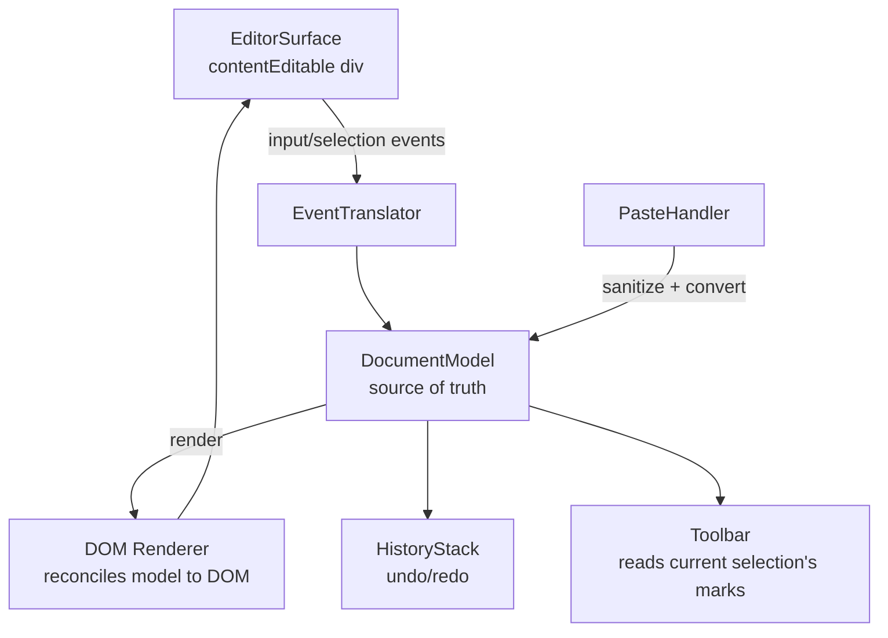

## Overview

- **Real-world analog:** Medium's editor, Gmail compose, comment boxes with formatting.
- **Difficulty:** Hard · **Asked at:** Meta, Stripe, productivity-tool companies.
- The core challenge is that the browser's native `contentEditable` gives you a working text-editing surface almost for free, and that's exactly the trap — its actual DOM output is inconsistent across browsers and impossible to reason about as a data model, which is why every serious rich text editor is built on its *own* document model with `contentEditable` as only the input surface, not the source of truth.

## Clarifying Questions & Requirements

> **Ask these first:**
> 1. What formatting is actually needed — inline only (bold/italic/links), or block-level too (lists, headings, quotes)?
> 2. Does it need a plugin system (custom embeds, mentions, slash commands), or a fixed feature set?
> 3. What does content need to serialize to — HTML, Markdown, a custom JSON schema, or several of these?
> 4. Collaborative (multiple editors at once) or single-user? (If collaborative, this becomes a variant of the Collaborative Editor question elsewhere in this bank — worth flagging the overlap and scoping explicitly to single-user unless told otherwise.)

| | In scope | Out of scope |
|---|---|---|
| **Functional** | Bold/italic/link formatting, lists, undo/redo, paste sanitization, serialization to at least one format | Real-time multi-user collaboration (a different, harder question — see Collaborative Editor), a full plugin marketplace |
| **Non-functional** | Typing latency stays imperceptible even in a long document; formatting state (is the cursor inside bold text right now?) is always correct | Perfect fidelity round-tripping through every possible external paste source |

## ── FRONTEND TRACK (RADIO) ──

### R — Requirements

| | Requirement | Why it's not optional |
|---|---|---|
| **Functional** | Toolbar with live formatting state, inline + block formatting, undo/redo, paste handling, serialization | This is one of the hardest component questions in the entire bank — treat it with matching depth |
| **Non-functional** | The editor's internal document model is the source of truth, not the raw DOM `contentEditable` produces | This single decision is what the rest of the question's design hinges on — get it wrong and everything downstream (undo/redo, serialization, selection) becomes unreliable |
| **Non-functional** | Pasted content (from Word, Google Docs, a webpage) never introduces XSS or wildly inconsistent formatting | A real, commonly-exploited vector if paste content is trusted and rendered directly |

### A — Architecture



- **`EventTranslator`** is the piece a shallow answer skips: raw `contentEditable` `input`/`beforeinput`/`selectionchange` events don't map cleanly to "the user pressed bold" or "the user typed a character at position X" — they have to be interpreted into model-level operations (insert text, apply mark, split block) before the model ever sees them.
- **`DocumentModel` → DOM Renderer** is a one-way, model-to-DOM reconciliation, structurally the same idea as a virtual DOM diff — the model is the truth, and the visible `contentEditable` DOM is a *rendering* of it, not the other way around. This is precisely what makes undo/redo, serialization, and collaborative editing (if ever added later) tractable.

### D — Data Model

The document model is a tree, not a flat string — this is the single most important data-modeling decision in the whole question:

```ts
type DocNode =
  | { type: 'paragraph'; children: InlineNode[] }
  | { type: 'heading'; level: 1 | 2 | 3; children: InlineNode[] }
  | { type: 'bulletList'; children: DocNode[] }
  | { type: 'listItem'; children: DocNode[] };

type InlineNode = {
  text: string;
  marks: ('bold' | 'italic' | 'link')[];
  linkHref?: string;
};

type Selection = {
  anchor: { path: number[]; offset: number }; // path = index chain into the tree
  focus: { path: number[]; offset: number };
};
```

| | Owner | Example |
|---|---|---|
| **Client state** | The entire document tree, selection, undo/redo history | This is unusually "all client state" for a component in this bank — there's often no server round-trip per keystroke at all |
| **Server state** (if persisted) | The saved/serialized document | Only touches the network on explicit save, not on every edit |

> **Key insight:** representing selection as a `path`/`offset` pair into the *model* tree (not a `Range` object referencing live DOM nodes) is what makes selection survive a model-to-DOM re-render — a DOM `Range` becomes invalid the instant the nodes it references get replaced, which happens on nearly every edit if the renderer does a naive full re-render.

### I — Interface / API

```
<Editor
  initialValue={DocNode[]}
  onChange={(doc: DocNode[]) => void}
  plugins={Plugin[]}
/>
<Toolbar editor={EditorInstance} /> // reads editor.activeMarks() for live button state
```

**Serialization API** — not a network contract in the usual sense, but the shared "shape" both a save-to-backend flow and a paste-from-clipboard flow depend on:

```
toHTML(doc: DocNode[]): string
fromHTML(html: string): DocNode[]     // used by the paste handler
toMarkdown(doc: DocNode[]): string
```

Having explicit, bidirectional serializers is what makes both "save this document" and "sanitize and convert this pasted HTML" the *same* well-tested code path, rather than two separately-hacked-together conversions.

### O — Optimizations

**Performance**
- For long documents, avoid re-rendering the entire model-to-DOM tree on every keystroke — diff the model change and patch only the affected DOM nodes, the same reconciliation discipline a virtual-DOM UI framework already applies, applied here to the editor's own render step specifically.
- Debounce `onChange` calls to a consuming parent component (e.g. an autosave handler) rather than firing on every single keystroke.

**Accessibility**
- Toolbar buttons need real `aria-pressed` state reflecting whether the current selection has that mark active, and must remain operable via keyboard, including standard shortcuts (Cmd/Ctrl+B for bold) matching platform conventions.
- The editable surface itself needs `role="textbox"` with `aria-multiline="true"`, and heading/list structure in the model should map to genuinely semantic output on serialization (a real `<h2>`, not a styled `<div>`), not just visual styling with no underlying structure.

**Resilience**
- Autosave to local storage on a short interval independent of any network save, so a crashed tab or a lost connection doesn't lose in-progress work — this is the editor-specific version of the offline-resilience pattern this bank's other questions apply to network requests.

### Frontend Deep Dives

**1. Why `contentEditable` alone can't be the source of truth.** Different browsers produce meaningfully different DOM structure for the same visual edit (e.g. pressing Enter inside a list item can produce a new `<li>`, a `<br>`, or a nested `<div>` depending on browser and context) — code that tries to read "what changed" directly out of the resulting DOM is chasing an unstable, browser-specific target. The fix, already reflected in the architecture above, is treating every `contentEditable` event as a *signal* that something happened, translating it into an explicit model operation (`insertText`, `splitBlock`, `applyMark`), applying that operation to the model, and then re-rendering the model back into the DOM — the DOM is never trusted as the record of what happened, only as the surface the user directly interacts with.

**2. Selection and range management across an edit.** A `path`/`offset`-based selection (from the Data Model section) has to be explicitly *transformed* through every model operation — inserting 5 characters before the current cursor position means every subsequent operation needs the cursor's offset shifted by 5, and a more complex operation like splitting a block means recomputing which resulting node's path the selection now falls into.

```ts
function transformSelectionAfterInsert(sel: Selection, insertPath: number[], insertOffset: number, textLength: number): Selection {
  // If the insertion happened at or before the selection's position on the same node,
  // shift the offset forward by the inserted length. Real implementations handle every
  // operation type (delete, split, merge) with an equivalent transform — this is the
  // core discipline that makes selection survive arbitrary edits without going stale.
  if (pathsEqual(sel.anchor.path, insertPath) && insertOffset <= sel.anchor.offset) {
    return { ...sel, anchor: { ...sel.anchor, offset: sel.anchor.offset + textLength } };
  }
  return sel;
}
```

**3. Paste sanitization without losing all formatting.** Pasted HTML from an external source (Word, a webpage) commonly carries both formatting worth preserving (bold, links, lists) and content that's a real security risk (`<script>` tags, inline event handlers, `javascript:` URLs) or just noise (Word's characteristically bloated inline styles). The fix is never rendering pasted HTML directly — it goes through the `fromHTML` serializer above, which parses it into the editor's own trusted `DocNode` tree (dropping anything that doesn't map to a known, safe node/mark type), and *that* trusted tree is what gets inserted — the sanitization happens as a side effect of only ever accepting content that survives translation into the model's own restricted vocabulary, not as a separate denylist-based cleanup pass over raw HTML.

**4. Undo/redo that groups related keystrokes sensibly.** A naive undo stack pushes one entry per keystroke, so undo has to be pressed once per character typed to undo a sentence — clearly wrong from a user's perspective. Real editors group a burst of related operations (continuous typing, a single formatting action) into one undo step, typically by coalescing operations that happen within a short time window and are of the same type, and starting a new undo group on a selection change, a pause exceeding some threshold, or a different operation type.

### Frontend Bottlenecks & Tradeoffs

| Bottleneck | Mitigation | Tradeoff accepted |
|---|---|---|
| `contentEditable`'s inconsistent native DOM output | Treat all input as signals, translate to model ops, render model → DOM one-way | Significantly more implementation complexity than "just use contentEditable directly" |
| DOM `Range`-based selection going stale on re-render | Model-relative `path`/`offset` selection, explicitly transformed through every operation | Every operation type needs its own selection-transform logic |
| One undo entry per keystroke | Coalesce related operations into undo groups | Slightly more complex history-stack bookkeeping |
| Unsafe pasted HTML | Route through the model's own `fromHTML` serializer, never render raw | Some visual fidelity loss from sources with unusual/unsupported formatting |

## ── BACKEND TRACK ──

### Requirements & Scope

- Persist a saved document in a serialized form; this question, scoped to single-user (per Clarifying Questions), has genuinely modest backend requirements — most of the hard problems live entirely in the frontend track above.

### Scale & Estimation

| | Estimate |
|---|---|
| Document size | Typically KB-scale text content — small relative to most other data this bank's backend tracks handle |
| Save frequency | Debounced autosave, roughly every few seconds of active editing, not per-keystroke |

### API Design

```
GET  /documents/:id           → { content: SerializedDoc, version, updatedAt }
PUT  /documents/:id           {content, expectedVersion} → { version } | 409 Conflict
```

- `expectedVersion` on save is a simple optimistic-concurrency check — if a document could ever be opened in two tabs (even without real-time collaboration in scope), this catches the case where a stale tab's autosave would otherwise silently clobber a newer save, and returns a 409 the frontend can surface rather than silently losing the other tab's edits.

### Data Model & Storage

```
documents
  id            uuid PK
  content       jsonb / text   -- the serialized DocNode tree, or its HTML/Markdown form
  version       bigint         -- incremented on every save, backs the optimistic-concurrency check
  updated_at    timestamp
```

- A single row per document is entirely sufficient at this scope — there's no need for the message-log or event-sourcing patterns other, more real-time-heavy questions in this bank require, precisely *because* collaboration is explicitly out of scope here.

### High-Level Architecture

A single document service backed by a normal relational or document store is genuinely enough — there's no meaningful architecture diagram beyond "client saves to an API, API writes a row." Drawing an elaborate microservices diagram here would be inventing complexity the question doesn't have, which is itself a real interview-signal miss in the *other* direction from underdesigning.

### Deep Dives

**1. The one real backend judgment call: optimistic concurrency vs. accepting last-write-wins.** Without real-time collaboration in scope, the only meaningful backend design question is whether two tabs/devices editing the same document need a conflict signal (the `expectedVersion` check above) or whether silently overwriting is an acceptable risk for this product. For most single-user editors, the version check is cheap insurance worth including; a product explicitly targeting only ever having one active session per document could reasonably skip it.

### Bottlenecks & Tradeoffs

| Bottleneck | Mitigation | Tradeoff accepted |
|---|---|---|
| Two tabs/devices silently overwriting each other's saves | Optimistic-concurrency version check on save | A 409 the frontend has to handle (e.g. "this doc was updated elsewhere, reload?"), rather than silent data loss |

## The Shared Contract

- **Transport:** plain REST — no real-time push required at this scope; if collaboration gets added later, this contract changes substantially (see the Collaborative Editor question for that variant).
- **Ownership boundary:** the frontend owns the entire document model, selection, and undo/redo — the backend's only responsibility is durable storage of whatever serialized form the frontend hands it, plus the version check.
- **Serialization format is the actual seam**: both tracks need to agree on it explicitly (HTML? Markdown? the editor's own JSON schema?) since it determines what the backend can meaningfully validate or search on later, if that's ever a requirement.

## Interview Signals

| | Strong answer | Weak answer |
|---|---|---|
| **Frontend** | Explains *why* contentEditable can't be the source of truth, with a concrete example of browser inconsistency | Builds directly on top of contentEditable's raw DOM output with no model layer |
| **Frontend** | Uses model-relative selection and explains why a DOM `Range` goes stale | Represents selection as a live DOM `Range` and doesn't address re-render invalidation |
| **Backend** | Correctly scopes backend depth down to match this question's actual (modest) backend surface | Invents unnecessary backend complexity (a message bus, sharding) for a single-user document |
| **Both** | Names paste sanitization as a real XSS vector, not just a formatting-fidelity concern | Treats pasted content as trusted, formatting-preservation-only |

**Common failure modes:** building directly on raw contentEditable DOM with no model layer; representing selection as a live DOM Range; rendering pasted HTML without sanitizing it; over-engineering the backend for a single-user scope.

## Glossary Links

No existing glossary terms apply directly — this question's hard problems (document-model architecture, selection transforms, undo coalescing) are specific to rich-text-editor engineering rather than the cross-cutting distributed-systems vocabulary the shared glossary tracks.

**Proposed glossary additions:** none from this question specifically — **optimistic concurrency** (the `expectedVersion` check) is a real, reusable term, but it's a lighter-weight cousin of **consistency model** already in the glossary; introducing a separate entry now would be a marginal addition better justified if a future question needs the distinction drawn more sharply.
