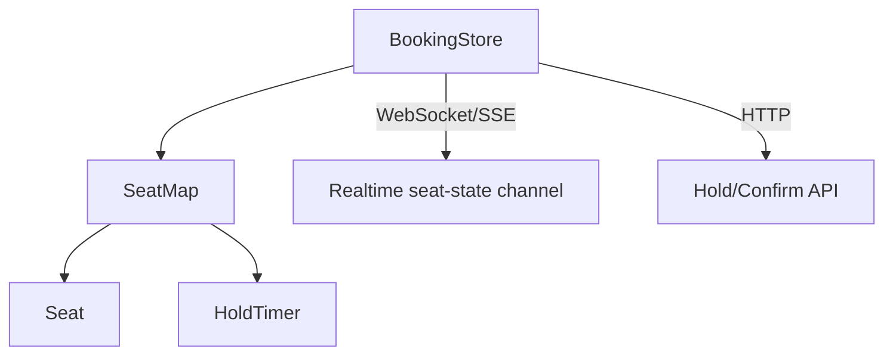
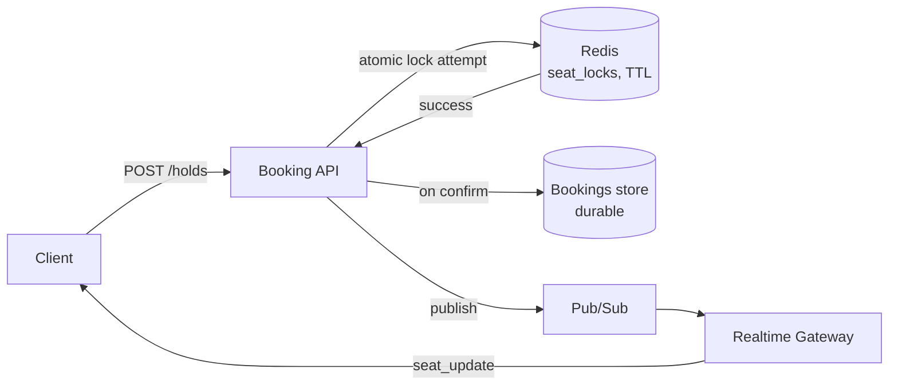

## Overview

- **Real-world analog:** BookMyShow, airline seat maps, event ticketing.
- **Difficulty:** Medium-Hard · **Asked at:** ticketing, travel, and event platforms.
- **Backend counterpart:** [Ticket Booking with Seat Locking](/backend-interviews/c/ticket-booking) picks up past this chapter's atomic hold mechanism to cover admission control at true on-sale scale.
- The core challenge is almost entirely a backend concurrency problem wearing a frontend UI: many users can click the same seat within milliseconds of each other, and exactly one of them can actually get it — the frontend's job is mostly to reflect that outcome honestly and quickly, not to decide it.

## Clarifying Questions & Requirements

> **Ask these first:**
> 1. Single-seat selection, or multi-seat (a group of 4 must be held/booked atomically together)?
> 2. How long does a hold last before it expires and releases the seat back?
> 3. Does payment happen *during* the hold window, and does a slow payment need to extend it?
> 4. Real-time seat-map updates for other users watching the same map, or only a page refresh?

| | In scope | Out of scope |
|---|---|---|
| **Functional** | Seat map, hold-then-book flow, countdown timer, multi-seat atomic hold, real-time map updates | Seat pricing/dynamic pricing logic, refunds/cancellation flows |
| **Non-functional** | Two users can never both successfully book the same seat, under any timing | Sub-100ms global lock acquisition at extreme scale (regional locking is an acceptable, stated simplification) |

## ── FRONTEND TRACK (RADIO) ──

*(This track is intentionally lighter than the backend track, per the task's own depth-calibration rule — the hard problem here is a backend concurrency/locking problem; the frontend's job is honest, responsive reflection of state it doesn't own.)*

### R — Requirements

| | Requirement | Why it's not optional |
|---|---|---|
| **Functional** | A seat map showing available/held/booked state per seat, a countdown timer once a hold is active, graceful conflict messaging | The map has to visibly reflect a state the *server* owns — this is not a client-authoritative UI |
| **Non-functional** | Selecting a seat feels instant, but a rejection (someone else got it first) is handled gracefully, not as a jarring error | Optimistic selection with honest rollback is the right feel — pretending the client's selection is final until confirmed is actively misleading |

### A — Architecture



- The seat map subscribes to a realtime channel broadcasting other users' hold/release/book events, so a seat another user just grabbed visibly locks *before* the current user clicks it, minimizing (never eliminating) the frustrating "I picked a seat that was already gone" case.
- `BookingStore` treats a local seat selection as **provisional** until the hold API confirms it — exactly the optimistic-but-reconciled pattern the bank's own requirement list calls for, not a client-side "reservation."

### D — Data Model

```ts
type Seat = {
  id: string;
  status: 'available' | 'held' | 'booked';
  heldByCurrentUser: boolean;   // distinguishes "I'm holding this" from "someone else is"
  holdExpiresAt: number | null; // server-provided TTL, used only to render the countdown
};
```

> **Key insight:** `holdExpiresAt` is a value the client *displays*, never one it *enforces* — the countdown timer is a UX convenience; the actual expiry is a server-side TTL, exactly as the requirement list specifies ("server-authoritative, TTL-based atomic locks — never client-side"). If the client's clock and the server's disagree, the server's is what actually matters, and the UI should reconcile against server responses rather than trusting its own countdown reaching zero.

### I — Interface / API

**Component API**

```
<SeatMap seats={Seat[]} onSelect={(seatIds: string[]) => void} />
<HoldTimer expiresAt={number} onExpire={() => void} />
```

**Network API** — the shared contract with the backend track below:

| Action | Transport | Shape |
|---|---|---|
| Hold seat(s) | `POST /holds` | `{ seatIds: string[] }` → `{ holdId, expiresAt }` or `409 Conflict` |
| Confirm booking | `POST /holds/:holdId/confirm` | `{ paymentToken }` → `200` or `410 Gone` (hold expired) |
| Release hold | `POST /holds/:holdId/release` | Explicit release, e.g. user navigates away |
| Realtime seat updates | WebSocket/SSE | `{ type: 'seat_update', seatId, status }` |

### O — Optimizations

- **Optimistic-but-reconciled selection:** clicking a seat shows it as "selected" immediately, but the actual hold isn't confirmed until the `POST /holds` response returns — a `409 Conflict` reverts the seat to its real (now-taken) state with a clear, specific message, not a generic error.
- **Countdown timer UI** re-syncs against the server's `expiresAt` on every relevant response rather than drifting from a purely client-side timer across a long session.
- **Accessibility:** each seat is a real, labeled, keyboard-operable control (`aria-label="Seat 14C, available"`), not a bare colored div in an SVG/canvas map with no accessible name.

### Frontend Deep Dives

**1. Multi-seat atomicity reflected honestly in the UI.** If a user selects 4 seats and only 3 are still available by the time the hold request lands, the correct behavior is rejecting the *entire* hold (matching the backend's atomic-or-nothing guarantee) and telling the user specifically which seat(s) became unavailable — not silently holding 3 of 4 and leaving the user to notice they're missing one.

**2. Countdown expiry racing the confirm request.** If a user submits payment right as the hold's TTL is about to expire, the confirm request can land server-side just before or just after expiry. The frontend has to handle a `410 Gone` on confirm as a real, distinct outcome from a generic failure — releasing the seat back visibly and letting the user re-select, rather than showing a confusing payment error for what was actually an expired hold.

## ── BACKEND TRACK ──

*(This is the deep half of this question — the actual hard problem.)*

### Requirements & Scope

- Guarantee that exactly one user can successfully book a given seat, under concurrent hold attempts within milliseconds of each other, with a bounded hold duration and atomic multi-seat holds.

### Scale & Estimation

| | Estimate |
|---|---|
| Concurrent hold attempts on a hot on-sale (peak) | 50K/sec on a single popular event |
| Hold TTL | 5-10 minutes typical |
| Seats per venue | 50-80K for a large venue/event |
| Read:write ratio during an on-sale | Extremely write-heavy and bursty — the opposite profile of most systems, and the actual scaling challenge |

### API Design

```
POST /holds            {seatIds: string[]}       → 201 {holdId, expiresAt} | 409 Conflict
POST /holds/:id/confirm {paymentToken}            → 200 | 410 Gone
POST /holds/:id/release                            → 204
WS   seat_update        → {seatId, status}
```

### Data Model & Storage

```
seat_locks
  seat_id       text PK
  status        enum('available','held','booked')
  hold_id       uuid nullable
  expires_at    timestamp nullable

holds
  id            uuid PK
  seat_ids      text[]
  user_id       uuid
  created_at    timestamp
  expires_at    timestamp
```

| Choice | Why |
|---|---|
| **In-memory store (Redis) for `seat_locks`, not the primary relational DB** | The lock/TTL operation needs to be atomic and extremely fast under heavy contention — Redis's `SETNX`/Lua-scripted compare-and-set primitives are built exactly for this; a relational DB row lock under this contention would become the bottleneck itself |
| **TTL expiry via Redis's native key expiry**, not an application-level cron sweep | A cron sweep checking "is this hold expired" on a polling interval means seats sit falsely locked for up to the sweep interval after actually expiring — native TTL releases the moment it's due, with no polling delay |
| **Multi-seat hold as one atomic operation**, not N separate per-seat locks | Locking seats one at a time risks holding 3 of 4 successfully and failing on the 4th, leaving a partial hold that has to be unwound — a single atomic multi-key operation (a Lua script checking and setting all N keys together) avoids the partial-failure state entirely |

### High-Level Architecture



- Redis holds the **contended, ephemeral** lock state; the durable relational store only ever records a *confirmed* booking — the hold itself never needs to survive a Redis restart, since an in-flight hold that's lost simply expires and the seat becomes available again, which is the correct, safe failure mode.

### Deep Dives

**1. The atomic compare-and-set that makes "exactly one winner" actually true.** Two requests for the same seat arriving within microseconds of each other must resolve deterministically to exactly one success — this requires a genuinely atomic check-and-set operation (Redis `SET seat:14C hold_id NX EX 300` — set-if-not-exists with a TTL, atomically) rather than a naive "check if available, then set" done as two separate operations, which has a real race window between the check and the set where both requests could read "available" before either writes.

**2. Multi-seat atomicity without deadlock.** Holding 4 seats atomically means either all 4 lock or none do — implemented as a single Lua script executed atomically by Redis (checking all 4 keys and setting all 4 in one indivisible operation), not 4 sequential lock calls, which would need a rollback path for partial success and risks deadlock if two multi-seat requests try to lock overlapping seats in different orders.

**3. Hold expiry during an in-flight payment.** A user can start payment with 30 seconds left on the hold and have the payment gateway take 45 seconds to respond. The system needs an explicit decision: either extend the hold on payment-initiation (a `POST /holds/:id/extend` called the moment checkout starts, with its own bounded maximum extension) or accept that a slow payment can legitimately lose the seat and the confirm call returns `410 Gone` — either is defensible, but it has to be a stated design decision, not an accident of whatever the TTL happens to be.

### Bottlenecks & Tradeoffs

| Bottleneck | Mitigation | Tradeoff accepted |
|---|---|---|
| Redis becoming a single point of contention on a viral on-sale | Shard by venue/event across multiple Redis instances | Cross-venue queries (rare) need fan-out; per-event contention is what actually matters, and sharding by event solves exactly that |
| A held seat that's never confirmed or explicitly released | Native TTL expiry, no polling delay | A small window (the TTL itself) where a truly abandoned seat looks unavailable when it's actually free — accepted as the cost of avoiding an active sweep process |
| Multi-seat atomic lock contention on popular adjacent seats | Lua-scripted atomic multi-key check-and-set | Slightly more complex lock logic than single-seat holds, necessary to avoid partial-hold states entirely |

## The Shared Contract

- **Ownership boundary, stated as plainly as possible:** the frontend never decides who gets a seat — it renders whatever the backend's atomic lock decided and reconciles honestly when its optimistic guess was wrong. This is the sharpest ownership split in this course's question set; unlike chat's negotiated ordering, there's no ambiguity about which side is authoritative.
- **Real-time transport:** WebSocket/SSE broadcasting `seat_update` events, so the frontend's map reflects other users' actions live rather than only on the next full page load.
- **Error propagation:** a `409 Conflict` on hold and a `410 Gone` on confirm are two distinct, specifically-handled outcomes — "someone beat you to it" and "you ran out of time" are different user-facing messages, not one generic error.

## Interview Signals

| | Strong answer | Weak answer |
|---|---|---|
| **Frontend** | Explicitly says the client never authoritatively decides seat ownership; handles 409 and 410 as distinct cases | Implies the client "reserves" a seat on click, with the server just confirming it later |
| **Backend** | Names the specific atomic primitive (compare-and-set with TTL) that prevents the double-booking race | Describes "check if available, then lock it" as two separate steps without noticing the race window |
| **Both** | Treats multi-seat holds as requiring genuine atomicity, not N independent single-seat locks | Handles multi-seat as a loop over single-seat logic with no discussion of partial failure |

**Common failure modes:** any design where the client decides who gets the seat; a naive check-then-set instead of an atomic primitive; treating multi-seat holds as N independent locks instead of one atomic operation; no answer for what happens if payment outlasts the hold.

## Glossary Links

This question draws on: Consistency model, Optimistic UI, RADIO framework, WebSocket, Server-Sent Events — each linked on first mention above. See Proposed glossary additions for distributed lock.
