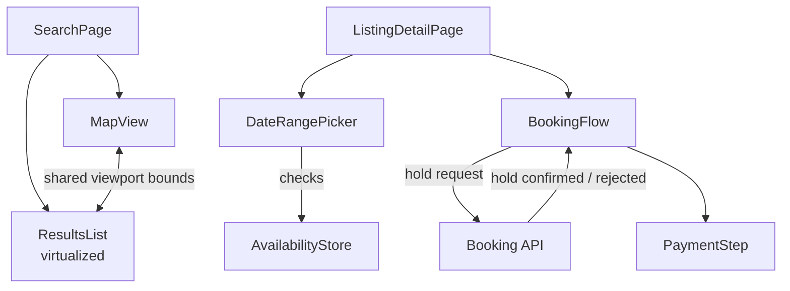
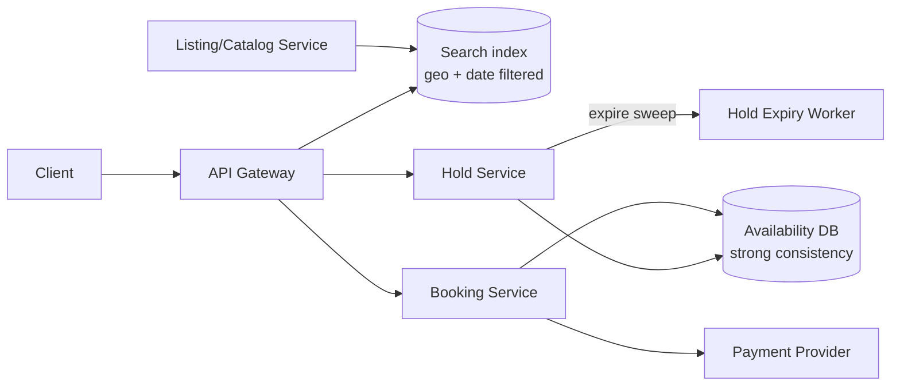

## Overview

- **Real-world analog:** Airbnb, Expedia — search, listings, date/seat selection, booking.
- **Difficulty:** Medium · **Asked at:** Airbnb, GreatFrontEnd bank.
- **Backend counterpart:** [Hotel Booking System](/backend-interviews/c/hotel-booking) covers the per-night inventory model and atomic date-range holds behind this chapter's availability calendar.
- The core challenge isn't showing a list of listings — it's keeping a map, a list, and an availability calendar in sync with each other while the underlying inventory (a specific date range on a specific listing) can be claimed by someone else at any moment, including the moment between "looks available" and "confirm booking."

## Clarifying Questions & Requirements

> **Ask these first:**
> 1. Single-night bookings only, or date ranges (which need range-availability logic, not just a single boolean per listing)?
> 2. Does the map need to stay in sync with the list as the user pans/zooms, or is the map a secondary, static affordance?
> 3. Multi-currency/multi-locale from day one, or a single-market MVP?
> 4. Is inventory locking (holding a date range during checkout) in scope, or is "just try to book and see if it fails" acceptable for this pass?

| | In scope | Out of scope |
|---|---|---|
| **Functional** | Search with filters, map+list view, listing detail, date-range availability, booking flow | Host-side listing management, pricing algorithms, reviews/ratings ingestion |
| **Non-functional** | Map/list stay synced under fast pan/zoom; booking never confirms a date range that's actually unavailable | Real-time multi-region inventory sync at extreme global scale (a deep-dive extension) |

## ── FRONTEND TRACK (RADIO) ──

### R — Requirements

| | Requirement | Why it's not optional |
|---|---|---|
| **Functional** | Search results as synchronized map + list, listing detail with a date-range picker, multi-step booking flow | The map/list sync alone is a real, non-trivial coordination problem, not a styling detail |
| **Functional** | Date-range availability reflects the *specific* listing's calendar, not a generic "available" boolean | A range picker that lets you select dates that are actually blocked produces a failed booking, not a graceful UI |
| **Non-functional** | Panning/zooming the map re-queries results without janking the list | The map is the primary exploration tool for this product category — if it's laggy, the core interaction is broken |
| **Non-functional** | The booking flow clearly distinguishes "this looks available" from "this is confirmed" at every step | Users need to know when they can still back out versus when money has actually moved — conflating these erodes trust fast |
| **Non-functional** | Localized currency, dates, and RTL-safe layout | This product category is inherently cross-border; treating localization as a later pass produces rework across the whole booking flow |

### A — Architecture



- **`MapView` and `ResultsList` share one viewport-bounds state, not two independently-driven ones.** Panning the map updates the bounds; the results list re-fetches for those bounds; scrolling the list (in some product designs) can highlight the corresponding map pin. Treating these as two separate data-fetching components that happen to show similar data is how they visibly drift out of sync under fast interaction.
- **`AvailabilityStore` is fetched per-listing on the detail page**, not baked into the search-results payload — a listing's full calendar is too much data to ship for every card in a results grid, but is exactly what's needed once a user commits to looking at one listing's dates.
- A sketch of the bounds-driven re-fetch, since debouncing this correctly is the part a shallow answer skips:

```ts
function useMapSyncedResults(bounds: MapBounds) {
  const [results, setResults] = useState<Listing[]>([]);
  const debouncedBounds = useDebouncedValue(bounds, 300); // avoid a request per animation frame while panning

  useEffect(() => {
    const controller = new AbortController();
    fetchListings(debouncedBounds, { signal: controller.signal })
      .then(setResults)
      .catch((err) => { if (err.name !== 'AbortError') reportError(err); });
    return () => controller.abort(); // cancel a stale in-flight request if bounds change again first
  }, [debouncedBounds]);

  return results;
}
```

### D — Data Model

| | Owner | Example |
|---|---|---|
| **Server state** | Listing details, real availability calendar, booking/hold status | Fetched per listing; hold status is authoritative server state the moment a hold is requested |
| **Client state** | Current map viewport, selected date range (before submission), booking-flow step | The selected date range is provisional client state until the server confirms a hold on it |

```ts
type DateRange = { checkIn: string; checkOut: string }; // ISO dates
type AvailabilityDay = { date: string; available: boolean; price: number };

type BookingFlowState = {
  step: 'dates' | 'guests' | 'payment' | 'confirming';
  selectedRange: DateRange | null;
  holdId: string | null;      // set once the server confirms a temporary hold
  holdExpiresAt: number | null;
};
```

> **Key insight:** `selectedRange` and `holdId` are deliberately separate. Selecting dates in the UI is free and instant; only a successful hold request against the backend track's inventory-locking system turns a *selection* into something with any real claim on that inventory. A design that treats "selected in the calendar" as equivalent to "reserved" will happily let two users select the same range with neither knowing about the other until one of them fails at final confirmation — badly.

### I — Interface / API

**Component API**

```
<MapView bounds={MapBounds} onBoundsChange={(b: MapBounds) => void} pins={Listing[]} />
<ResultsList listings={Listing[]} highlightedId={string | null} />
<DateRangePicker availability={AvailabilityDay[]} onSelect={(r: DateRange) => void} />
<BookingFlow step={BookingFlowState['step']} holdExpiresAt={number | null} />
```

**Network API** — the shared contract with the backend track below:

| Action | Transport | Shape |
|---|---|---|
| Search by bounds/filters | `GET /search?bounds=&checkIn=&checkOut=&filters=` | REST, results include listing summaries only |
| Listing availability | `GET /listings/:id/availability?from=&to=` | Real per-day availability + price |
| Request a hold | `POST /listings/:id/hold` | `{ checkIn, checkOut }` → `{ holdId, expiresAt }` or `409` if unavailable |
| Confirm booking | `POST /bookings` | `{ holdId, paymentToken }` → `{ bookingId, status }` |

The `409` on hold conflict is the shared contract's key line — the frontend must treat it as an expected, handled outcome, not an unexpected error.

### O — Optimizations

**Performance**
- Debounce map-bounds-driven re-fetches (the sketch above) and cancel stale in-flight requests via `AbortController` — without this, fast panning generates a cascade of races.
- Virtualize the results list for markets with thousands of listings in a viewport; only render map pins actually within the current bounds, not the whole dataset.
- Lazy-load listing images below the fold and in map-pin popovers, since a results page can have dozens of images in view at once.

**Accessibility**
- The date-range picker is fully keyboard-operable (arrow keys move between days, Enter selects), with unavailable days marked via `aria-disabled` rather than just visually grayed out.
- Map interactions have a list-based equivalent — a screen reader or keyboard-only user should never be *required* to use the map to complete a search; the list is the accessible primary path.

**Networking**
- Localize currency/date formatting via the `Intl` API rather than hand-rolled formatting, and detect locale from the request/session rather than assuming one.
- Hold requests and confirmations are on the critical path and get their own loading state distinct from search — search latency shouldn't visually block or conflate with booking latency.

**Resilience**
- If a hold expires mid-flow (countdown reaches zero before payment completes), the UI surfaces that clearly and offers to re-request a hold rather than silently letting checkout fail at the final step with a confusing error.
- A `409` on hold request is a first-class, designed UI state ("these dates were just taken — here are similar available options"), not a generic error toast.

### Frontend Deep Dives

**1. Keeping map and list synchronized without a request storm.** Naively, every pan/zoom event fires a new search request; a user dragging the map generates dozens of events per second. The debounce-plus-cancel sketch above is necessary but not sufficient — the UI also needs to show *some* immediate feedback (e.g., a subtle "updating results…" indicator) during the debounce window, so the interaction doesn't feel unresponsive while waiting for the trailing request to actually fire.

**2. The hold-countdown UI under real clock drift.** A hold has a server-side expiry (`holdExpiresAt`), but the client's countdown timer is running against its own local clock, which may be skewed relative to the server's. If the client's countdown hits zero a few seconds *after* the server has actually expired the hold, the user can submit payment against an already-released hold. Fix: the client countdown is advisory UI only; the actual expiry check happens server-side on payment submission, and the client's countdown is calculated from `holdExpiresAt - serverTimeAtResponse`, not from when the *client* happened to receive the response, correcting for network latency in the initial hold response.

**3. Preventing a double-hold from double-clicking "book these dates."** A slow network response tempts a user to click again; two hold requests for the same range can both be in flight. Fix: disable the action immediately on first click (not just visually — the underlying handler needs a client-side in-flight guard too), and treat a second hold response for dates the client already holds as a no-op reconciliation rather than a new, separate hold.

### Frontend Bottlenecks & Tradeoffs

| Bottleneck | Mitigation | Tradeoff accepted |
|---|---|---|
| Map pan/zoom firing a search request per frame | Debounce + cancel stale requests | A few hundred milliseconds of lag between the map settling and results updating |
| Full availability calendar fetched per listing view | Fetch only the visible month range, paginate further months on navigation | An extra request if a user picks dates far in the future, in exchange for not shipping a year of calendar data upfront |
| Client-side hold countdown vs. server clock drift | Countdown calculated from server-reported expiry, corrected for response latency | Countdown display can be off by up to one round-trip's worth of time, which is acceptable since the server enforces the real expiry regardless |

## ── BACKEND TRACK ──

### Requirements & Scope

- Search over geographically-bounded, date-range-filtered inventory; per-listing availability; a real inventory-locking hold mechanism; payment-gated booking confirmation.
- Must never confirm two overlapping bookings for the same listing and date range.

### Scale & Estimation

| | Estimate |
|---|---|
| Listings | 10M active |
| DAU searching | 5M |
| Peak search QPS | ~5M × 3 searches/session / 86,400 × 6 (peak) ≈ **~1K QPS** |
| Peak hold requests/sec | ~5M × 1% hold-conversion / 86,400 × 4 (peak) ≈ **~2.3 holds/sec** — low volume, but each one is a strict-consistency operation |
| Availability data per listing | ~365 days × a few bytes/day ≈ trivial per listing, but 10M listings × 365 days is a real index-size concern for the search layer |

### API Design

```
GET  /search?bounds=&checkIn=&checkOut=&filters=&cursor=
GET  /listings/:id/availability?from=&to=
POST /listings/:id/hold          {checkIn, checkOut} → {holdId, expiresAt} | 409
POST /bookings                   {holdId, paymentToken} → {bookingId, status}
```

- A hold request is the one endpoint in this system that requires strong consistency — everything else can tolerate the eventual-consistency lag of a search index.

### Data Model & Storage

```
listings
  id PK, title, lat, lng, base_price, ...

availability
  listing_id, date, status enum('open','held','booked')
  PRIMARY KEY (listing_id, date)

holds
  id PK, listing_id, check_in, check_out, expires_at, user_id

bookings
  id PK, hold_id UNIQUE, listing_id, check_in, check_out, status, created_at
```

| Choice | Why |
|---|---|
| **`availability` keyed by (listing_id, date), one row per day** | Makes a range-hold a simple, transactional range-update over contiguous rows rather than a complex overlap-detection query against arbitrary stored ranges |
| **Hold acquisition uses a transaction that updates every day in range to `'held'`, or fails entirely if any day is not `'open'`** | Guarantees all-or-nothing: a hold either claims the whole requested range atomically or claims none of it — never a partial hold on some nights and not others |
| **`bookings.hold_id UNIQUE`** | A booking can only ever originate from exactly one hold — makes "confirm this hold" idempotent the same way `orders.idempotency_key` works in the e-commerce question |

### High-Level Architecture



- The **Availability DB is intentionally a strongly-consistent store** even though the rest of the system (search index, listing catalog) is eventually consistent — this is the one place where "probably correct" isn't good enough, because it's directly enforcing "never double-book."
- A **Hold Expiry Worker** sweeps expired holds back to `'open'` on a schedule — holds aren't released lazily on next-read, because an abandoned hold should free up inventory for other searchers promptly, not only when someone happens to query it again.

### Deep Dives

**1. Atomic range holds without double-booking.** Holding a 5-night stay means acquiring 5 rows in `availability` atomically. Fix: a single transaction that first checks all 5 rows are `'open'`, and only then updates all 5 to `'held'` — using `SELECT ... FOR UPDATE` (or the equivalent row-lock mechanism) so a concurrent transaction attempting an overlapping range blocks until the first transaction commits or rolls back, rather than both reading `'open'` and both succeeding.

**2. Hold expiry versus a slow-but-legitimate checkout.** A hold has to expire eventually (to free abandoned inventory), but a legitimate customer entering payment details slowly shouldn't lose their hold mid-entry. Fix: a moderate TTL (commonly 10-15 minutes) balances the two, and the booking-confirmation endpoint explicitly checks `holds.expires_at > now()` at the moment of payment submission — an expired hold fails confirmation cleanly and immediately, returning a specific "hold expired" status the frontend maps to its designed re-request flow, rather than a generic error.

**3. Search-index staleness versus availability correctness.** The search results a user browses come from an eventually-consistent index that doesn't reflect holds/bookings made in the last few seconds-to-minutes — meaning search can show a listing as available for dates that are, in fact, just held by someone else. This is an accepted tradeoff, not a bug to eliminate: the *authoritative* check happens at hold-request time against the strongly-consistent `availability` table, and a stale search result simply produces an expected `409` at that point, which the frontend already treats as a first-class, handled outcome.

### Bottlenecks & Tradeoffs

| Bottleneck | Mitigation | Tradeoff accepted |
|---|---|---|
| Row-level locking on `availability` during hold acquisition, under contention on a popular listing | Short-lived transactions, small row sets per hold (only the requested date range) | A moderately popular listing can have brief lock contention around checkout, but the lock is held for milliseconds, not the full checkout duration |
| Search index staleness allowing "phantom availability" | Authoritative re-check at hold time, `409` as a designed UI outcome | Users occasionally see a listing as available that gets held by someone else moments before they click — handled gracefully, not eliminated |
| Expired-hold sweep running on a fixed schedule rather than instantly on expiry | A short polling interval (e.g. every 30s) on the expiry worker | Inventory can sit unnecessarily reserved for up to one sweep interval after a hold actually expires |

## The Shared Contract

- **Ownership boundary:** the client's selected date range is a *request*, never a claim — only a successful `POST /hold` response gives the client anything resembling a real reservation, and even that is time-bounded and re-checked at confirmation.
- **Real-time transport:** plain request/response REST throughout — this system doesn't need push-based real-time updates the way chat does; a `409` on hold conflict is sufficient signal, discovered at the moment it matters rather than needing to be proactively pushed.
- **Pagination:** cursor-based on search results, since the underlying availability data changes continuously and offset pagination would skip/duplicate results as listings shift in/out of availability mid-scroll.
- **Error propagation:** a `409` from `/hold` is not an error to the frontend — it's an expected outcome with a designed UI response (surface similar available alternatives), and both tracks agree it's the *normal* way overlapping demand gets resolved, not an edge case.

## Interview Signals

| | Strong answer | Weak answer |
|---|---|---|
| **Frontend** | Explicitly distinguishes "selected" from "held" from "booked" in the data model; handles map/list sync with debounce+cancel | Treats calendar selection as equivalent to a real reservation |
| **Backend** | Reasons about atomic multi-day range holds and hold-expiry TTL tradeoffs explicitly | Checks each day's availability independently, missing the atomicity requirement across the whole range |
| **Both** | Treats a hold conflict (`409`) as an expected, designed-for outcome on both tracks | Designs only the successful-booking happy path |

**Common failure modes:** designing calendar selection as if it were a reservation; checking availability day-by-day instead of atomically for the whole range; forgetting the hold needs an expiry and a worker to reclaim it; assuming search results are real-time-accurate.

## Glossary Links

This question draws on: RADIO framework, optimistic UI, cursor-based pagination, consistency model, idempotency — each linked on first mention above.

## Proposed Glossary Additions

- **Inventory hold / lock** — a time-bounded, strongly-consistent reservation on a resource (a date range, a seat, a unit of stock) that blocks conflicting claims until it's confirmed or expires. Directly shared with the e-commerce and seat-booking questions in this bank; worth promoting to a real registry entry once written once more consistently across those.
