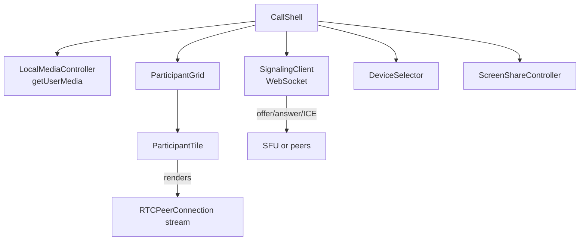
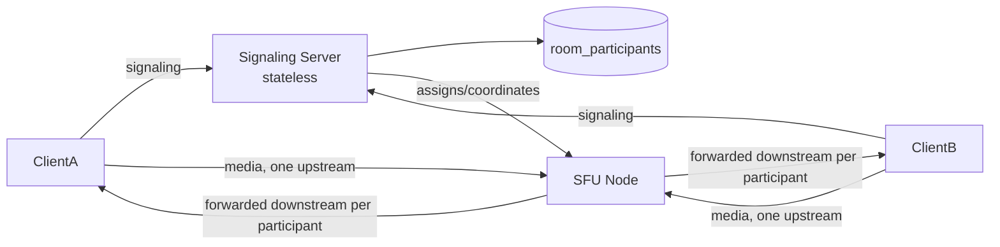

## Overview

- **Real-world analog:** Zoom, Google Meet — browser-based real-time audio/video conferencing.
- **Difficulty:** Hard · **Asked at:** Zoom-style companies, Google, GreatFrontEnd bank.
- The core challenge is that real-time video is fundamentally different from everything else in this course — it's not a message or a document to synchronize, it's continuous, latency-intolerant media that has to reach every participant with minimal delay, and the topology decision for *how* streams reach other participants is the single most consequential design choice in the whole question.

## Clarifying Questions & Requirements

> **Ask these first:**
> 1. What's the realistic max participant count per call — small team calls (under 10), or does this need to support large webinar-style calls (hundreds)? This almost entirely determines the topology answer.
> 2. Is screen share one-at-a-time, or can multiple participants share simultaneously?
> 3. Recording — in scope, or assumed handled by a separate system?
> 4. Is this browser-only (WebRTC via the browser's native APIs), or does it need to interoperate with a native mobile/desktop app using the same backend?

| | In scope | Out of scope |
|---|---|---|
| **Functional** | Multi-party audio/video, screen share, mute/device controls, active-speaker and gallery layouts | Recording pipeline internals, webinar-scale (500+) participant fan-out, virtual backgrounds/effects |
| **Non-functional** | Low, consistent latency for audio/video; graceful degradation under poor bandwidth rather than a frozen call; UI stays responsive with many simultaneous video streams rendering | Guaranteed sub-100ms glass-to-glass latency at very large scale (a genuinely different, harder variant of this question) |

## ── FRONTEND TRACK (RADIO) ──

### R — Requirements

| | Requirement | Why it's not optional |
|---|---|---|
| **Functional** | Local media capture, multi-participant video grid or active-speaker layout, screen share, device selection, mute controls | Each participant is simultaneously a media producer and a consumer of everyone else's streams — that dual role shapes the whole component design |
| **Non-functional** | Audio/video latency stays low and consistent, not just "eventually arrives" | Unlike chat or a feed, stale-but-eventually-correct is not an acceptable degradation mode for live conversation — a half-second of audio lag breaks the conversational turn-taking that makes a call usable at all |
| **Non-functional** | The UI stays responsive rendering many simultaneous video elements | A naive implementation that doesn't manage stream/render lifecycle degrades badly well before any realistic participant cap |
| **Non-functional** | A participant on a degrading connection degrades *their own* experience gracefully rather than degrading the *whole call* for everyone | One bad connection shouldn't be able to drag every other participant's experience down with it |

### A — Architecture



- **`SignalingClient` only exchanges connection-setup metadata — it never carries media.** Offers, answers, and ICE candidates flow over a WebSocket to coordinate the actual peer connections; once a connection is established, audio/video flows over `RTCPeerConnection`'s own media transport, completely separate from the signaling channel. Conflating the two — trying to push video frames through the same WebSocket used for signaling — is a common, fundamental misunderstanding of how WebRTC is structured.
- **`ParticipantGrid` manages render lifecycle per stream carefully** — attaching a `MediaStream` to a `<video>` element is cheap, but *how many* simultaneously-decoding video elements exist is the real performance constraint, covered in Deep Dives.
- A sketch of what actually setting up one peer connection involves — the part a shallow answer reduces to "use WebRTC" with no mechanism shown:

```ts
class PeerConnectionManager {
  private pc = new RTCPeerConnection({ iceServers: STUN_TURN_SERVERS });

  async createOffer(localStream: MediaStream) {
    localStream.getTracks().forEach(track => this.pc.addTrack(track, localStream));
    const offer = await this.pc.createOffer();
    await this.pc.setLocalDescription(offer);
    this.signaling.send({ type: 'offer', sdp: offer.sdp });
  }

  async handleAnswer(sdp: string) {
    await this.pc.setRemoteDescription({ type: 'answer', sdp });
  }

  constructor() {
    this.pc.onicecandidate = (e) => {
      if (e.candidate) this.signaling.send({ type: 'ice', candidate: e.candidate });
    };
    this.pc.ontrack = (e) => this.onRemoteStream(e.streams[0]); // feeds a ParticipantTile
  }
}
```

STUN/TURN servers exist specifically because most real users are behind NAT — STUN discovers a usable public address, and TURN relays media as a fallback when a direct peer-to-peer path genuinely can't be established (common on restrictive corporate/mobile networks).

### D — Data Model

| | Owner | Example |
|---|---|---|
| **Server/signaling state** | Room membership, who's connected, active-speaker signal | Coordinated via signaling server, not carried in media streams themselves |
| **Client state** | Local device selection, mute state, which participant is currently rendered large (active-speaker or pinned), per-tile decode/render status | Local-only, not synchronized beyond what's needed for others to know your mute state |

```ts
type Participant = {
  id: string;
  displayName: string;
  isMuted: boolean;
  isScreenSharing: boolean;
  connectionQuality: 'good' | 'degraded' | 'reconnecting';
  stream: MediaStream | null; // null until the peer connection's track actually arrives
};

type CallState = {
  participants: Record<string, Participant>;
  activeSpeakerId: string | null;
  pinnedParticipantId: string | null; // local-only, overrides active-speaker layout
};
```

> **Key insight:** `connectionQuality` is per-participant, not a single global call-health flag. One participant's degraded connection is *their* problem to visibly indicate (so others understand why their tile looks rough), not something that should be reported as if the whole call is unhealthy.

**The reconciliation problem this data model exists to solve:** a participant's `stream` field starts `null` and is only populated once `ontrack` actually fires for their peer connection — the UI has to render a real, distinct "connecting" state for a participant who's joined the room (signaling-visible) but whose media hasn't arrived yet (peer-connection-pending), which are genuinely two different states, not one.

### I — Interface / API

**Component API**

```
<CallShell roomId={string} />
<ParticipantGrid participants={Participant[]} activeSpeakerId={string | null} />
<ParticipantTile participant={Participant} isPinned={boolean} onPin={() => void} />
<DeviceSelector kind={'audioinput' | 'videoinput'} onSelect={(deviceId: string) => void} />
<ScreenShareButton onStart={() => void} onStop={() => void} />
```

**Network API** — the shared contract with the backend track below:

| Action | Transport | Shape |
|---|---|---|
| Join room | WebSocket event | `{ type: 'join', roomId, displayName }` |
| Signaling offer/answer | WebSocket event | `{ type: 'offer' \| 'answer', sdp, targetId? }` |
| ICE candidate | WebSocket event | `{ type: 'ice', candidate, targetId? }` |
| Active speaker update | WebSocket event | `{ type: 'active_speaker', participantId }` |
| Media | **Not WebSocket at all** | `RTCPeerConnection`'s own SRTP transport, negotiated *through* signaling but carried separately |

The last row matters enough to call out explicitly in an interview: media never goes through the same channel as everything else in this table — conflating them is exactly the mistake flagged in the Architecture section above.

### O — Optimizations

**Performance**
- Cap simultaneously-decoding video elements — beyond a handful of full-resolution decodes, degrade non-active-speaker tiles to a lower resolution/framerate (via `RTCRtpSender` parameters or simulcast) rather than decoding every stream at full quality regardless of tile size.
- Pause decoding entirely for tiles that are scrolled off-screen in a large gallery view (equivalent in spirit to a virtualized list not rendering off-screen rows).
- Debounce active-speaker layout changes — switching the large tile the instant volume crosses a threshold produces a distracting, flickery layout during normal back-and-forth conversation.

**Accessibility**
- Every participant tile has an accessible name (the participant's display name), and mute state is conveyed with a non-color-only indicator (an icon + label), not a color change alone.
- Captions/live-transcription, where supported, are a first-class toggle, not buried — increasingly a baseline expectation for this category, not a nice-to-have.
- Keyboard-reachable controls for mute, camera, screen share, and pinning a participant — none of this should require a mouse.

**Networking**
- Prefer a direct peer-to-peer path when ICE negotiation succeeds; fall back to TURN relay only when it doesn't — TURN relay costs real server bandwidth and adds latency, so it's a fallback, not a default.
- Renegotiate (not tear down and rebuild) a peer connection when adding/removing a track (e.g. starting screen share) — a full reconnect for what should be an incremental change is disruptive and unnecessary.

**Resilience**
- Detect a degrading connection (via `RTCPeerConnection` stats — packet loss, jitter) and proactively downgrade *that participant's own* outgoing quality before the connection fails outright, rather than waiting for a hard disconnect.
- On a genuine disconnect, attempt fast reconnection with the existing room/session context preserved, rather than forcing a full rejoin flow.

### Frontend Deep Dives

**1. Choosing mesh vs. SFU, and what it means for the frontend specifically.** In a **mesh** topology, every participant opens a direct peer connection to every other participant — for N participants, that's N-1 outgoing streams *each* client has to encode and send, which becomes untenable past a handful of people (the upload bandwidth and CPU cost scale with N). In an **SFU** (Selective Forwarding Unit) topology, each client sends *one* stream to a central server, which forwards it to everyone else — the client's upload cost is constant regardless of participant count, at the cost of needing that server infrastructure at all. For anything beyond small calls, SFU is the only architecture that scales, and this decision shapes the entire signaling design: in a mesh call, `PeerConnectionManager` above would need one `RTCPeerConnection` per *other* participant; in an SFU model, it needs exactly one, to the SFU itself.

**2. Rendering many simultaneous video streams without degrading the tab.** Each active `<video>` element decoding a stream has real CPU/GPU cost — a large gallery view with dozens of tiles all decoding full-resolution video will bog down even a capable machine. The fix combines simulcast (the SFU can be asked to forward a lower-resolution version of a stream for tiles rendered small) with local decode-pausing for off-screen tiles, so the actual decode cost tracks what's *visibly and meaningfully* rendered, not the theoretical participant count.

**3. Distinguishing "joined the room" from "media has arrived."** A participant appears in the room roster (via signaling) before their `RTCPeerConnection`'s `ontrack` necessarily fires — there's a real, sometimes multi-second gap where someone is a known participant with no visible/audible stream yet. A shallow implementation either shows nothing (looks broken) or assumes a stream exists and crashes on a null reference. The fix is exactly the `stream: MediaStream | null` distinction in the Data Model — render a real, distinct "connecting" state for that gap, not a broken or absent tile.

### Frontend Bottlenecks & Tradeoffs

| Bottleneck | Mitigation | Tradeoff accepted |
|---|---|---|
| Upload/CPU cost scaling with participant count in a mesh topology | SFU topology for anything beyond small calls | Requires central server infrastructure and adds it as a dependency, versus mesh's "just peers" simplicity |
| Decoding many full-resolution streams simultaneously | Simulcast + pause decode for off-screen tiles | Non-focused participants render at visibly lower quality — an accepted, deliberate degradation |
| Flickery active-speaker layout switching on every volume threshold crossing | Debounce active-speaker changes | Layout updates lag the true active speaker by a small, deliberate delay |
| A single participant's poor connection degrading their own experience only | Per-participant `connectionQuality` and proactive self-downgrade | That participant sees a visibly reduced quality on their own outgoing/incoming stream, in exchange for not degrading anyone else's |

## ── BACKEND TRACK ──

### Requirements & Scope

- Coordinate signaling (room membership, offer/answer/ICE exchange) and, for anything beyond small calls, run the SFU media-forwarding infrastructure itself.
- Must scale media forwarding independently of signaling, since the two have completely different resource profiles (signaling is small messages; media forwarding is continuous, high-bandwidth).

### Scale & Estimation

| | Estimate |
|---|---|
| DAU | 10M |
| Avg participants per call | 4 |
| Concurrent calls at peak | ~1M |
| Avg per-stream bandwidth (video, moderate quality) | ~1.5 Mbps |
| SFU forwarding bandwidth at peak | ~1M calls × 4 participants × 1.5 Mbps (received) × ~3 (forwarded to others) ≈ **~18 Tbps**, heavily dependent on participant count per call and simulcast usage |
| Signaling messages/sec | Comparatively tiny — offer/answer/ICE is a handful of small messages per call setup, not a continuous stream |

### API Design

Server-side view of the same contract the frontend track defined above:

```
WS  join           {roomId, displayName} → roster {participants: [...]}
WS  offer/answer   {sdp, targetId?} → relayed to the SFU or target peer
WS  ice            {candidate, targetId?} → relayed
WS  active_speaker → broadcast {participantId}
```

Note explicitly: **media itself never appears in this API** — it's a separate transport (SRTP) that the SFU (or peers, in a mesh) handle directly, negotiated *through* but not carried *by* the signaling API.

### Data Model & Storage

```
rooms
  id            uuid PK
  created_at    timestamp

room_participants
  room_id       uuid, indexed
  participant_id uuid
  sfu_node_id   text        -- which SFU instance is handling this participant's media
  joined_at     timestamp
  PRIMARY KEY (room_id, participant_id)
```

This is deliberately the smallest data model in this course — a video call's *state* worth persisting is nearly all ephemeral, room-membership-shaped metadata; the interesting engineering is almost entirely in the real-time media path, not in anything durably stored.

| Choice | Why |
|---|---|
| **`sfu_node_id` tracked per participant** | Routing signaling messages (renegotiation, participant leaving) correctly requires knowing which specific SFU instance is handling a given participant's media — this isn't optional bookkeeping, it's required for the system to function at all |
| **No message/event history persisted** | Unlike chat or a document, there's no "replay what you missed" requirement for a live call — a participant who was disconnected simply reconnects and rejoins live, nothing to catch up on |

### High-Level Architecture



- The **Signaling Server is stateless and horizontally scaled**, just like chat's gateway — it coordinates connection setup but doesn't touch media, so it scales independently of the media-forwarding tier entirely.
- **SFU nodes are the resource-intensive tier**, sized and scaled based on concurrent-call and bandwidth-per-call estimates, not request count — this is a fundamentally different scaling axis than almost every other question in this course, which scale on request/message rate; here the constraint is raw, continuous bandwidth.

### Deep Dives

**1. SFU node assignment and scaling.** Deciding which SFU node handles a given call/room, and ensuring all participants in the *same* call land on the *same* node (or a coordinated set of nodes for cross-region calls), is the core scaling decision. Fix: rooms are assigned to a specific SFU node at creation (or the first participant's join), tracked in `room_participants.sfu_node_id`, and all subsequent joins to that room are routed to the same node — cross-region calls (participants far from each other) are a genuinely harder variant requiring SFU-to-SFU media relay between regions, out of scope for the base question but worth naming as a real limitation.

**2. Graceful degradation under SFU capacity pressure.** If an SFU node approaches its bandwidth ceiling, naively continuing to accept new participants degrades quality for everyone already on it. Fix: request simulcast layer downgrades from already-connected participants (forward lower-resolution streams to relieve bandwidth) before refusing new joins outright — this mirrors the frontend's own "degrade before disconnecting" philosophy, applied server-side to the SFU's own capacity rather than a single participant's connection.

**3. TURN relay cost as a real infrastructure line item.** When direct peer-to-peer (or peer-to-SFU) connectivity fails ICE negotiation — common behind restrictive corporate NATs — media has to relay through a TURN server, which costs real, continuous bandwidth on infrastructure the team operates, unlike a successful direct path which costs nothing extra. Fix: monitor and budget for TURN relay percentage explicitly as a capacity-planning input, since it's a highly variable cost driven by the target user base's network environments, not a fixed, predictable overhead.

### Bottlenecks & Tradeoffs

| Bottleneck | Mitigation | Tradeoff accepted |
|---|---|---|
| Media forwarding bandwidth scaling with participants × calls, not request rate | SFU capacity planning as the primary scaling axis, distinct from signaling | Signaling and media tiers need entirely separate scaling models and separate on-call ownership |
| Cross-region calls needing SFU-to-SFU relay | Explicit inter-region relay path (or accept it as an out-of-scope limitation) | Added latency and complexity for genuinely geographically-distributed calls |
| TURN relay cost when direct connectivity fails | Budget for it explicitly; monitor relay percentage | A real, variable infrastructure cost that scales with how restrictive the user base's networks are, not something eliminable by design alone |

## The Shared Contract

- **Transport:** WebSocket for signaling only; media travels over WebRTC's own SRTP transport, negotiated through signaling but never carried by it. This is the single most important thing to say explicitly on both tracks in an interview — conflating the two channels is a genuine, common misunderstanding worth naming and ruling out directly.
- **Ownership boundary:** the client's `PeerConnectionManager` owns the actual media transport once negotiated; the signaling server owns *coordinating* that negotiation (offer/answer/ICE relay) and room membership — it never touches the media bytes themselves in an SFU-forwarded call any more than in a pure mesh call (the SFU forwards, it doesn't originate or terminate the conversation's meaning).
- **No pagination concept applies** — this is the one question in this course with no history/list to page through; state is almost entirely live and ephemeral.
- **Error propagation:** a failed ICE negotiation triggers a TURN-relay fallback attempt before surfacing a real connection failure to the user; a degrading connection surfaces a visible, specific quality indicator rather than silently failing.

## Interview Signals

| | Strong answer | Weak answer |
|---|---|---|
| **Frontend** | Explains mesh vs. SFU as a real tradeoff with concrete bandwidth-scaling numbers, and picks based on the stated participant-count requirement | Says "use WebRTC" with no topology discussion at all |
| **Backend** | Identifies that media-forwarding bandwidth, not request rate, is the real scaling constraint | Applies request-rate-based capacity planning (correct for chat/feed) uncritically to a bandwidth-bound problem |
| **Both** | Clearly separates the signaling channel from the media transport, explicitly | Implies or states that video frames flow through the WebSocket used for signaling |

**Common failure modes:** conflating the signaling channel with the media transport; assuming mesh topology scales to any participant count; not distinguishing "joined the room" from "media has arrived" in the UI; treating TURN relay as free instead of a real, variable infrastructure cost.

## Glossary Links

This question draws on: WebSocket — linked on first mention above. See "Proposed glossary additions" below for terms new to this question.

**Proposed glossary additions:**
- **WebRTC** — a browser-native API for real-time peer-to-peer audio/video/data transport, using its own negotiation (`RTCPeerConnection`) and media transport (SRTP) separate from any signaling channel used to set it up.
- **SFU (Selective Forwarding Unit)** — a media server that receives one upstream stream per participant and forwards it to every other participant, keeping each client's upload cost constant regardless of call size — the scalable alternative to a full mesh of direct peer connections.
- **STUN/TURN** — STUN discovers a client's public-facing network address to help establish a direct peer connection through NAT; TURN relays media through a server when a direct path can't be established at all, at real bandwidth cost.
