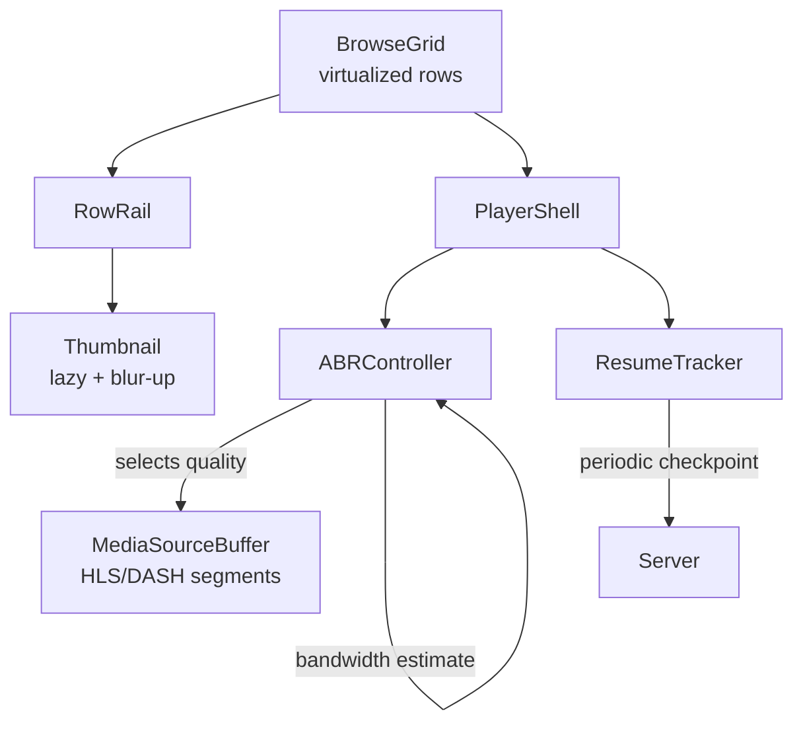
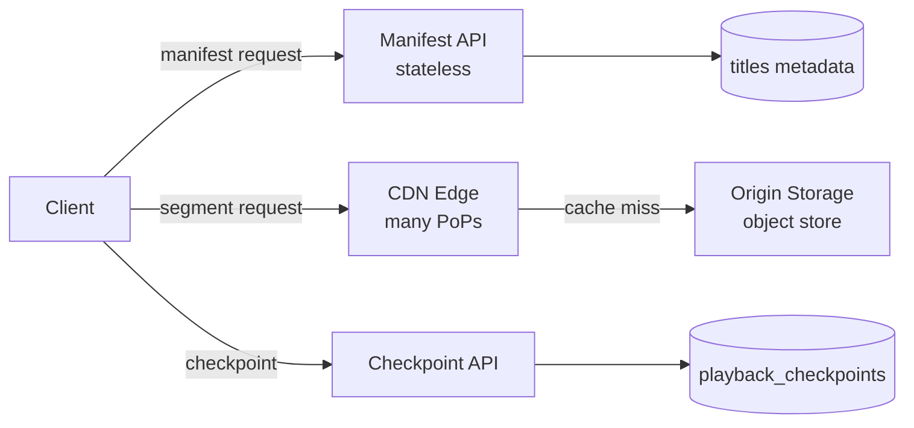

## Overview

- **Real-world analog:** Netflix, YouTube — a video-on-demand platform frontend.
- **Difficulty:** Hard · **Asked at:** Netflix, Google/YouTube, GreatFrontEnd bank.
- **Backend counterpart:** [Video Streaming Platform](/backend-interviews/c/video-platform) covers the transcoding pipeline, storage tiering, and multi-CDN distribution that produces the variants this chapter's player adapts between.
- The core challenge isn't playing a video file — it's continuously choosing, mid-playback, the right quality level for a connection that's constantly changing, without the viewer ever seeing a stall, and doing that across a UI that also has to browse, preview, and resume thousands of other titles efficiently.

## Clarifying Questions & Requirements

> **Ask these first:**
> 1. Live streaming in scope, or VOD (video-on-demand) only? Live adds latency constraints VOD doesn't have.
> 2. Multi-device resume (start on TV, continue on phone) — in scope for the base question?
> 3. DRM/content protection — assumed to exist and out of scope, or does the design need to account for it explicitly?
> 4. Offline download for later playback — in scope, or streaming-only?

| | In scope | Out of scope |
|---|---|---|
| **Functional** | Adaptive playback, browse/discover rows, resume playback, captions, keyboard/remote controls | Live streaming latency requirements, DRM key-exchange internals, content recommendation ranking |
| **Non-functional** | Playback starts fast and rarely rebuffers even on a degrading connection; browsing rows stay smooth with large catalogs; resume position is always accurate | Guaranteed zero rebuffering under adversarial network conditions (that's a deep-dive extension, not the base bar) |

## ── FRONTEND TRACK (RADIO) ──

### R — Requirements

| | Requirement | Why it's not optional |
|---|---|---|
| **Functional** | Adaptive-bitrate player, browse rows with lazy-loaded thumbnails, resume-from-position, captions, full keyboard/remote-control support | A player alone isn't the product — the browse experience is where most session time and most performance risk actually lives |
| **Non-functional** | Playback begins within a couple seconds of pressing play, on a realistic connection | Slow start is one of the most-measured, most product-critical metrics in this category — it's a real, testable requirement, not a vague "should feel fast" |
| **Non-functional** | Quality adapts to bandwidth changes without a full stall wherever avoidable | This is the actual hard problem — not "play video," but "keep playing smoothly while conditions change under you" |
| **Non-functional** | Resume position is accurate across devices without racing itself | Two devices both reporting "I stopped at X" concurrently is a real race this design has to resolve |

### A — Architecture



- **`ABRController` owns quality selection, not the raw `<video>` element.** It continuously estimates available bandwidth from recent segment download times, and decides which bitrate rendition to fetch *next* — the player element itself just plays whatever segments it's handed; it has no adaptive logic of its own.
- **`BrowseGrid` and `PlayerShell` are separate concerns** deliberately — a title card's thumbnail preview (a short, silent, low-res loop) uses a *lighter* playback path than the full player, so hovering over dozens of cards while browsing never competes for bandwidth with an actual playback session.
- A sketch of the ABR decision loop — the part a shallow answer collapses into "adjust quality based on speed" with no actual mechanism:

```ts
class ABRController {
  private recentThroughputs: number[] = []; // bytes/sec, last N segment downloads
  private currentLevel = 0; // index into available bitrate ladder

  onSegmentDownloaded(bytes: number, durationMs: number) {
    const throughput = bytes / (durationMs / 1000);
    this.recentThroughputs.push(throughput);
    if (this.recentThroughputs.length > 5) this.recentThroughputs.shift();
    this.currentLevel = this.selectLevel(this.estimatedThroughput(), this.bufferHealth());
  }

  private selectLevel(throughput: number, bufferSeconds: number): number {
    // Conservative: target a bitrate comfortably below estimated throughput,
    // and downgrade aggressively if the buffer is running low regardless of
    // throughput — buffer health matters more than raw bandwidth once it's thin.
    if (bufferSeconds < 5) return Math.max(0, this.currentLevel - 1);
    const target = throughput * 0.8; // headroom, don't fully saturate the estimate
    return this.ladder.findLastIndex(level => level.bitrate <= target);
  }
}
```

### D — Data Model

| | Owner | Example |
|---|---|---|
| **Server state** | Title metadata, available bitrate renditions, resume position (authoritative across devices) | Fetched per title; resume position reconciled on playback start/stop |
| **Client state** | Current buffer health, current ABR level, local playback position between checkpoints | Local-only until the next periodic checkpoint |

```ts
type Title = {
  id: string;
  manifestUrl: string;        // HLS/DASH manifest listing available renditions
  durationSec: number;
  resumePositionSec: number | null; // last known checkpoint, may be stale until reconciled
};

type PlaybackSession = {
  titleId: string;
  positionSec: number;
  lastCheckpointAt: number;   // timestamp of last successful server sync
  pendingCheckpoint: boolean; // true between a local update and its ack
};
```

> **Key insight:** `resumePositionSec` on `Title` is explicitly nullable-and-possibly-stale — the client always treats the server's value as a *starting point to reconcile against* on playback start, never as instantly trustworthy, because a second device may have advanced further since this device last checked.

**The reconciliation problem this data model exists to solve:** the same title can be resumed from two devices in a short window (paused on the TV, opened on the phone before the TV's checkpoint synced). The client can't just always trust its own last-known local position, because a *different* device might have watched further in the meantime.

### I — Interface / API

**Component API**

```
<BrowseGrid rows={Row[]} onTitleSelect={(id: string) => void} />
<RowRail titleIds={string[]} renderCard={(id) => ReactNode} />
<Player titleId={string} startPositionSec={number} onCheckpoint={(sec: number) => void} />
<CaptionTrack track={VTTTrack} />
```

**Network API** — the shared contract with the backend track below:

| Action | Transport | Shape |
|---|---|---|
| Load manifest | `GET /titles/:id/manifest` | Returns HLS/DASH manifest — the bitrate ladder itself |
| Fetch segment | `GET /segments/:titleId/:renditionId/:segmentIndex` | Served via CDN, not the origin API |
| Get resume position | `GET /titles/:id/resume` | Returns `{ positionSec, updatedAt }` |
| Checkpoint progress | `POST /titles/:id/checkpoint` `{ positionSec, deviceId }` | Idempotent — the server keeps the *latest* checkpoint by timestamp, not by arrival order |

### O — Optimizations

**Performance**
- Prefetch the next few segments at the *current* ABR level ahead of playback position, so a brief throughput dip doesn't immediately starve the buffer — this is what buffer-health-aware ABR (above) is actually protecting.
- Virtualize browse rows on both axes — a catalog with hundreds of rows and dozens of titles per row never mounts more than what's near the viewport.
- Preload only a short, muted, low-res preview clip on hover/focus, not the full player pipeline — hovering across a row shouldn't spin up dozens of full ABR sessions.

**Accessibility**
- Full keyboard/remote-control navigation through browse rows and player controls — this category is disproportionately consumed on TV remotes and set-top boxes, where "keyboard support" is the *primary* input, not a fallback.
- Captions are a first-class, always-available control, not buried in a nested settings menu, and caption rendering respects user-configured size/contrast preferences.
- Player controls auto-hide during playback but are always reachable via a single, predictable key/gesture — never require hunting for a hidden control.

**Networking**
- Segments are served from a CDN edge, never the origin, for exactly the reason a CDN exists — origin-served video at this scale is not viable.
- ABR decisions favor buffer health over squeezing maximum bitrate — a viewer strongly prefers a stable slightly-lower-quality stream over one that's higher quality but stalls.

**Resilience**
- On a severe bandwidth drop, downgrade quality aggressively rather than let the buffer run dry and force a hard stall — a visible quality drop is a far better experience than a spinner.
- If a checkpoint `POST` fails, retry with backoff but never block playback on it — checkpointing is a background concern, not a playback-blocking one.

### Frontend Deep Dives

**1. Buffer-aware ABR, not just throughput-aware ABR.** A common shallow mistake: pick bitrate purely from estimated bandwidth. The problem is bandwidth estimates are noisy and lag reality — a naive throughput-only algorithm can pick a bitrate that was accurate a few seconds ago but isn't now, draining the buffer. The fix, shown in the `selectLevel` sketch above, is a two-signal decision: throughput estimate for the *target* bitrate, but buffer health as a hard override — if the buffer is running low, downgrade regardless of what throughput looks like, because an empty buffer means a guaranteed stall while a downgraded-but-still-playing stream means no visible interruption at all.

**2. Reconciling resume position across two devices.** If device A paused at 12:34 and device B was opened moments later before A's checkpoint reached the server, B might start from a stale position and then itself checkpoint *backward* relative to what actually happened. The fix: checkpoints carry a client timestamp, and the server (and any device reconciling against it) always keeps the checkpoint with the *latest* timestamp, never the one that happened to arrive last over the network — this is the same "don't trust arrival order, trust a real ordering signal" principle chat's `serverSeq` embodies, applied to wall-clock-ish progress instead of a monotonic counter.

**3. Preventing hover-preview playback from starving the actual player.** Browsing a row and hovering across several cards in quick succession can trigger multiple preview playback sessions competing for bandwidth if not managed carefully — and if the user then commits to actually playing a title, that session needs priority immediately. The fix: preview sessions are capped (at most one active at a time, cancelling the previous on a new hover) and are the *first* thing torn down the instant a real playback session starts, rather than left to compete for the same connection pool.

### Frontend Bottlenecks & Tradeoffs

| Bottleneck | Mitigation | Tradeoff accepted |
|---|---|---|
| Throughput-only ABR causing avoidable stalls | Buffer-health override on top of throughput estimate | Slightly more conservative quality selection in exchange for far fewer hard stalls |
| Many simultaneous hover-preview sessions while browsing | Cap to one active preview, cancel on new hover, kill on real playback start | A hovered preview can take a beat to start if a previous one is still tearing down |
| Full-resolution thumbnails for an entire large catalog | Lazy-load + blur-up placeholders, only near-viewport | A brief low-res placeholder is visible before the real thumbnail loads in |
| Checkpoint races across multiple devices | Timestamp-based "latest wins" reconciliation, not arrival-order | A device that's been offline can briefly show a stale resume point until it next syncs |

## ── BACKEND TRACK ──

### Requirements & Scope

- Serve manifests describing available bitrate renditions per title, serve segments efficiently at massive scale via CDN, and track/reconcile resume position across devices per user.
- Encoding pipeline internals (transcoding into the bitrate ladder itself) are out of scope — the backend track covers serving what's already encoded, not the encode step.

### Scale & Estimation

| | Estimate |
|---|---|
| DAU | 200M |
| Concurrent streams at peak | ~20M (roughly 10% of DAU watching simultaneously at peak hours) |
| Avg bitrate served | ~4 Mbps (mixed SD/HD/4K distribution) |
| Peak egress bandwidth | 20M streams × 4 Mbps ≈ **~80 Tbps**, overwhelmingly served from CDN edge, not origin |
| Checkpoint writes/sec | ~20M concurrent streams × 1 checkpoint per ~10s ≈ **~2M writes/sec** |

### API Design

Server-side view of the same contract the frontend track defined above:

```
GET  /titles/:id/manifest → HLS/DASH manifest (bitrate ladder, segment URLs)
GET  /segments/:titleId/:renditionId/:segmentIndex → binary, served via CDN
GET  /titles/:id/resume → {positionSec, updatedAt}
POST /titles/:id/checkpoint {positionSec, deviceId, clientTimestamp} → 204
```

- The manifest is the API-layer response; segments themselves are almost never served by the API tier directly — the manifest just contains CDN-hosted URLs, and the origin's real job is manifest generation and checkpoint bookkeeping, not bulk video egress.
- `checkpoint` carries `clientTimestamp` specifically so the server can apply the same latest-timestamp-wins reconciliation the frontend track relies on, rather than trusting request arrival order.

### Data Model & Storage

```
titles
  id            uuid PK
  manifest_url  text
  duration_sec  int

playback_checkpoints
  user_id       uuid
  title_id      uuid
  position_sec  int
  device_id     uuid
  client_timestamp  timestamp
  PRIMARY KEY (user_id, title_id)   -- one row per user+title, always overwritten by latest

segment_access_log   -- sampled, not every request, for CDN cache-hit analytics
  title_id      uuid
  rendition_id  text
  cdn_pop       text
  timestamp     timestamp
```

| Choice | Why |
|---|---|
| **`playback_checkpoints` keyed `(user_id, title_id)`, always upserted** | Only the latest resume position per user-per-title matters — there's no reason to keep a history of every checkpoint, and upserting keeps the write path cheap at 2M writes/sec |
| **Segments never routed through the primary datastore at all** | At ~80 Tbps peak egress, serving video bytes through the same tier that handles metadata/checkpoints would be a catastrophic bottleneck — segments live entirely in CDN/object storage, decoupled from the metadata API |
| **`segment_access_log` sampled, not exhaustive** | Logging every single segment request at this volume is not worth the storage/write cost; a sampled log is sufficient for cache-hit-rate and CDN-performance analytics |

### High-Level Architecture



- The **CDN Edge** is where the overwhelming majority of actual bytes-served happens — the origin object store is only hit on a cache miss, and for a catalog of popular titles the cache-hit rate at the edge is extremely high, which is precisely what makes 80 Tbps peak egress viable at all without every request round-tripping to origin.
- **Manifest API and Checkpoint API are separate services** deliberately — manifest requests are cacheable and nearly static per title; checkpoint writes are high-frequency, small, and latency-sensitive in a completely different way, and coupling them would mean a checkpoint-write spike degrading manifest-serving latency for unrelated requests.

### Deep Dives

**1. CDN cache efficiency at massive scale.** Serving 80 Tbps from origin directly is not economically or technically viable. Fix: segments are content-addressed and cached aggressively at CDN edge PoPs close to viewers, with cache-hit rates for popular content in the high 90s of a percent — the entire architecture's viability rests on this hit rate, which is why title popularity distribution (a small number of titles driving a large fraction of total viewing) is actually a load-bearing assumption of the design, not incidental.

**2. Checkpoint write volume at 2M/sec.** Naive per-checkpoint inserts at this rate would be a serious write bottleneck. Fix: `playback_checkpoints` is an upsert-only table (one row per user+title, always overwritten), which keeps the write pattern simple and bounded regardless of how many times a user has ever watched a title — and checkpoint writes can tolerate being batched/buffered briefly (a few seconds of write-behind buffering) since losing the very last few seconds of position on a crash is an acceptable, low-severity failure mode, unlike losing a chat message.

**3. Manifest generation for a device-appropriate bitrate ladder.** Different devices (a phone on cellular vs. a 4K TV on ethernet) shouldn't receive the same bitrate ladder — sending 4K renditions to a phone wastes manifest space and can mislead client-side ABR into considering options that were never realistic. Fix: manifest generation is device-class-aware, filtering the offered ladder to renditions actually relevant to the requesting device/connection class, which also reduces the ABR controller's decision space on constrained devices to only meaningful choices.

### Bottlenecks & Tradeoffs

| Bottleneck | Mitigation | Tradeoff accepted |
|---|---|---|
| 80 Tbps peak egress if served from origin | CDN edge caching, high hit rate for popular content | Long-tail, rarely-watched titles have a higher cache-miss rate and slightly slower first-segment latency |
| 2M checkpoint writes/sec | Upsert-only schema, brief write-behind buffering | A few seconds of the very latest position can be lost on an ungraceful crash — acceptable given severity |
| Sending an irrelevant bitrate ladder to constrained devices | Device-class-aware manifest generation | Slightly more manifest-generation complexity, in exchange for a meaningfully smaller, more relevant decision space for client-side ABR |

## The Shared Contract

- **Transport:** plain HTTP(S) for both manifest and segment fetches — no WebSocket needed, since adaptive streaming is fundamentally a series of discrete, cacheable GET requests, not a persistent bidirectional channel. This is a deliberate contrast with chat/collaborative-editing questions in this same course, worth naming explicitly in an interview: not every real-time-feeling product needs a persistent connection.
- **Ownership boundary:** the client's `ABRController` owns *which* rendition to request next; the server/CDN owns *what's actually available* (the bitrate ladder in the manifest) and *serving it efficiently*. Resume position is reconciled with the server as the tie-breaking authority via timestamp, exactly like the frontend track's Deep Dive #2.
- **"Pagination" equivalent:** segment-by-segment fetching is inherently chunked/incremental — there's no analogous cursor concept needed since segments are already discretely indexed by the manifest.
- **Error propagation:** a failed segment fetch triggers an ABR downgrade-and-retry, not a hard player error — playback should degrade gracefully through several retry/downgrade attempts before ever surfacing a "playback failed" state to the viewer.

## Interview Signals

| | Strong answer | Weak answer |
|---|---|---|
| **Frontend** | Describes ABR as a two-signal (throughput + buffer health) decision, not throughput-only | Says "just monitor bandwidth and switch quality" with no buffer-health consideration |
| **Backend** | Explains why segments bypass the primary datastore entirely and rely on CDN cache-hit rate as a load-bearing assumption | Treats video serving as "just another API response" without addressing egress scale |
| **Both** | Treats keyboard/remote-control navigation as a first-class requirement for this specific category, not an accessibility afterthought | Designs primarily for mouse/touch and mentions remote-control support only if prompted |

**Common failure modes:** throughput-only ABR with no buffer-health signal; assuming resume position can be trusted from whichever device's write arrives first rather than reconciling by timestamp; not addressing CDN/origin separation at all; forgetting that this category is disproportionately consumed on TV remotes.

## Glossary Links

This question draws on: consistency model (for the resume-position reconciliation discussion) — linked on first mention above. See "Proposed glossary additions" below for terms new to this question.

**Proposed glossary additions:**
- **Adaptive bitrate streaming (ABR)** — continuously selecting which encoded quality rendition to fetch next during playback, based on estimated bandwidth and buffer health, so a single stream can degrade or improve quality without restarting.
- **HLS/DASH** — the two dominant adaptive-streaming manifest formats (HTTP Live Streaming and Dynamic Adaptive Streaming over HTTP); both describe a bitrate ladder of renditions split into small, independently-fetchable segments.
